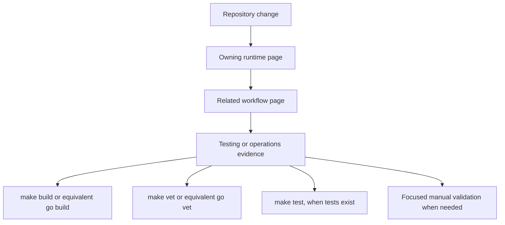

## Start here

Use this page before changing SCSP. First identify the owning runtime page for the code you will touch, then follow the related cross-system workflow, and finally collect testing or operations evidence. This page routes readers to durable detail; it intentionally does not reproduce every API, lifecycle, configuration, or workflow detail.

The service entrypoint is `cmd/server/main.go`: it loads configuration, initializes observability and adapters, wires the two domain usecases, builds the Gin router, and performs graceful shutdown. The everyday development controls live in `Makefile`.

Caption: The change-routing sequence used for every task: identify the owner, follow the workflow, then validate.

## Repository map

| Area | Start here | What it owns |
| --- | --- | --- |
| Process entry and wiring | `cmd/server/main.go`, [System Architecture](/openwiki/architecture/overview.md) | Startup order, adapter construction, usecase injection, HTTP serving, graceful shutdown |
| HTTP surface | `internal/adapters/driving/rest`, [HTTP API Surface](/openwiki/architecture/http-api.md) | Routes, middleware order, path parsing, policy-role enforcement, status-code mapping |
| Key lifecycle | `internal/domain/usecase/secure_key_usecase.go`, [Key Create, Update, Delete Flow](/openwiki/workflows/key-create-update-delete.md) | Encrypt/store/update/delete behavior, optimistic versions, cache invalidation |
| Read caching | `internal/domain/usecase/secure_key_usecase.go`, [Key Read and Caching Flow](/openwiki/workflows/key-read-caching.md) | Cache lookup, singleflight miss coalescing, decrypt-on-miss, TTL and invalidation |
| Authentication and authorization | `internal/domain/usecase/auth_usecase.go`, [Authentication and Authorization](/openwiki/workflows/authentication-authorization.md) | Basic-auth verification, credential cache, Argon2 check, policy JSON, per-route roles |
| Domain contracts | `internal/domain/port` | Storage, auth-storage, encryption, cache, and logger ports plus shared errors and `KeyData` |
<!-- openwiki: broken internal link [/openwiki/architecture/persistence-and-encryption.md] file "/openwiki/architecture/persistence-and-encryption.md" does not exist. Fix the href or restore the target, then delete this comment. -->
| Persistence and encryption | `internal/adapters/driven/postgres`, `internal/adapters/driven/vault`, [Persistence and Encryption](/openwiki/architecture/persistence-and-encryption.md) | PostgreSQL records and transactions, Vault transit encryption, adapter lifecycle |
| Configuration and runtime | `internal/config/config.go`, `config.yaml`, [Configuration and Environment](/openwiki/operations/configuration.md) | Viper loading, defaults, `SCSP_` environment overrides, cache TTL clamp, runtime knobs |
| Build and deployment | `Makefile`, release scripts, [Build and Deploy](/openwiki/operations/build-and-deploy.md) | Binary build, packaging, config placement, environment-specific deployment flows |
| Validation and observability | [Testing and Validation](/openwiki/testing/testing.md) | Test status, validation commands, middleware logging, OTel tracer behavior |
| Domain vocabulary | [Key Paths and Policies](/openwiki/concepts/key-paths-and-policies.md) | Key-path/subkey grammar, versions, metadata, soft deletes, policy roles |

Folder index pages are generated automatically and are not planned here. Route readers to the concrete domain pages above instead.

## Task-routing guide

Choose the row that best matches the change you intend to make, read the owning runtime page first, then follow the linked workflow and validation guidance.

| If the task is to... | Owning runtime page | Then follow | Validation evidence |
| --- | --- | --- | --- |
| Change a route, status code, request validation rule, or middleware order | [HTTP API Surface](/openwiki/architecture/http-api.md) | [Authentication and Authorization](/openwiki/workflows/authentication-authorization.md) for auth/policy interactions | `make build`, `make vet`, and focused curl checks for each affected status |
| Change Basic-auth behavior, credential caching, Argon2 verification, or policy-role matching | [Authentication and Authorization](/openwiki/workflows/authentication-authorization.md) | [Key Paths and Policies](/openwiki/concepts/key-paths-and-policies.md) for policy/path semantics | Build/vet plus manual 401/403/allowed-path cases; add tests if introducing them |
<!-- openwiki: broken internal link [/openwiki/architecture/persistence-and-encryption.md] file "/openwiki/architecture/persistence-and-encryption.md" does not exist. Fix the href or restore the target, then delete this comment. -->
| Change create, update, or delete semantics, version checks, or soft-delete state | [Key Create, Update, Delete Flow](/openwiki/workflows/key-create-update-delete.md) | [Persistence and Encryption](/openwiki/architecture/persistence-and-encryption.md) for transaction and encryption details | Build/vet plus focused create, update-conflict, delete, and recreate checks |
| Change read caching, singleflight behavior, TTL, or invalidation | [Key Read and Caching Flow](/openwiki/workflows/key-read-caching.md) | [Key Create, Update, Delete Flow](/openwiki/workflows/key-create-update-delete.md) because writes drive invalidation | Build/vet plus hit, miss, concurrent-miss, update-invalidate, and path-delete checks |
| Change configuration loading, defaults, environment overrides, or runtime settings | [Configuration and Environment](/openwiki/operations/configuration.md) | [Build and Deploy](/openwiki/operations/build-and-deploy.md) for packaging and deployment effects | Build/vet plus startup with representative YAML and `SCSP_` overrides |
| Change build, packaging, release scripts, or deployment layout | [Build and Deploy](/openwiki/operations/build-and-deploy.md) | [Configuration and Environment](/openwiki/operations/configuration.md) for config placement and secrets | `make build`, script dry run where safe, and artifact-path inspection |
| Change startup wiring, dependency direction, adapter construction, or shutdown | [System Architecture](/openwiki/architecture/overview.md) | [HTTP API Surface](/openwiki/architecture/http-api.md) for request-path effects | Build/vet plus startup, SIGINT/SIGTERM, and focused request smoke tests |
<!-- openwiki: broken internal link [/openwiki/architecture/persistence-and-encryption.md] file "/openwiki/architecture/persistence-and-encryption.md" does not exist. Fix the href or restore the target, then delete this comment. -->
| Change storage schema use, PostgreSQL transactions, or Vault encryption | [Persistence and Encryption](/openwiki/architecture/persistence-and-encryption.md) | [Key Create, Update, Delete Flow](/openwiki/workflows/key-create-update-delete.md) for lifecycle consequences | Build/vet plus focused persistence and encryption checks in a controlled environment |
| Add or change tests, static checks, logging, tracing, or validation commands | [Testing and Validation](/openwiki/testing/testing.md) | [System Architecture](/openwiki/architecture/overview.md) for observability wiring | The exact Makefile target or command changed, with complete failure output preserved |
| Change path grammar, metadata shape, versioning, or policy vocabulary | [Key Paths and Policies](/openwiki/concepts/key-paths-and-policies.md) | The affected HTTP or authentication workflow page | Build/vet plus boundary examples for valid and invalid paths |

## Common change patterns

### 1. Request or response behavior

1. Read [HTTP API Surface](/openwiki/architecture/http-api.md).
2. Trace the handler and middleware through `internal/adapters/driving/rest`.
3. Read [Authentication and Authorization](/openwiki/workflows/authentication-authorization.md) when credentials, roles, or policy matching are involved.
4. Record the exact status-code and body changes, then validate representative success and failure requests.

### 2. Key lifecycle or persistence behavior

1. Read the relevant side of [Key Create, Update, Delete Flow](/openwiki/workflows/key-create-update-delete.md) and [Key Read and Caching Flow](/openwiki/workflows/key-read-caching.md).
2. Follow the usecase call into `internal/domain/usecase/secure_key_usecase.go`.
3. Follow the port into `internal/adapters/driven/postgres` or `internal/adapters/driven/vault`.
4. Check whether the change affects versioning, soft-delete state, encryption, or cache invalidation before editing.

### 3. Configuration or deployment behavior

1. Read [Configuration and Environment](/openwiki/operations/configuration.md).
2. Check `internal/config/config.go` for load order, defaults, and normalization.
3. Check `config.yaml` and deployment scripts for the target environment.
4. Read [Build and Deploy](/openwiki/operations/build-and-deploy.md) before changing artifact layout, config placement, or release flow.

### 4. Cross-cutting startup or observability behavior

1. Read [System Architecture](/openwiki/architecture/overview.md).
2. Inspect `cmd/server/main.go` for initialization and shutdown ordering.
3. Read [Testing and Validation](/openwiki/testing/testing.md) for middleware, logging, and tracer implications.
4. Validate startup, request tracing/logging, and graceful shutdown as appropriate.

## Validation baseline

Use the narrowest validation that proves the change, but preserve complete failure output.

| Purpose | Command | Source |
| --- | --- | --- |
| Compile the service | `make build` | `Makefile` |
| Run all Go tests | `make test` | `Makefile` |
| Run static analysis | `make vet` | `Makefile` |
| Format Go sources | `make fmt` | `Makefile` |
| Tidy and download modules | `make deps` | `Makefile` |
| Start locally | `make run` | `Makefile` |

`make test` runs `go test ./... -v`; if no matching tests exist, the command still provides useful compile-time signal. For request changes, run focused HTTP checks against the configured prefix after startup. For configuration changes, start with representative YAML and environment overrides. For build or deployment changes, inspect the produced artifact and config placement described in [Build and Deploy](/openwiki/operations/build-and-deploy.md).

## Safe-change checklist

Before editing:

- Identify the owning runtime page and its related workflow.
- Identify the state owner: REST handler, usecase, port, driven adapter, configuration, or startup wiring.
- Note any cache, authentication, persistence, or HTTP-contract dependency.
- Choose the narrowest validation command or manual probe that proves the behavior.

After editing:

- Re-read the affected workflow page for invariants and failure semantics.
- Run the baseline build and vet commands.
- Run focused tests when they exist; add focused tests when changing cache, authorization, versioning, or error-mapping behavior.
- Record any known validation gap in the change summary instead of implying test coverage that does not exist.
- Update documentation only in the owning wiki page; generated folder index pages are not hand-edited.

## Related pages

- [HTTP API Surface](/openwiki/architecture/http-api.md)
- [System Architecture](/openwiki/architecture/overview.md)
- [Configuration and Environment](/openwiki/operations/configuration.md)
- [Build and Deploy](/openwiki/operations/build-and-deploy.md)
- [Testing and Validation](/openwiki/testing/testing.md)
- [Authentication and Authorization](/openwiki/workflows/authentication-authorization.md)
- [Key Create, Update, Delete Flow](/openwiki/workflows/key-create-update-delete.md)
- [Key Read and Caching Flow](/openwiki/workflows/key-read-caching.md)
