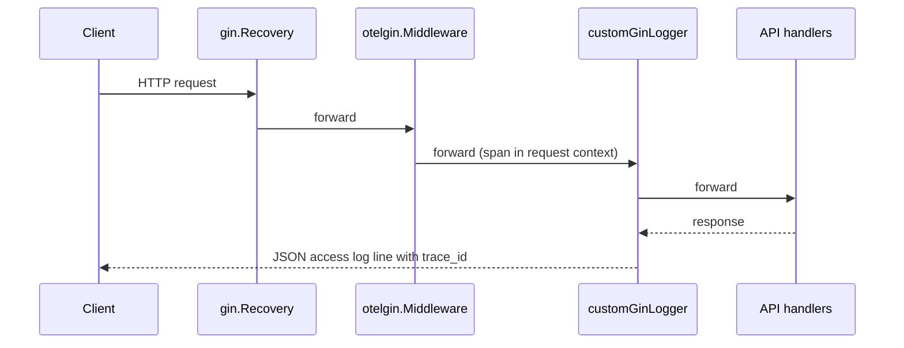

# Testing and Validation

SCSP currently has **no** `*_test.go` files anywhere in the repository (`glob` confirms none under `/internal`, `/cmd`, or anywhere else). Validation therefore relies on build-time tooling, the (currently empty) Go test runner, and manual API calls against a running server.

## Validation commands

The `Makefile` provides the standard entrypoints:

| Command | Effect |
| --- | --- |
| `make build` | Compiles the server binary to `releases/bin/scsp` via `go build -ldflags="-s -w"` from `./cmd/server/main.go`. |
| `make test` | Runs `go test ./... -v`; with no test files this only compiles and reports "no test files" per package. |
| `make vet` | Runs `go vet ./...`. |
| `make fmt` | Runs `go fmt ./...`. |
| `make deps` | Runs `go mod tidy` and `go mod download`. |
| `make run` | Starts the server with `go run ./cmd/server/main.go`. |

Because there is no automated test coverage, real validation today means:

1. `go build ./...` / `make build` to prove compilation.
2. `go vet ./...` / `make vet` for static checks.
3. `go test ./...` / `make test` (kept wired up so it starts exercising packages as tests are added).
4. Manual API calls with `curl` (or similar) against the endpoints exposed by `Handler.SetupRouter()` in `internal/adapters/driving/rest/handler.go` — create, update, read, list, and delete key/subkey routes under the configured `server.prefixURI`.

## Observability hooks

All request-time observability is wired in two places: the Gin router setup in `Handler.SetupRouter()` and the tracer initialization in `cmd/server/main.go`.

### Middleware order in `SetupRouter()`

Caption: Request flow through the Gin middleware chain; the access logger emits one JSON line per request enriched with trace/span IDs.

1. `gin.Recovery()` — registered first so panics from any downstream middleware are caught.
2. `otelgin.Middleware(h.serviceName)` — the OpenTelemetry Gin instrumentation; it starts a span per request and places the span context on the request so downstream code and the logger can extract `trace_id`/`span_id`.
3. `h.customGinLogger()` — the custom JSON access logger.

Gin's own debug/plain-text output is also redirected into the JSON logger: `gin.DebugPrintRouteFunc` formats route registration through `h.log.Infof`, and `gin.DefaultWriter`/`gin.DefaultErrorWriter` are replaced with a `ginLogWriter` that forwards each line to `h.log.Info`.

### Custom JSON access logger

`customGinLogger()` records, after `c.Next()` returns:

- status code, latency (truncated to seconds when over a minute), client IP, method, and full path including raw query;
- private Gin errors appended to the message when present;
- emitted via `h.log.ErrorContext` for status >= 500, otherwise `h.log.InfoContext`, so the line automatically carries `trace_id` and `span_id` when a valid span is present in the request context.

The application's logger (`internal/logger/logger.go`, `SlogLogger`) is a `slog` JSON handler writing to stdout. Its context-aware methods (`InfoContext`, `ErrorContext`, `InfofContext`, ...) pull `trace_id`/`span_id` from the OTel span in `ctx` via `trace.SpanFromContext`, injecting them as structured fields.

### OTLP tracer init and shutdown

`tracer.InitTracer(cfg.Tracer)` in `internal/tracer/tracer.go`:

- opens a gRPC connection to `cfg.Endpoint` (default `localhost:4317`) with insecure credentials;
- creates an `otlptracegrpc` exporter bound to that connection;
- builds a resource carrying service name, service version, deployment environment, host, OS, process, and host architecture attributes;
- installs a global `TracerProvider` with `sdktrace.WithBatcher(exporter)`;
- configures W3C `TraceContext` + `Baggage` propagation.

It returns `tp.Shutdown`, which `main.go` defers under a fresh `context.Background()` so batched spans are flushed on graceful exit. This pairs with the SIGINT/SIGTERM-driven graceful HTTP shutdown in `main.go`.

Tracer configuration keys (see `config.TracerConfig` and `config.Load` defaults):

- `tracer.endpoint` (default `localhost:4317`)
- `tracer.service_name` (default `scsp`)
- `tracer.service_version` (default `v1.0.0`)
- `tracer.environment` (default `prod`)

## Practical implications

- Any manual API smoke test should produce `[GIN]` access-log JSON lines containing `trace_id`/`span_id` when the OTLP endpoint is reachable; if the collector is down, `InitTracer` fails fast at startup (`log.Fatalf`), so observability setup is a hard dependency of the server starting.
- Since no unit/integration tests exist, changes to middleware order, logger behavior, or tracer setup must be verified by running the server and inspecting stdout JSON logs plus the collector's received spans.
