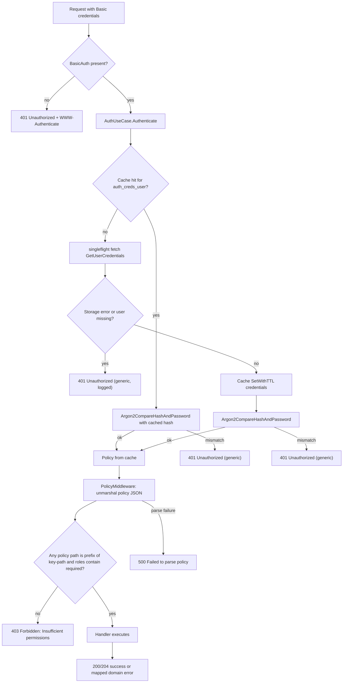

## Overview

SCSP gates every API route behind HTTP Basic authentication plus a per-route role policy check. The driving REST adapter in `internal/adapters/driving/rest/handler.go` extracts Basic credentials, delegates verification to `AuthUseCase` (`internal/domain/usecase/auth_usecase.go`), and then `PolicyMiddleware` matches the returned policy JSON against the request key-path. Credentials are cached in a Ristretto-backed `CachePort`, verified with Argon2id, and failures are always reported to clients as generic `401 Unauthorized` / `403 Forbidden` responses while detailed errors are logged internally.

## Entrypoints and wiring

`cmd/server/main.go` constructs the chain:

1. `postgres.NewPostgresAdapter` implements `port.AuthStoragePort` (`GetUserCredentials`, `GetUserPasswordHash`).
2. `cache.NewRistrettoAdapter` implements `port.CachePort`.
3. `usecase.NewAuthUseCase(pgAdapter, cacheAdapter, log, cacheTTL)` — TTL comes from `cache.ttl` (seconds), defaulting to `DefaultAuthCacheTTL` of 5 minutes when non-positive.
4. `rest.NewHandler(secureKeyUseCase, authUseCase, prefixURI, serviceName, log)` mounts `BasicAuthMiddleware()` on the API group and per-route `PolicyMiddleware(role)` checks.

No test files exist in the repository, so this workflow is verified by wiring and source inspection rather than focused unit tests.

## Authentication control flow

`Handler.BasicAuthMiddleware` runs for every request under the configured prefix (`/scsp/api/v1` in `config.yaml`):

1. `c.Request.BasicAuth()` extracts username/password. Missing credentials → `401` with `WWW-Authenticate: Basic realm="Restricted"`.
2. `h.authUseCase.Authenticate(ctx, username, password)` is called.
3. On any error it logs the concrete failure (`WarnfContext`) and returns a generic `401 {"error": "Unauthorized"}` — the client never learns whether the user, hash lookup, or password comparison failed.
4. On success the raw policy JSON string and username are stored in the Gin context for `PolicyMiddleware`.

`authUseCase.Authenticate` internally:

1. Builds cache key `auth_creds_<username>`.
2. Checks `cache.Get`; a hit with a valid `cachedCredentials` runs `utils.Argon2CompareHashAndPassword` against the cached hash. A match returns the cached policy immediately.
3. On cache miss, error, or failed assertion it enters a `singleflight.Group` keyed by the same cache key so concurrent requests for one user trigger a single storage fetch.
4. Inside singleflight, `authStorage.GetUserCredentials` reads `s_hash_password` and `s_policy` from `scsp.tb_user_policy`. Failures are not cached and produce `"authentication failed"`.
5. Successful fetches are stored via `cache.SetWithTTL` with cost `1` and the configured TTL (log-and-continue on set failure).
6. The password is verified with `Argon2CompareHashAndPassword`; mismatch or storage error yields `"authentication failed"`.

## Argon2id verification

`internal/utils/crypto.go` provides `Argon2CompareHashAndPassword(hashedPassword, password)`. It parses a PHC-format string (`$argon2id$v=19$m=...,t=...,p=...$<salt>$<hash>`), re-derives the key with `argon2.IDKey`, and compares with `subtle.ConstantTimeCompare` to resist timing attacks. `ErrInvalidHash`, `ErrIncompatibleVersion`, and `ErrMismatchedHashAndPassword` distinguish format, version, and mismatch failures; all surface to callers as a failed authentication.

## Policy JSON and per-route role enforcement

`PolicyMiddleware(requiredRole)` unmarshals the policy string into `[]Policy{ {Path, Roles} }`. The request `key-path` parameter is normalized to begin with `/`; access is granted only when some policy entry's `Path` is a `strings.HasPrefix` of the request path and that entry's `Roles` contains the route's required role (`create`, `update`, `read`, `delete`, `list`). Failure semantics:

| Condition | Response |
| --- | --- |
| Missing username in context | `401 Unauthorized` |
| Missing policy in context | `403 Forbidden: No policy found` |
| Policy not a string / JSON unmarshal failure | `500 Internal error` / `500 Failed to parse policy` |
| No matching prefix+role | `403 Forbidden: Insufficient permissions` (warn-logged) |

## Mermaid flowchart

The flowchart shows the decision path from BasicAuth parsing through cached credential verification, singleflight fetch, Argon2id check, and prefix-prefix policy role enforcement, including the generic client-facing failure responses.

## State, invariants, and failure semantics

- Cache entries under `auth_creds_<username>` hold `{Hash, Policy}` and expire after `cache.ttl`; the values are the same pair stored in `scsp.tb_user_policy` at login provisioning time.
- Storage errors during credential fetch are never cached; only successful fetches are persisted in Ristretto.
- Client-facing auth errors are deliberately generic (`Unauthorized`); specific causes (`user not found`, `authentication failed`, cache errors, DB errors) are only logged via the injected `LoggerPort`.
- Role enforcement is deny-by-default: absence of any matching prefix+role pair produces `403`, and a malformed policy string produces `500` rather than granting access.

## Extension points and configuration

- Swap `AuthStoragePort` or `CachePort` implementations (e.g., Redis instead of Ristretto) without changing `authUseCase`.
- Tune `cache.ttl` (bounded to 300–86400s by `config.Load`) to balance credential freshness against Postgres load.
- Add new routes with their own `PolicyMiddleware(role)`; authorization is enforced independently of handler logic.
- Provision users by writing Argon2id hashes and policy JSON into `scsp.tb_user_policy`; there is currently no in-code user management path.

## Related pages

- [HTTP API Surface](/openwiki/architecture/http-api.md)
- [Key Paths and Policies](/openwiki/concepts/key-paths-and-policies.md)
