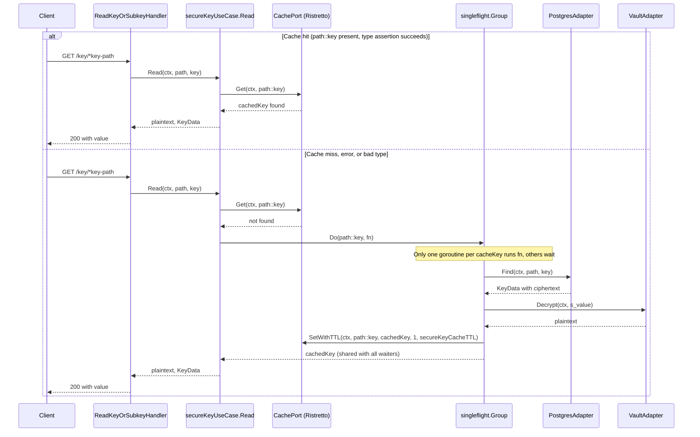

# Key Read and Caching Flow

## Purpose

This page documents the read path for secure keys: how `ReadKeyOrSubkeyHandler` reaches
`secureKeyUseCase.Read`, how the Ristretto-backed cache short-circuits repeat lookups, how
`singleflight` prevents a stampede of concurrent misses for the same key, and how the cache is
invalidated by the write and delete paths described in
[[key-create-update-delete]]. The write-side flows themselves are out of scope here.

## Entrypoints

- `GET /key/*key-path` (role `read`) → `Handler.ReadKeyOrSubkeyHandler` → `SecureKeyUseCase.Read`.
- `GET /keys/*key-path` (role `read`) → `Handler.ReadAllSubkeysHandler` → `SecureKeyUseCase.FindByPath`.
- `LIST /keys/*key-path` (role `list`) → `Handler.ListSubkeysHandler` → `SecureKeyUseCase.ListSubkeys`.

Only the first entrypoint is cached. `FindByPath` and `ListSubkeys` go straight to
`StoragePort` on every call and never consult, populate, or invalidate the cache. Because
`FindByPath` returns `KeyData` with the **decrypted** value in `Value`, the multi-key read
endpoint pays one Vault transit `decrypt` call per key on every request, whereas the single-key
read pays at most one per TTL window.

`ReadKeyOrSubkeyHandler` maps `port.ErrKeyNotFound` to `404` and anything else (including a
Vault decrypt failure) to `500`, then renders `value`, parsed `custom_metadata`, `version`, and
`created_time`.

## The read pipeline

`secureKeyUseCase.Read(ctx, path, key)` derives the cache key as `path + "::" + key` and
follows a fixed three-step sequence.

1. **Cache lookup.** `keyCache.Get(ctx, cacheKey)`. A non-nil error is logged and treated as a
   miss; the read continues against storage. If the entry is found, the value is type-asserted
   to the internal `cachedKey` struct. On success the usecase returns `cached.plaintext` and
   `cached.keyData` immediately — no storage query and no Vault call. A failed type assertion is
   logged as a warning and also degrades to a miss.
2. **Singleflight fetch.** On a miss the call joins
   `sfGroup.Do(cacheKey, ...)` using the *same* string as the singleflight key, so all concurrent
   readers of one `path::key` collapse into one execution. Inside the callback:
   `storage.Find` loads the row, then `encryptor.Decrypt` turns the stored `s_value` ciphertext
   into plaintext. `sql.ErrNoRows` is mapped to `port.ErrKeyNotFound`; every other storage error
   and every decrypt error is returned verbatim. Nothing is cached on any error path.
   Only after both steps succeed is `cachedKey{plaintext, keyData}` written with
   `SetWithTTL(ctx, cacheKey, dataToCache, 1, uc.secureKeyCacheTTL)`.
3. **Result handling.** An error from `Do` is returned to the caller unchanged. On success the
   returned value is type-asserted to `cachedKey`; an unexpected type yields
   `fmt.Errorf("unexpected type returned from singleflight group: %T", v)`.

### Cache hit versus cache miss

Caption: On a hit the response is served entirely from the in-process cache; on a miss a single
storage query and a single Vault decrypt are performed per `path::key` and then cached with TTL.

## What is cached

`cachedKey` stores **both** the decrypted plaintext and the full `port.KeyData` returned by
`Find` (`Key`, ciphertext `Value`, `Version`, `Metadata`, `CreatedAt`, `UpdatedAt`). Consequently:

- Vault decryption happens once per TTL window rather than once per read.
- The version, metadata, and timestamps served to the client are the ones observed when the entry
  was populated, so a cache hit can return metadata/version that an update has already superseded.
  The ciphertext in `keyData.Value` is also the pre-update ciphertext.
- Plaintext key material lives in process memory for the TTL duration; the cache is an in-process
  Ristretto cache, not a shared store, so each replica has its own entries and its own TTL clock.

## Cache adapter behavior

`RistrettoAdapter` (`internal/adapters/driven/cache/ristretto.go`) is the only `CachePort`
implementation wired into the server. It translates the port to Ristretto:

- `Get` returns `cache.Get(key)` with a nil error, because Ristretto has no read error path.
- `SetWithTTL` forwards the caller's cost and TTL. When Ristretto returns `false` (an item dropped
  because of cost/eviction) the adapter logs a warning but still returns `nil`, so a rejected cache
  write is never surfaced to the usecase as an error.
- `Delete` maps to `Del`, `Clear` to `Clear`, and `Shutdown` to `Close`. None of these return errors.
- The adapter computes a `defaultTTL` from `cfg.TTL` (falling back to 5 minutes when non-positive)
  but `SetWithTTL` never uses it; TTLs are always supplied by the callers.

## Invalidation

| Trigger | Cache effect | Where |
| --- | --- | --- |
| `Create` | none — the key enters the cache lazily on first successful `Read` | `secureKeyUseCase.Create` |
| `Update` (success) | `Delete(ctx, path::key)` | `secureKeyUseCase.Update` |
| `DeleteKey` (success) | `Delete(ctx, path::key)` | `secureKeyUseCase.DeleteKey` |
| `DeleteByPath` (success) | `Clear(ctx)` — the **entire** cache | `secureKeyUseCase.DeleteByPath` |
| Failed write (version conflict, not found) | none | write paths |

Every invalidation runs *after* the storage operation commits and only on success, so a failed
update never evicts a still-valid entry. Invalidation errors are logged as warnings and never
fail the API call: storage is the source of truth and a stale cache entry is preferred over a
failed write.

`DeleteByPath` clears the whole cache because `CachePort` exposes no prefix/scan deletion; the
source comment notes that a granular strategy could replace it if performance demands. This is
worth knowing operationally: one path delete also drops cached **authentication credentials**,
because `main.go` injects the same `cacheAdapter` instance into both `NewSecureKeyUseCase` and
`NewAuthUseCase`. The reverse asymmetry also holds: auth entries are keyed `auth_creds_<username>`
and cannot collide with key entries, so key invalidation never evicts credentials.

## Stampede protection and its limits

`singleflight` deduplicates concurrent misses **within one process**; it does not coordinate across
replicas, and it is scoped to the duration of the fetch-and-decrypt callback. A deleted key is not
negatively cached: `port.ErrKeyNotFound` propagates out of the callback, every waiter receives the
same error, and each subsequent read repeats the storage query.

## Configuration and lifecycle

- `config.CacheConfig` supplies `NumCounters`, `MaxCost`, `BufferItems`, and `TTL` (seconds) via
  Viper with the `SCSP_` env prefix (`cache.ttl`, `cache.max_cost`, ...). Defaults are 10M
  counters, 1 GiB max cost, 64 buffer items, and `ttl = 300`.
- `config.Load` clamps `Cache.TTL`: non-positive becomes 300 seconds, and values above 86400
  (one day) are clamped down to 86400.
- `main.go` converts `cfg.Cache.TTL` to a `time.Duration` and injects the same value into both
  use cases as their entry TTL, so the configured TTL governs key plaintext and auth credentials
  alike. The cache adapter is created before the use cases and `cacheAdapter.Shutdown()` runs via
  `defer` on server exit.

## Invariants and failure semantics

- Cache entries are written only after a successful storage read *and* a successful Vault decrypt.
- Cache failures are non-fatal in both directions: a read error or bad type degrades to a storage
  read, and a rejected write is logged and dropped.
- `PostgresAdapter.Find` filters `s_state != 'DELETED'`, so a soft-deleted key is reported as
  `port.ErrKeyNotFound` (the adapter maps `pgx.ErrNoRows` itself, so the usecase's
  `sql.ErrNoRows` branch is a belt-and-braces translation).
- Cached values are the plaintext; a cache hit therefore bypasses Vault entirely, and Vault
  unavailability does not affect cached reads.
- The Ristretto cache is in-process and per-replica: entries are neither shared nor invalidated
  across instances, and a restart drops everything.

## Extension points

- Swapping the cache backend only requires implementing `CachePort` (`Get`, `SetWithTTL`, `Delete`,
  `Clear`) in `internal/adapters/driven/cache` and changing the construction in `main.go`; the
  usecase depends on the interface only. A backend with prefix deletion would let `DeleteByPath`
  stop clearing the whole cache.
- Adding a per-key or per-path TTL override, or caching `FindByPath` results, would only change
  `secureKeyUseCase`; no adapter or handler change is required.
- Adding negative caching for `ErrKeyNotFound` inside the singleflight callback would change miss
  latency semantics and needs care around the delete/update invalidation ordering described above.

## Testing

The repository contains **no** `*_test.go` files, so the caching path has no automated coverage;
`make test` only compiles the packages. This behavior is verified today by `make build` / `make vet`
plus manual calls, and the read-path semantics above are the natural target for the first
`secureKeyUseCase` tests with a fake `CachePort`, `StoragePort`, and `EncryptionPort` — covering
hit short-circuit, singleflight fan-in, error-not-cached, and the invalidation calls made by
`Update`, `DeleteKey`, and `DeleteByPath`.
