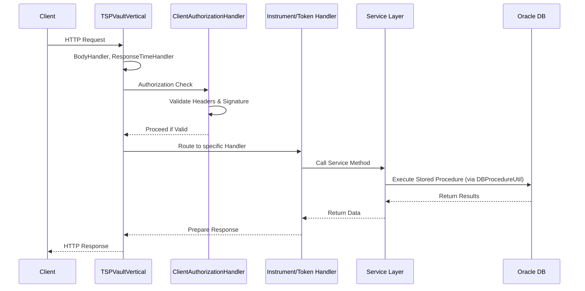

# System Overview

The TSP Vault is a tokenization service for payment instruments, built with Java and Vert.x. It acts as a secure vault for storing and managing sensitive payment data (instruments) and generating tokens for them.

## Core Components

### 1. Entry Point: `Main`
The `Main` class serves as the application entry point. It is responsible for:
- Loading configuration from `app.properties` using `TemplateProcessor`.
- Initializing the `HikariCP` connection pool for the Oracle database.
- Configuring static service classes (`ClientService`, `InstrumentService`, `TokenService`, `OneSMService`).
- Setting up application-wide constants and cache settings.
- Bootstrapping the `TSPVaultServer` with the `TSPVaultVertical`.

### 2. Server: `TSPVaultServer`
`TSPVaultServer` manages the Vert.x instance lifecycle.
- It implements `Runnable` and starts a new thread to initialize the Vert.x environment.
- Configures the `VertxOptions` with worker pool size, event loop size, and thread check intervals.
- Deploys the `TSPVaultVertical` into the Vert.x instance.

### 3. Vertical: `TSPVaultVertical`
`TSPVaultVertical` extends `AbstractVerticle` and defines the HTTP routing and server configuration.
- Configures the HTTP server with host, port, TCP keep-alive, and idle timeouts.
- Sets up the Vert.x `Router` with global handlers and specific route handlers.
- **Global Handlers**:
  - `BodyHandler`: Parses request bodies.
  - `ResponseTimeHandler`: Adds response time headers.
  - `TimeoutHandler`: Handles request timeouts.
  - `RequestLoggingHandler`: Logs incoming requests.
  - `ClientAuthorizationHandler`: Validates client authorization (signature verification).
- **Route Handlers**: Maps specific HTTP methods and paths to handler classes for Instruments and Tokens.
- Includes a global `ExceptionHandler` for error handling and a `ResponseHandler` for final response formatting.

### 4. Services
Services encapsulate business logic and database interactions.

- **`InstrumentService`**: Manages payment instruments (credit cards, etc.).
  - Operations: `get`, `search`, `insert`, `update`, `delete`.
  - Uses `OneSMService` to encrypt/decrypt sensitive data and calculate HMACs.
  - Interacts with the database via `DBProcedureUtil` calling Oracle stored procedures.

- **`TokenService`**: Manages tokens representing instruments.
  - Operations: `generate`, `get`, `search`, `update`, `delete`.
  - `generate` creates a token based on instrument details (masking numbers, setting expiration).
  - Uses `TokenGenerator` for token number generation logic.

- **`ClientService`**: Manages client credentials and keys.
  - `getKey`: Retrieves the client's secret key for authorization verification.

- **`OneSMService`**: An external security module service integration.
  - Provides AES encryption (`encryptAES`), HMAC generation (`encryptHMAC`), and decryption (`decrypt`).
  - Uses `OneSMHttpClient` to communicate with the OneSM service.

### 5. Utilities
- **`DBProcedureUtil`**: A utility class for executing Oracle stored procedures. It handles parameter mapping (input/output), connection management, and result set processing.
- **`ApplicationCache`**: A Guava `LoadingCache` implementation to cache client keys (`ClientService.getKey`) to reduce database load during authorization checks.
- **`RoutePool`**: Contains constants for API route paths (e.g., `/instruments`, `/tokens`).

## Request Flow

The following diagram illustrates the request processing flow within the system:

Caption: Client->>Vertical: HTTP Request

## Configuration
Configuration is primarily handled via `app.properties`, which is processed by `TemplateProcessor`. Key configurations include:
- **Database**: JDBC URL, pool size, timeouts.
- **Server**: Host, port, worker pool settings.
- **Security**: Service name, region, algorithm for authorization.
- **Cache**: Size and timeout for the application cache.

## Dependencies
- **Vert.x**: Core framework for the HTTP server and asynchronous processing.
- **HikariCP**: JDBC connection pooling.
- **Oracle JDBC Driver**: Database connectivity.
- **Guava**: Caching implementation.
- **OneSM Client**: External security service integration.
