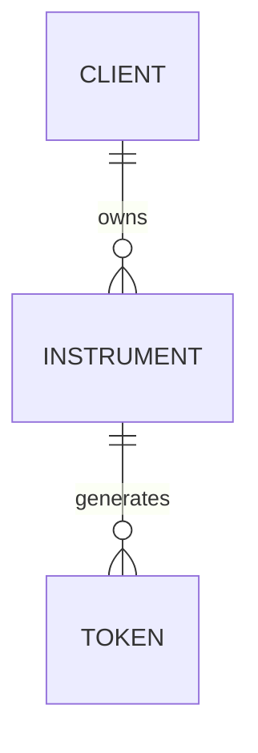

# Data Model

The TSP Vault data model is built around three primary entities: **Client**, **Instrument**, and **Token**. These entities are managed through Oracle database stored procedures invoked by the application services.

## Core Entities

### Client
Represents the service consumer (merchant or application) accessing the vault.

- **Client ID**: Unique identifier for the client.
- **Key**: An encryption key used by the client for authorization, retrieved via `ClientService.getKey`.

### Instrument
Represents a payment method (e.g., credit card, bank account) stored securely in the vault.

- **Instrument ID**: Unique identifier (`S_INSTRUMENT_ID`).
- **User ID**: The user who owns this instrument (`S_USER_ID`).
- **Type**: The type of instrument (`S_TYPE`), such as `card` or `np_card` (domestic bank card).
- **Name**: A descriptive name for the instrument (`S_NAME`).
- **Number**: The masked number (`S_NUMBER`), never storing the full PAN in plain text.
- **Expiry**: `N_MONTH` and `N_YEAR` representing the expiration date.
- **Billing Address**: Components like `S_BILLING_LINE1`, `S_BILLING_CITY`, etc.
- **Data**: Encrypted sensitive data (`S_DATA`) and additional data (`S_DATA_EXTRA`), decrypted on demand.
- **State**: Current lifecycle status (`S_STATE`).
- **Timestamps**: `D_CREATE` and `D_UPDATE`.

### Token
A secure, non-reversible representation of an Instrument used for transactions. Tokens are generated from Instruments and have their own lifecycle.

- **Token ID**: Unique identifier (`S_ID`).
- **Instrument ID**: The source instrument (`S_INSTRUMENT_ID`).
- **Token Number**: The generated token number (`S_NUMBER`).
- **ICVV**: A dynamic security code for the token (`S_ICVV`).
- **Expiry**: `N_EXP_MONTH` and `N_EXP_YEAR`.
- **State**: Current status (`S_STATE`).

## Entity Relationships

Caption: CLIENT ||--o{ INSTRUMENT : owns

- A **Client** owns multiple **Instruments**.
- An **Instrument** can generate multiple **Tokens** (e.g., for different devices or instances).

## Stored Procedures

All persistence is handled through Oracle stored procedures defined in `DBProcedurePool`.

### Client Procedures
- `PKG_CLIENT.client_get_key`: Retrieves the client's encryption key.

### Instrument Procedures
- `PKG_INSTRUMENT.instrument_get`: Retrieves instrument details.
- `PKG_INSTRUMENT.instrument_insert`: Creates a new instrument record.
- `PKG_INSTRUMENT.instrument_update`: Updates instrument details.
- `PKG_INSTRUMENT.instrument_update_state`: Updates the instrument's status.
- `PKG_INSTRUMENT.instrument_delete`: Soft deletes an instrument.
- `update_instrument_data` / `update_instrument_data_3`: Updates encrypted instrument data.

### Token Procedures
- `PKG_TOKEN2.token_get`: Retrieves token details.
- `PKG_TOKEN2.token_search`: Searches for tokens based on various criteria.
- `PKG_TOKEN2.token_insert`: Generates and stores a new token.
- `PKG_TOKEN2.token_update_state`: Updates the token's status.
- `PKG_TOKEN2.token_delete`: Deletes a token.
- `PKG_TOKEN2.token_search_by_user`: Finds all tokens for a specific user.

## State Lifecycle

Both Instruments and Tokens follow a defined state machine.

### Instrument States
- `created`: Initial state upon creation.
- `authorization_required`: Pending authorization.
- `approved`: Active and ready for use.
- `expired`: Past its validity period (e.g., card expiry).
- `locked`: Temporarily suspended.
- `deleted`: Soft deleted.

### Token States
Tokens generally inherit the state of their parent instrument but can also be independently managed (e.g., set to `deleted` or `expired`).

## Encryption and Security

- **Sensitive Data**: Instrument numbers and other sensitive fields are encrypted using AES (`OneSMService.encryptAES`) before storage.
- **Data Integrity**: An HMAC hash is generated for the instrument data to ensure integrity (`OneSMService.encryptHMAC`).
- **Decryption**: Data is decrypted only when requested (`OneSMService.decrypt`).
- **Masking**: Instrument numbers are masked (e.g., `**** **** **** 1234`) for storage and display.
