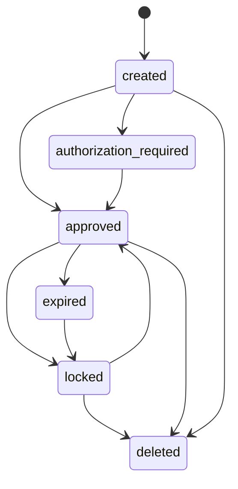

# Instrument Management

This document describes the lifecycle and operations for **Instruments** within the TSP Vault system. An Instrument represents a payment method, such as a credit card (`card`) or a domestic bank card (`np_card`).

## Lifecycle

Instruments follow a defined state machine managed by the system.



Caption: [*] --> created

### States

The `ResourceStates` class defines the possible states for an instrument:

*   **`created`**: Initial state when the instrument is first registered.
*   **`authorization_required`**: Pending authorization or verification.
*   **`approved`**: Active and ready for use (e.g., tokenization).
*   **`expired`**: Past its validity period (e.g., card expiry).
*   **`locked`**: Temporarily suspended.
*   **`deleted`**: Soft deleted (retained in history but inactive).

### State Transitions

*   **Creation**: Instruments are typically created in the `created` or `approved` state, depending on configuration (specifically the `token.reserved` flag).
*   **Tokenization**: If `token.reserved=true` (configured via `app.properties`), a token is automatically generated upon instrument creation if the instrument state is `approved`.
*   **Update**: The state can be updated via the PATCH endpoint. State changes can cascade to associated Tokens (e.g., locking an instrument may lock its tokens).

## Operations

The `InstrumentService` provides the core business logic, backed by Oracle stored procedures (`PKG_INSTRUMENT`).

### Creation (Insert)

1.  **Validation**: The handler validates the instrument type and number. For card types (`card`), it enforces regex validation on the number and requires valid expiry month (1-12) and year.
2.  **Encryption**:
    *   Sensitive data (card number, name, billing info) is assembled into a map.
    *   An HMAC hash is generated for data integrity using `OneSMService.encryptHMAC`.
    *   The data map is encrypted using AES via `OneSMService.encryptAES`.
3.  **Storage**: The masked number (e.g., `4111********1111`) and encrypted data blob are stored via `PKG_INSTRUMENT.instrument_insert`.
4.  **Token Reservation**: If `token.reserved` is true OR the instrument state is `approved`, a token is immediately generated via `TokenService.generate`.

### Retrieval (Get)

1.  **Direct Lookup**: Retrieve by `instrumentId`. The system calls `PKG_INSTRUMENT.instrument_get`.
2.  **Decryption**: If the `decrypt` flag is true (default for direct GET), the encrypted `S_DATA` blob is decrypted via `OneSMService.decrypt` to reveal sensitive details.
3.  **Search by Token**: Instruments can also be retrieved by searching for associated token numbers.

### Update (Patch)

1.  **State Update**: Updating the instrument state (e.g., to `approved` or `locked`) triggers a lookup of associated tokens. If tokens exist and are not expired/locked/deleted, their state is updated to match.
2.  **Data Update**: Partial updates to instrument data (e.g., name, expiry) are handled by re-encrypting the modified data map and updating the database record.
3.  **Extra Data**: The handler supports updating `instrumentDataExtra`, which is also encrypted and stored.

### Deletion (Delete)

1.  **Soft Delete**: The system performs a logical deletion by updating the instrument state to `deleted` via `PKG_INSTRUMENT.instrument_delete`. The record is retained for audit and history.

## Security & Validation

### Card Number Validation

The `InstrumentPostHandler` validates card numbers using a regex pattern matching common card schemes (Visa `4`, Mastercard `5`, Amex `34/37`, JCB `35`, UnionPay `62`):

```java
if (type.equalsIgnoreCase(InstrumentTypes.CARD) && number.matches("(4|5|2|35|34|37)\\d+")) {
    // Validate expiry month and year
}
```

### Expiry Validation

*   **Month**: Must be between 1 and 12.
*   **Year**: Must be a positive integer.

### Data Protection

*   **At Rest**: Sensitive instrument data is encrypted using AES (`OneSMService`).
*   **Integrity**: Data integrity is ensured via HMAC signatures (`OneSMService`).
*   **Masking**: Stored card numbers are masked (e.g., BIN + last 4 digits) to minimize exposure.

## Token Reservation

The "Token Reservation" feature allows a token to be generated immediately when an instrument is created, bypassing the need for a separate tokenization request later. This is controlled by the `token.reserved` configuration flag in `app.properties`.

*   **Flow**:
    1.  Instrument is inserted with state `approved`.
    2.  If `token.reserved` is true, `TokenService.generate` is called immediately.
    3.  The generated token is returned in the response payload alongside the instrument details.

## API Endpoints

Instruments are managed via the following RESTful endpoints under the base path `/tspvault/api/v1`:

| Method | Path                  | Handler                  | Description                      |
| :----- | :-------------------- | :----------------------- | :------------------------------- |
| `POST` | `/instruments`        | `InstrumentPostHandler`  | Create a new instrument.         |
| `GET`  | `/instruments/:id`    | `InstrumentGetHandler`   | Retrieve instrument details.     |
| `GET`  | `/instruments`        | `InstrumentGetHandler`   | Search instruments (by token).   |
| `PATCH`| `/instruments/:id`    | `InstrumentPatchHandler` | Update instrument state or data. |
| `DELETE`| `/instruments/:id`    | `InstrumentDeleteHandler`| Soft delete an instrument.       |
| `GET`  | `/user/instruments`   | `InstrumentListHandler`  | List instruments for a user.     |
| `PATCH`| `/tokens/:id/instruments`| `UpdateInstrumentHandler`| Update instrument data via token ID. |

## References

*   **Service Layer**: `InstrumentService` handles core logic and DB interaction.
*   **Handlers**: `InstrumentPostHandler`, `InstrumentGetHandler`, `InstrumentPatchHandler`, `InstrumentDeleteHandler`, `UpdateInstrumentHandler`.
*   **Security**: `OneSMService` (AES/HMAC).
*   **Tokenization**: `TokenService`.
