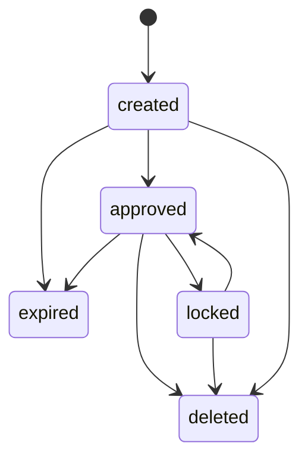
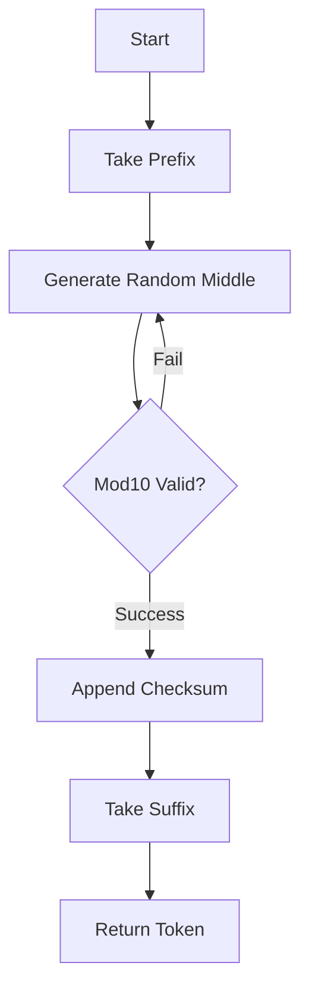
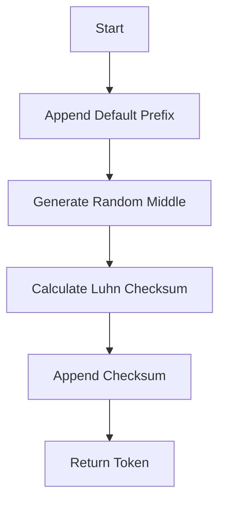
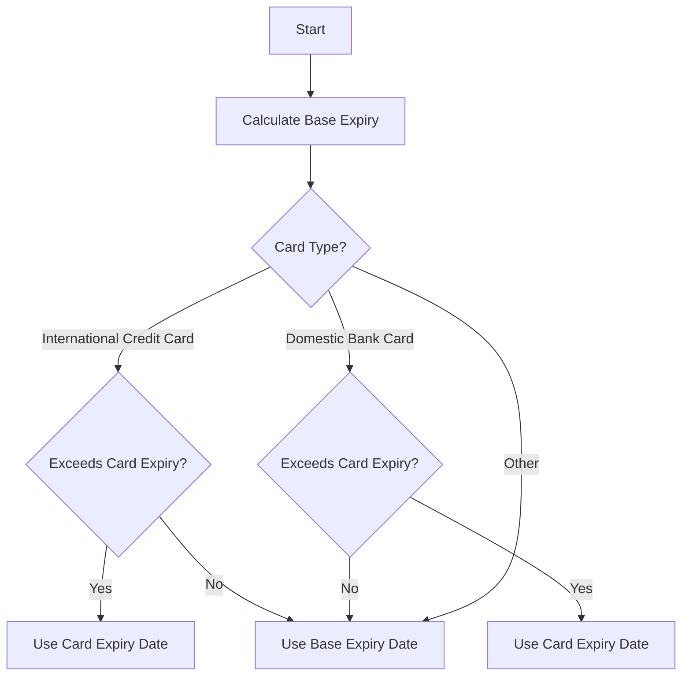

# Tokenization

Tokenization in the TSP Vault system creates secure, non-reversible representations (**Tokens**) of sensitive payment **Instruments** (e.g., credit cards, bank accounts). This process allows transactions to be processed without exposing actual payment credentials.

## Token Lifecycle

Tokens follow a state machine independent of, but often linked to, their parent Instruments.

Caption: [*] --> created

### States

Tokens share the same state definitions as Instruments (`ResourceStates`):

*   **`created`**: Initial state upon generation.
*   **`approved`**: Active and ready for transaction use.
*   **`expired`**: Past its validity period (based on the instrument's expiry or a configured token lifetime).
*   **`locked`**: Temporarily suspended (e.g., if the parent instrument is locked).
*   **`deleted`**: Soft deleted.

### State Transitions

*   **Generation**: Tokens are created in `created` or `approved` state. If the parent instrument is `approved`, the token is typically immediately `approved`.
*   **Expiration**: Tokens are automatically marked as `expired` upon retrieval if their expiry date has passed.
*   **Instrument Linkage**: Changing an Instrument's state (e.g., locking or deleting) cascades to its Tokens.

## Token Generation Algorithm

Token numbers are generated using two distinct algorithms based on the instrument type. This logic resides in `TokenGenerator`.

### 1. Card Tokens (Credit/Debit)

For standard cards (`InstrumentTypes.CARD`), the token number preserves the original card's structure to pass basic validation checks while replacing the middle digits.

Caption: A[Start] --> B[Take Prefix]

*   **Structure**: `Prefix + Random Middle + Checksum + Suffix`
*   **Prefix/Suffix**: Preserves the first `N` and last `M` digits of the original card number (configurable via `token.number.prefix.length` and `token.number.suffix.length`).
*   **Checksum**: A **Mod10 (Luhn)** check digit is calculated to ensure the token number is valid according to standard card validation rules.

### 2. Account Tokens (Bank Accounts)

For non-credit card instruments (e.g., `np_card` or accounts), the token is a purely random number with a calculated checksum.

Caption: A[Start] --> B[Append Default Prefix]

*   **Structure**: `Prefix + Random Digits + Checksum`
*   **Prefix**: A fixed default prefix defined by `token.number.prefix.default`.
*   **Length**: The total length is fixed by `token.number.length.default`.
*   **Checksum**: Uses the **Luhn algorithm** (`getLuhnChecksumNumbers`) to calculate the final check digit.

## Expiration Logic

Token expiration is determined by `generateTokenExpiredDate` and checked on retrieval.

Caption: A[Start] --> B[Calculate Base Expiry]

*   **Base Expiry**: Calculated as current date + `token.expiration.month`.
*   **Card Limit**: For international and domestic cards, if the calculated token expiry exceeds the card's actual expiry, the token is set to expire on the **same date as the card**. This ensures tokens do not outlive the funding source.
*   **On-Retrieval Check**: When a token is requested via `TokenService.get`, the system checks `AppUtil.isExpired`. If true, the token state is updated to `EXPIRED` and returned as such.

## Dynamic CVV Generation

Tokens can generate dynamic security codes (iCVV) for transaction authorization using `TokenCvvGenerator`.

*   **Algorithm**: HMAC-SHA256.
*   **Input**: Token Number, Expiry, Sequence Number, and Pay Time.
*   **Output**: A 4-digit dynamic CVV.

## API Endpoints

Tokens are managed via the following endpoints under `/tspvault/api/v1`:

| Method | Path | Handler | Description |
| :--- | :--- | :--- | :--- |
| `POST` | `/tokens` | `TokenPostHandler` | Generate tokens for instruments. |
| `GET` | `/tokens/:id` | `TokenGetHandler` | Retrieve a specific token. |
| `GET` | `/tokens` | `TokenGetHandler` | Search tokens (by user/instrument). |
| `PATCH` | `/tokens/:id` | `TokenPatchHandler` | Update token state (lock/unlock). |
| `DELETE` | `/tokens/:id` | `TokenDeleteHandler` | Delete a token. |
| `DELETE` | `/user/:id/tokens` | `UserTokenDeleteHandler` | Delete all tokens for a user. |
| `GET` | `/user/:id/tokens` | `UserTokenListHandler` | List all tokens for a user. |

## Configuration

Key configuration properties in `app.properties`:

*   `token.reserved`: If `true`, automatically generates a token when an instrument is created/approved.
*   `token.number.prefix.length`: Length of the preserved card prefix.
*   `token.number.suffix.length`: Length of the preserved card suffix.
*   `token.number.prefix.default`: Fixed prefix for account tokens.
*   `token.number.length.default`: Fixed length for account tokens.
*   `token.expiration.month`: Base validity period in months.
