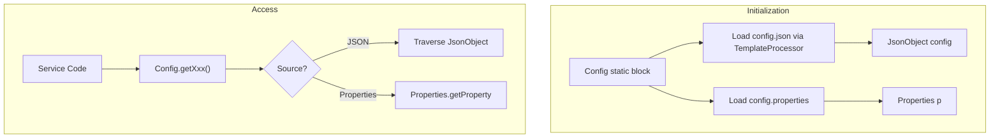

# Configuration System

WSP uses a centralized configuration system managed by `vn.onepay.wsp.Config`. This system enables the stateless HTTP gateway to connect to downstream services (MSP, ASP, TSP, PSP connectors) by providing endpoints, credentials, and operational parameters.

## Loading Mechanism

Configuration loading occurs during the static initialization of `Config.java`, which reads from the classpath.



Caption: A[Config static block] --> B[Load config.json via TemplateProcessor]
*Configuration loading and access flow.*

1.  **JSON Configuration**: `Config.java` reads `config.json` from the classpath. It uses `TemplateProcessor` to handle templating (e.g., resolving placeholders) before parsing the content into a Vert.x `JsonObject`.
2.  **Properties Configuration**: `config.properties` is loaded into a standard Java `Properties` object.
3.  **Validation Configuration**: `validation.yaml` is loaded by `Validation.java` (not `Config`) to define field validation rules.

> **Note**: While the page history and overview mention environment-based selection (dev vs CICD), current evidence in `Config.java` shows it always loads `config.json`. Environment-specific configuration is likely handled by providing different `config.json` files on the classpath during deployment.

## Accessing Configuration

The `Config` class provides static methods to retrieve values. It uses a dot-separated path notation to traverse the JSON hierarchy.

*   **JSON Access**: `Config.getString("server.port", 8000)` looks up `server` -> `port` in the `JsonObject`.
*   **Properties Access**: `Config.getProperties("bank.name", "default")` looks up keys in `config.properties`.
*   **Defaults**: All access methods accept a default value, which is returned if the key is missing.

```java
// Example access patterns in Config.java
public static String getMspUrl() {
    return getString("msp.url", "http://localhost/msp/api/v1");
}
public static String getProperties(String path, String def) {
    return p.getProperty(path, def);
}
```

## Configuration Sections

### Server Settings
Defines the WSP runtime environment.
*   `server.port`: HTTP listen port.
*   `server.uri_prefix`: Base path for external APIs.
*   `server.authorization`: Service identity for downstream calls.

### Downstream Services
Sections for each connector (ASP, MSP, TSP, etc.) containing:
*   `url`: Service base URL.
*   `timeout`: Connection timeout.
*   `access_key_id` / `secret_access_key`: Credentials.
*   `region` / `service`: Authorization metadata.

### Operational Parameters
*   `config.properties`: Contains bank-specific logic (card formats, validation regexes).
*   `validation.yaml`: Maps merchants to validation profiles (e.g., `general`, `shopify`).

## Overrides and Security

*   **System Properties**: Values can be overridden at runtime using `-D` flags (e.g., `-Dserver.port=9000`), allowing secure injection of secrets in containerized environments.
*   **Sensitive Data**: Credentials are stored in configuration files. In production, these files are managed securely outside the repository (or via `configCICD.json` if applicable).
