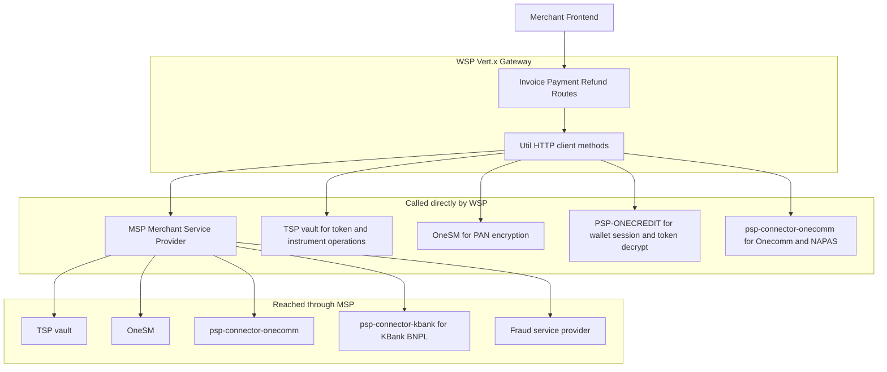

# WSP Architecture Overview

WSP (Website Service Provider) is a Vert.x-based HTTP API gateway that acts as the central orchestration layer for payment processing. It translates merchant-facing invoice and payment APIs into calls to downstream services, including MSP (Merchant Service Provider), ASP (Acquirer Service Provider), TSP (Token Service Provider), and various PSP (Payment Service Provider) connectors.

WSP does not have its own database layer; instead, it proxies and transforms requests to downstream services which handle data persistence.

## System Diagram

Caption: Client[Merchant Frontend] --> WSP
*System diagram: WSP is a stateless gateway with no payment database of its own. It calls MSP for invoices, payments and refunds, TVSP directly for BIN and token operations, OneSM directly for PAN encryption, PSP-ONECREDIT for Apple Pay session and token decryption, and psp-connector-onecomm for Onecomm and NAPAS. MSP in turn drives TVSP, OneSM, psp-connector-onecomm, psp-connector-kbank and the fraud service provider.*

## Startup Sequence

The application startup process is defined in `Main.main()` and `Server.start()`:

1.  **Initialization (`Main.main`)**:
    *   Loads configuration from `config.properties`.
    *   Validates configuration using `Validation.loadConfig()`.
    *   Deploys the `Server` verticle using a `Vertx` instance.

2.  **Server Setup (`Server.start`)**:
    *   **Client Creation**: Initializes `httpClient` (plain) and `httpsClient` (HTTP/2 with SSL/TLS and ALPN support) for downstream communication.
    *   **Mail Client**: Creates a `MailClient` for sending help emails (configured via `Config.getHelpMailConfig()`).
    *   **Router Configuration**: Initializes a Vert.x `Router` and defines URI prefixes (e.g., `/paygate/api/v1`).
    *   **Health Checks**: Registers `HealthCheckHandler` with custom logic (`HealthCheckService`).
    *   **Route Registration**: Registers global handlers (`BodyHandler`, `logRequest`, `failureResponse`, `metricsMiddleware`) and specific route handlers for invoices, payments, refunds, and other payment lifecycle events.
    *   **Server Start**: Starts the HTTP server on the configured port (`Config.getServerPort()`).

## Request Flow

All incoming requests follow a layered pipeline:

1.  **BodyHandler**: Parses the request body (JSON or form data).
2.  **logRequest**: Logs the request method, URI, headers, and body.
3.  **failureHandler**: Handles errors and returns structured JSON error responses.
4.  **metricsMiddleware**: Tracks active connections, request counts, response times, and error rates using `ApplicationMetrics`.
5.  **Route-Specific Handler**: Executes the business logic (e.g., `InvoiceService::create`).
6.  **Util.sendResponse**: Sends the final JSON response back to the client.

## Core Runtime Components

*   **Vert.x HttpClient**: Used for synchronous and asynchronous communication with MSP, ASP, TSP, and PSP connectors. Supports HTTP/1.1 and HTTP/2.
*   **MailClient**: Used for sending customer help emails (e.g., for HomeCredit).
*   **CircuitBreaker**: Provides resilience for downstream calls, preventing cascading failures. Configured with timeouts, retry policies, and notification handlers (`OpenHandler`, `CloseHandler`, `HalfOpenHandler`).
*   **HealthCheckHandler**: Exposes a `/health-check` endpoint that aggregates status from WSP itself and downstream services (e.g., MSP).
*   **ApplicationMetrics**: Tracks runtime metrics like request count, average response time, and error rate.

## Configuration

Configuration is managed via `Config.java`, which reads from `config.json` (or `configCICD.json` for non-dev environments) and `config.properties`. It provides access to:
*   Server settings (port, URI prefixes).
*   Downstream service URLs and credentials (MSP, ASP, TSP, PSP connectors).
*   Database settings (for legacy Oracle DB integration).
*   Mail and notification settings.
*   Circuit breaker parameters.

## Build and Release

The project is built using Maven. The `pom.xml` defines dependencies and configuration, including Vert.x 3.9.2 and Netty 4.1.52.Final. Tests are skipped by default via the `<skipTests>true</skipTests>` property in the POM.

1.  **Build Preparation**: The `1_prepare_build.sh` script handles the build process:
    *   Cleans the build directory.
    *   Clones or updates the binary repository.
    *   Executes `mvn clean package` (skipping tests).
    *   Filters artifacts from `target/` to `bin/tmp`.
    *   Syncs artifacts to the binary repository directory using `meld`.

2.  **Release**: The `2_push_release.sh` script handles the release:
    *   Checks for changes in the binary repository.
    *   Commits changes with a detailed message including source branch and commit info.
    *   Pushes the commit to the remote repository.

## Key Integrations

WSP integrates with a wide range of downstream services to support various payment methods and workflows:

*   **MSP (Merchant Service Provider)**: Core service for invoice and payment management.
*   **ASP (Acquirer Service Provider)**: Handles acquiring side operations.
*   **TSP (Token Service Provider)**: Manages tokenization for secure payments.
*   **PSP Connectors**: Specific integrations for payment providers like OneCredit, OneComm, KBank, HomeCredit, Kredivo, VNPTMoney, ViettelQR, Apple Pay, Google Pay, Samsung Pay, Amigo, UPOS, ViettelPay, ZaloPay, and SmartPay.
*   **Oracle DB**: Legacy database integration (commented out in recent versions but historically present).
*   **SMS Service**: For sending OTPs and notifications.
*   **ONESM**: For service management and monitoring.

## Legacy and Migration

WSP includes several migration paths and legacy support features:
*   **Migration Service**: Handles redirection and data migration from older systems (ONECREDIT, ONECOMM).
*   **VPC API**: Supports legacy VPC (Virtual Payment Client) APIs for "Big Merchants" (e.g., captures, refunds, voids).
*   **NAPAS OTP**: Supports NAPAS authorization flows.

## Testing and Resilience

*   **Circuit Breaker**: Prevents cascading failures by stopping requests to failing downstream services.
*   **Retry Policy**: Implements retry logic for transient failures (configurable per connector).
*   **Health Checks**: Monitors the health of WSP and its dependencies.
*   **Metrics**: Provides observability into request processing and error rates.
