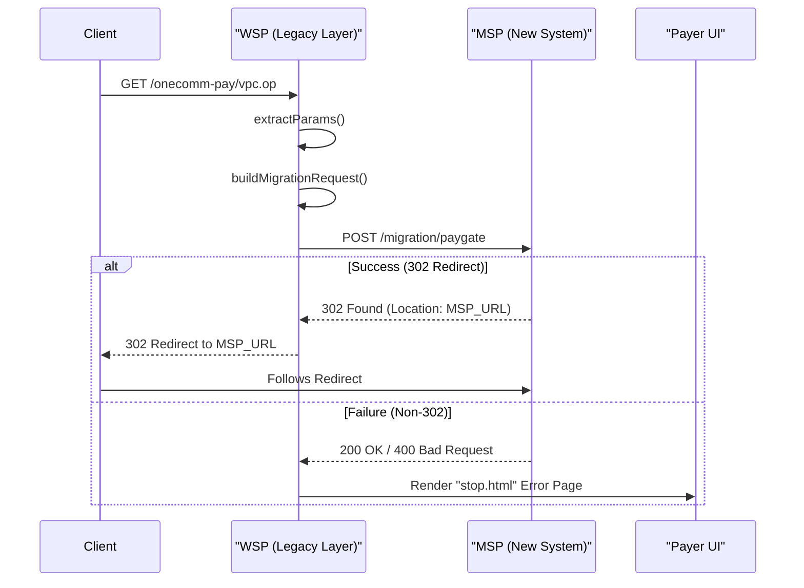

This page documents the migration layer in `vn.onepay.wsp.resources.migration.onecommweb`. This layer is responsible for handling requests from the legacy ONECOMM payment gateway and redirecting or adapting them for the modern payment service provider (MSP).

## Overview

The `onecommweb` package implements a compatibility layer that preserves backward compatibility with the legacy ONECOMM API. It intercepts requests destined for the old gateway, processes them, and redirects them to the appropriate MSP endpoints where possible.

This is crucial for maintaining existing merchant integrations while migrating to the new backend architecture.

## Key Components

The migration layer consists of several handler classes and utility components:

1.  **Handlers**:
    *   `Vpc`: Handles `vpc.op` GET requests (legacy payment initiation).
    *   `Vpcpost`: Handles `vpcpost.op` POST requests (legacy payment form submission).
    *   `Vpcdps`: Handles `Vpcdps.op` requests (legacy Dispute Resolution queries).
    *   `Traveloka`: Handles `traveloka.op` requests (Traveloka-themed payment initiation).
    *   `Refund`: Handles `refund.op` POST requests (legacy refund initiation).

2.  **Utilities**:
    *   `OnecommWebUtils`: Shared helper methods for parameter extraction, request building, localization, and error page rendering.
    *   `TcbTransactionConfirm`: Handles Techcombank transaction confirmations (`techresponse.op`).
    *   `SacombankTransactionConfirm`: Handles Sacombank transaction confirmations (`sacombankfrontendconfirm.op`) and cancellations.

3.  **Templates**:
    *   The system uses `stop.html` and `redirect.html` templates via Thymeleaf to render error pages or intermediate states, ensuring a consistent user experience even when errors occur.

## How Legacy ONECOMM Calls are Redirected/Handled

The primary flow involves intercepting legacy requests, validating them (where necessary), and attempting to redirect them to the MSP.

Caption: Client->>WSP: GET /onecomm-pay/vpc.op
*Legacy ONECOMM migration flow: WSP translates the legacy request and posts it to MSP, relaying the redirect or rendering the localized stop page.*

### Detailed Flow

1.  **Interception**: Vert.x routes (defined in `Server.java`) direct legacy requests (e.g., `/onecomm-pay/vpc.op`) to the corresponding handler (e.g., `Vpc`).

2.  **Parameter Extraction**: Handlers use `OnecommWebUtils.extractParams()` to gather request parameters from the URL query string or form body.

3.  **Request Translation**: `OnecommWebUtils.buildMigrationRequest()` transforms the legacy parameters into a JSON format suitable for the MSP migration endpoint (`/migration/paygate`).

4.  **Redirection/Proxying**:
    *   **VPC/Traveloka**: The handler posts the translated request to the MSP. If the MSP returns a 302 redirect (indicating a successful migration and redirection URL), the handler passes this redirect back to the client.
    *   **Refund**: The handler posts the refund request directly to the MSP refund endpoint (`/vpc/merchant/{id}/refunds/{ref}`).
    *   **Vpcdps**: This handler currently proxies the request directly to `ClientRequest.queryDR` (likely an existing ONECOMM service client) rather than the new MSP migration endpoint, as noted in the code comments ("placeholder implementation").

5.  **Error Handling**:
    *   If the MSP call fails or returns an unexpected status code, the handler falls back to rendering a localized error page.
    *   `OnecommWebUtils.renderStopPage()` detects the user's locale (defaulting to English) and renders `onecomm-web/stop.html` with localized messages from `Payment.properties` (English) or `Payment_vi.properties` (Vietnamese).

## Bank-Specific Confirmation Flows

Certain banks require specific callback handling, which is implemented in dedicated classes within the migration package.

### Techcombank (TCB)
*   **Endpoint**: `GET /onecomm-pay/techresponse.op`
*   **Handler**: `TcbTransactionConfirm`
*   **Logic**: Extracts parameters and calls `ClientRequest.bankConfirm()` with `request_type: TCB_CONFIRM`. On success, it redirects the user to the merchant's `merchant_url`.

### Sacombank
*   **Endpoints**:
    *   `POST /onecomm-pay/sacombankfrontendconfirm.op` (Confirm)
    *   `GET /onecomm-pay/sacombankcancel.op` (Cancel)
*   **Handler**: `SacombankTransactionConfirm`
*   **Logic**:
    *   **Confirm**: Calls `ClientRequest.bankConfirm()` with `request_type: SACOMBANK_FRONTEND_CONFIRM`. On success, redirects to the provided `redirect_url`.
    *   **Cancel**: Calls `ClientRequest.bankConfirm()` with `request_type: SACOMBANK_CANCEL`. Handles the cancellation response and redirects accordingly.

## Configuration and Localization

The legacy layer relies on external property files for localization:

*   **English**: `src/main/resources/onecomm-web/Payment.properties`
*   **Vietnamese**: `src/main/resources/onecomm-web/Payment_vi.properties`

These files contain messages for error pages, form labels, and validation messages. The system detects the locale via the `vpc_Locale` parameter or the `Accept-Language` header.

## Template Rendering

The system uses **Thymeleaf** for rendering HTML templates.

*   **Engine**: A `ThymeleafTemplateEngine` is initialized in `Server.java`.
*   **Caching**: A `StandardCacheManager` is used to cache compiled templates and expressions to improve performance.
*   **Templates**:
    *   `stop.html`: Displayed when a transaction fails or is invalid.
    *   Other templates in `vpcpay` and `onecomm-web` directories handle various redirection and payment form states.

This setup ensures that the legacy user interface remains functional and performant during the transition period.
