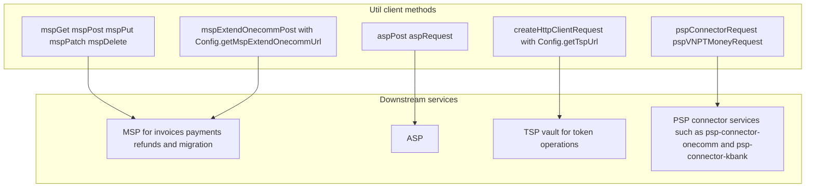

# Shared Utilities

WSP relies on a set of shared utility classes in `vn.onepay.wsp` that provide foundational capabilities for configuration, request handling, error processing, and data manipulation.

## Util Class

The `Util` class (`src/main/java/vn/onepay/wsp/Util.java`) is a comprehensive utility class that implements `IConstants` and `IErrors`. It provides:

### Date and Time Formatting

The class maintains thread-safe date formatters for standard date/time operations:

- **RFC1123 Format**: Used for HTTP header dates (`EEE, dd MMM yyyy HH:mm:ss z`)
- **ISO 8601 Format**: Used for internal timestamps (`yyyyMMdd'T'HHmmss'Z'` and `yyyy-MM-dd'T'HH:mm:ss'Z'`)

All formatting methods are synchronized to prevent concurrent modification issues with shared `DateFormat` instances.

### Cryptographic Operations

The utility provides cryptographic primitives used for secure communication:

- **RSA Operations**: `encryptRSA()` and `decryptRSA()` for asymmetric encryption
- **AES Operations**: `encryptAES()` and `decryptAES()` for symmetric encryption with automatic IV generation
- **HMAC Operations**: `hmacSha256()` for message authentication

### HTTP Client Utilities

The class provides a comprehensive set of HTTP client methods for communicating with downstream services:



Caption: Msp[mspGet mspPost mspPut mspPatch mspDelete]
*Util HTTP client methods: WSP talks to MSP for invoice, payment, refund and migration calls, to ASP, and to the PSP connector services (psp-connector-onecomm, psp-connector-kbank and the other connector endpoints) for payment creation; the TSP vault is reached through its own signed HTTP client calls.*

Each method handles:
- Request creation with proper authentication headers
- Authorization signature generation
- Response handling with error logging
- Timeout management

### Data Masking and Logging

The `mask()` method provides sensitive data masking for logging:

- **Card Numbers**: Masks middle digits, preserving first 6 and last 4
- **CVV**: Completely masks security codes
- **Phone Numbers**: Masks middle digits
- **Email Addresses**: Masks local part, preserving first and last characters

This masking is applied throughout the logging pipeline to prevent exposure of sensitive payment data.

### Validation Methods

The class provides validation utilities for:

- **Card Information**: `validateCardInfo()` validates card number format, expiration, and CVV
- **Invoice Information**: `validateInvoiceInfo()` validates VPC-style invoice parameters
- **Phone Numbers**: `validatePhoneNumber()` validates Vietnamese phone number formats
- **Email Addresses**: `checkEmail()` validates email format using regex

### Request/Response Helpers

- **Parameter Extraction**: `getRequestParams()` extracts query and body parameters
- **Response Sending**: `sendResponse()` and `sendVpcResponse()` for standardized response formats
- **Error Handling**: `failureResponse()` for global exception handling

## JsonObjectBuilder

The `JsonObjectBuilder` class (`src/main/java/vn/onepay/wsp/JsonObjectBuilder.java`) provides a fluent interface for constructing Vert.x `JsonObject` instances:

### Key Features

- **Fluent API**: Chain methods for readable JSON construction
- **Conditional Addition**: `put(boolean condition, String key, Object value)` only adds if condition is true
- **Null Safety**: `putNotNull()` and `putNotEmpty()` methods prevent null/empty values
- **Nested Builders**: Automatically flattens nested `JsonObjectBuilder` instances

### Usage Pattern

```java
JsonObject result = new JsonObjectBuilder()
    .put("status", "success")
    .putNotNull("message", optionalMessage)
    .putNotEmpty("data", nestedObject)
    .build();
```

## Configuration Management

### Config Class

The `Config` class (`src/main/java/vn/onepay/wsp/Config.java`) provides centralized configuration access:

- **JSON Configuration**: Reads from `config.json` with template processing
- **Properties Configuration**: Reads from `config.properties`
- **Dot-Path Navigation**: `Config.getString("server.port", 8000)` traverses JSON hierarchy

### ConfigProperties Class

The `ConfigProperties` class (`src/main/java/vn/onepay/wsp/ConfigProperties.java`) extends Apache Commons `PropertiesConfiguration`:

- **Auto-Reloading**: Implements `FileChangedReloadingStrategy` for automatic config updates
- **Singleton Pattern**: Provides `getInstance()` for global access
- **Fallback Mechanism**: Searches multiple classpath locations for properties files

## Error Handling Utilities

### ErrorExceptionUtil

The `ErrorExceptionUtil` class (`src/main/java/vn/onepay/wsp/ErrorExceptionUtil.java`) provides standardized error response formatting:

#### Error Response Format

All error responses follow this structure:

```json
{
  "error": {
    "name": "ERROR_NAME",
    "message": "Human-readable error message"
  },
  "merchant_name": "Merchant identifier",
  "order_info": "Order information",
  "merch_txn_ref": "Transaction reference",
  "create_time": "2025-11-04T11:45:00+07:00"
}
```

#### Special Error Handling

- **INVALID_INSTALLMENT_AMOUNT**: Includes `min_amount`, `max_amount`, and `amount` fields
- **Redirect Errors**: `redirectError()` sends HTTP 302 redirects to themed error pages
- **Locale Detection**: Extracts locale from `Referer` header or error details

#### Error Page Redirects

The utility provides specialized error page builders:

- `buildCustomerIntimeError()`: For customer timeout errors
- `buildInvalidCardListError()`: For card validation failures
- `buildInvalidInstallmentAmountError()`: For installment amount issues
- `buildDefaultError()`: Fallback for general errors

### ErrorExceptionExt

The `ErrorExceptionExt` class (`src/main/java/vn/onepay/wsp/ErrorExceptionExt.java`) extends the base `ErrorException` with:

- **Error Code Support**: Additional `code` field for machine-readable error codes
- **Transaction Context**: `E()` method enriches errors with merchant/order/transaction references

## Log Masking Converter

The `LogMaskingConverter` class (`src/main/java/vn/onepay/wsp/LogMaskingConverter.java`) is a Log4j2 plugin that automatically masks sensitive data in log messages:

- **Card Numbers**: Masks middle digits
- **CVV**: Completely masks security codes
- **Phone Numbers**: Masks middle digits
- **Email Addresses**: Masks local part
- **Token Numbers**: Masks middle digits

This converter is registered as a Log4j2 pattern converter and can be used in log format configurations.

## Constants Interface

The `IConstants` interface (`src/main/java/vn/onepay/wsp/IConstants.java`) defines shared constants used across the application:

- **HTTP Headers**: `CONTENT_TYPE`, `X_DATE`, `X_FORWARDED_FOR`
- **Response Codes**: `OK`, `CREATED`, `BAD_REQUEST`
- **Payment States**: `PENDING`, `PAID`, `NOT_PAID`, `CANCELED`
- **Field Names**: `INVOICE_ID`, `PAYMENT_ID`, `MERCHANT_NAME`

This interface ensures consistent naming across services and utilities.
