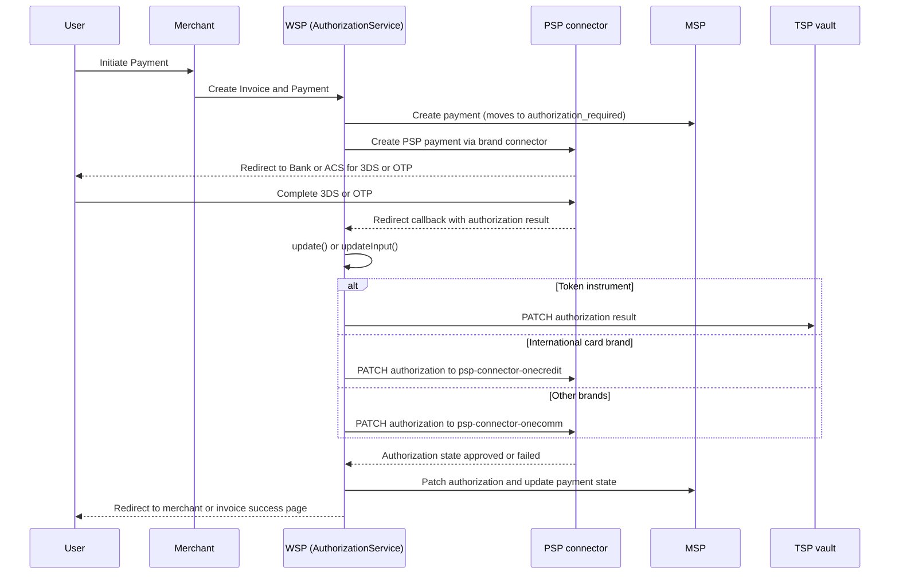

# Authorization and 3D Secure

The **Authorization** domain in the WSP application manages the critical verification phase of a payment transaction, specifically focusing on 3-D Secure (3DS) challenges, One-Time Password (OTP) verification, and state transitions between the Payment Service Provider (PSP), Merchant Service Provider (MSP), and the end-user interface.

## Core Responsibilities

1.  **Challenge Handling**: Processes callbacks from external 3DS Access Control Servers (ACS) and PSPs (e.g., MasterCard, Visa, NAPAS).
2.  **State Management**: Tracks authorization state (`created`, `approved`, `failed`, `expired`) and ensures consistency between internal MSP records and external PSP responses.
3.  **Redirection Logic**: Manages the complex redirection flow where users move from the merchant site to the bank/PSP and back to the WSP invoice page.
4.  **Input Verification**: Handles the submission of verification data like OTPs (`vpc_Otp`) and authorization IDs.

## Key Components

### AuthorizationService
The central service class (`src/main/java/vn/onepay/wsp/resources/authorization/AuthorizationService.java`) implements the core logic for:

*   **Updating Authorization Status** (`update`): Receives the final response from the PSP (often via a browser redirect or server-to-server call) and updates the internal state.
*   **Handling TSP (Token Service Provider) Updates** (`updateTsp`): Specific logic for token-based payment authorization.
*   **Processing Verification Input** (`updateInput`): Handles direct updates, typically from mobile SDKs or specific integrations (like Lazada), where the authorization result is posted directly.
*   **Migration Support** (`migrationVerifyOtp`): Supports legacy OTP verification flows for migrated systems.

### NapasAuthorization
A specialized handler (`src/main/java/vn/onepay/wsp/resources/authorization/NapasAuthorization.java`) designed for NAPAS (National Payment Corporation of Vietnam) OTP challenges. It renders a specific HTML template (`napas_template.html`) for the user to enter their OTP.

## Authorization Flow

Caption: User->>Merchant: Initiate Payment
*Authorization callback flow: the confirmation target is chosen from the instrument brand, so a token instrument is patched to the TSP vault, international brands go to psp-connector-onecredit, and everything else (including NAPAS domestic cards) goes to psp-connector-onecomm; the final state is always written back to MSP.*

### 1. Challenge & Callback (`update`)
This is the most common flow for web-based 3DS.
1.  **Entry**: `POST /authorizations/:authorization_id` or `GET /authorizations/:authorization_id`.
2.  **Validation**: Checks if the authorization is already in a final state (`approved`, `failed`, `canceled`, `expired`). If so, it redirects to the invoice page to prevent duplicate processing.
3.  **PSP Interaction**: Forwards the callback parameters (like `vpc_3DSstatus`, `vpc_TxnResponseCode`) to the PSP via a `PATCH` request to confirm the result, targeting the TSP vault for token instruments, `psp-connector-onecredit` for international brands, and `psp-connector-onecomm` otherwise.
4.  **Processing**:
    *   If **Approved/Failed**: Updates the MSP payment record with settlement details or failure reasons.
    *   **Token Handling**: If a token update is required, it propagates this to the MSP.
    *   **Redirection**: Returns an HTML page that auto-submits a form to the `merchant_return_url` (for seamless redirect) or redirects to the invoice page.

### 2. Direct Input (`updateInput`)
Used for integrations where the PSP result is received via a different channel (e.g., mobile app) and posted directly to WSP.
1.  **Entry**: `PATCH /authorizations/:id` with JSON body containing the result.
2.  **OTP Timeout Check**: Verifies if the OTP has timed out by patching the MSP authorization state.
3.  **Forwarding**: Sends the input directly to the PSP (`/authorizations/:id` PATCH).
4.  **Result Handling**: Similar to the update flow, updates MSP and returns the result.

### 3. NAPAS OTP (`NapasAuthorization`)
Specific to NAPAS domestic transactions.
1.  **Entry**: `POST /napasauth` or `POST /auth`.
2.  **Rendering**: Renders an HTML form for the user to enter their OTP.
3.  **Submission**: The form likely submits back to `updateInput` or a similar endpoint to verify the OTP.

## State Management & Invariants

*   **Idempotency**: The `update` method checks for final states before processing to prevent double-spending or overwriting a settled transaction.
*   **Expiration**: Checks `expire_time` on the invoice. If expired, the transaction is failed immediately without hitting the PSP again.
*   **MSP Synchronization**: The WSP acts as a bridge. It *must* ensure the MSP (internal ledger) is updated to reflect the PSP's final decision before redirecting the user.

## Tests

Unit tests are located in `src/test/java/vn/onepay/wsp/resources/authorization/AuthorizationServiceTest.java`.

*   **Coverage**:
    *   `isFinalPaymentState`: Verifies state detection logic (`approved`, `failed`, `canceled`, `expired` return true; others false).
    *   `isInvoiceExpiredTime`: Tests the expiration logic with various time scenarios (past, future, near-future).
*   **Running Tests**:
    *   Tests are skipped by default in the Maven build (`pom.xml` has `<skipTests>true</skipTests>`).
    *   To run them explicitly: `mvn test -DskipTests=false`.

## Error Handling

*   **Timeouts**: Handled specifically to prevent locking transactions. Timeouts result in a `TRANSACTION_TIMEOUT` error redirect.
*   **PSP Errors**: If the PSP returns a non-200 status or a failure state, the user is redirected to an error page or the invoice with an error message.
*   **Exceptions**: Global exception handling (`Util::failureResponse`) catches unexpected errors and ensures the user is always redirected to a safe state (merchant or invoice page).
