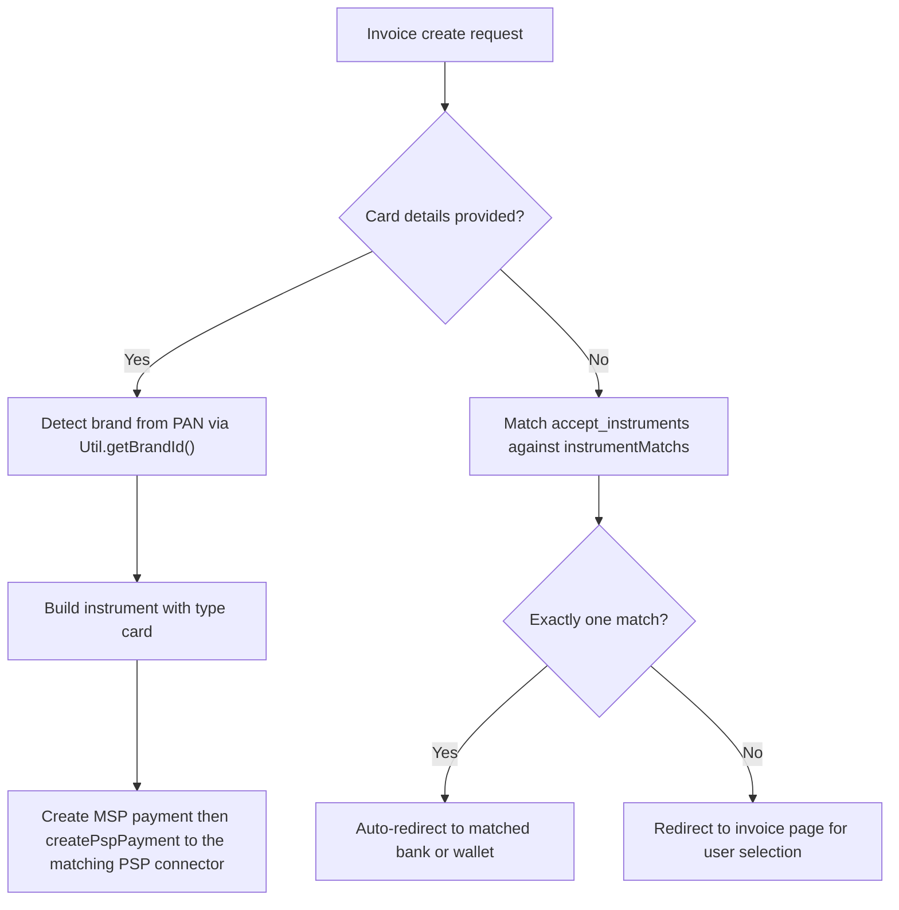

# Card Brands and Instrument Types

The gateway represents each payment method as an **instrument** object (`Instrument`) containing a `type` (the instrument category), an `issuer` object with a `brand` (network or method identifier) and optional `swiftCode` (bank SWIFT/BIC), plus card-specific fields like `number`, `month`, `year`, and `cvv`. This page documents how brands are detected, how BIN prefixes map to Vietnamese bank ATM routing via NAPAS, and the full set of supported instruments.

## Instrument Type Taxonomy

The `type` field in the instrument JSON distinguishes the broad category of the payment method. The main types are:

| Type | Meaning | Example |
|---|---|---|
| `card` | International or local card processed through standard card networks | Visa, Mastercard, JCB, Amex, CUP, PayPal |
| `np_card` | Vietnamese domestic ATM card routed through NAPAS (National Payment Services) | BIDV, Techcombank, Vietcombank via NAPAS |
| `ewallet` | Mobile/electronic wallet | MOMO (`MSERVICE` issuer) |
| `vnptmoney` | VNPT Money wallet | VNPTMONEY |
| `viettelpay_account` | ViettelPay account | VIETTELPAY ATM route |
| `techcombank_account` | Techcombank internet banking | Techcombank ATM |
| `dongabank_account` | DongA Bank internet banking | DongABank ATM |
| `vib_account` | VIB internet banking | VIB ATM |
| `applepay` | Apple Pay token | Underlying card brand |
| `googlepay` | Google Pay token | Underlying card brand |

Some types appear only in specific invoice services. The Google Pay and Apple Pay flows use the `APPLEPAY` and `GOOGLEPAY` identifiers in their `instrumentMatchs` maps (e.g., `APPLEPAY` → `"applepay;;applepay;"`), while the standard `InvoiceService` focuses on card and e-wallet types.

## Card Brand Detection

### Regex-Based Brand Detection (Card Number)

`Util.getBrandId()` (and its duplicate in `Vpc2DInvoiceService`) identifies the card network from the primary account number (PAN):

| Regex | Brand ID | Network |
|---|---|---|
| `(34\|37)[0-9]{13}` | `amex` | American Express |
| `62([0-9]{14}\|[0-9]{17})` | `cup` | China UnionPay |
| `35[0-9]{14}` | `jcb` | JCB |
| `(2\|5)[0-9]{15}` | `mastercard` | Mastercard |
| `4[0-9]{15}` | `visa` | Visa |

A companion helper, `Util.getCardByNumber()`, returns the short brand code (`VC`, `MC`, `JC`, `AE`, `CUP`) used in the `instrumentMatchs` map.

Evidence: `repo://src/main/java/vn/onepay/wsp/Util.java#L1249-L1263`, `repo://src/main/java/vn/onepay/wsp/Util.java#L1292-L1306`.

### Brand-to-Instrument Mapping (instrumentMatchs)

The static `instrumentMatchs` map in `InvoiceService` (and its copies in `HomeCreditInvoice`, `GooglePayInvoice`) translates brand codes and BIN prefixes into the `type;issuer;brand;` prefix pattern used in regex-based instrument matching against the merchant's `accept_instruments` configuration.

**Card brands and wallets:**

| Key | Instrument Pattern | Brand/Method |
|---|---|---|
| `VC` | `card;;visa;` | Visa |
| `MC` | `card;;mastercard;` | Mastercard |
| `JC` | `card;;jcb;` | JCB |
| `AE` | `card;;amex;` | American Express |
| `CUP` | `card;;cup;` | China UnionPay |
| `PAYPAL` | `;;paypal;` | PayPal |
| `MOMO` | `ewallet;MSERVICE;momo;` | MoMo e-wallet |
| `ZALOPAY` | `;;zalopay;` | ZaloPay |
| `SMARTPAY` | `;;smartpay;` | SmartPay |
| `VIETTELPAY` | `viettelpay_account;;atm;` | ViettelPay |
| `VNPTMONEY` | `vnptmoney;VNPTMONEY;atm;` | VNPT Money |
| `mPAYvn` | `;;mpayvn;` | mPAYvn |
| `bidvpayplus` | `card;;bidvpayplus;` | BIDV PayPlus |
| `MyVIB` | `card;;myvib;` | MyVIB |

**Google Pay invoice service** also adds: `APPLEPAY` → `applepay;;applepay;`.

Evidence: `repo://src/main/java/vn/onepay/wsp/resources/invoice/InvoiceService.java#L52-L135`, `repo://src/main/java/vn/onepay/wsp/resources/googlepay/GooglePayInvoice.java#L39-L57`.

## BIN-Based Vietnamese Bank ATM Routing (NAPAS)

### BIN Prefix Mapping

The `instrumentMatchs` map doubles as a BIN lookup table. Vietnamese bank ATM cards are identified by the first 6–7 digits of the card number (the BIN/IIN). Each BIN maps to a semicolon-delimited pattern `type;swiftCode;brand;currency`. BINs ending in `1` (e.g., `9704181`) indicate NAPAS-routed domestic ATM cards (`np_card`), while the base BIN (e.g., `970418`) indicates the standard bank ATM route.

| BIN Prefix | Instrument Pattern | Bank | Route |
|---|---|---|---|
| `970418` | `card;BIDVVNVX;atm;` | BIDV | Standard ATM |
| `9704181` | `np_card;BIDVVNVXNP;atm;` | BIDV | NAPAS |
| `970407` | `techcombank_account;VTCBVNVX;atm;` | Techcombank | Internet Banking |
| `9704071` | `np_card;VTCBVNVXNP;atm;` | Techcombank | NAPAS |
| `970406` | `dongabank_account;EACBVNVX;atm;` | DongA Bank | Internet Banking |
| `9704061` | `np_card;EACBVNVXNP;atm;` | DongA Bank | NAPAS |
| `970441` | `vib_account;VNIBVNVX;atm;` | VIB | Internet Banking |
| `9704411` | `np_card;VNIBVNVXNP;atm;` | VIB | NAPAS |
| `970436` | `card;BFTVVNVX;atm;` | Vietcombank | Standard ATM |
| `9704361` | `np_card;BFTVVNVXNP;atm;` | Vietcombank | NAPAS |
| `970403` | `card;SGTTVNVX;atm;` | Sacombank | Standard ATM |
| `9704031` | `np_card;SGTTVNVXNP;atm;` | Sacombank | NAPAS |
| `970432` | `card;VPBKVNVX;atm;` | VPBank | Standard ATM |
| `9704321` | `np_card;VPBKVNVXNP;atm;` | VPBank | NAPAS |
| `970427` | `card;VNACVNVX;atm;` | VietinBank | Standard ATM |
| `9704271` | `np_card;VNACVNVXNP;atm;` | VietinBank | NAPAS |
| `970429` | `card;SACLVNVX;atm;` | Sacombank | Standard ATM |
| `9704291` | `np_card;SACLVNVXNP;atm;` | Sacombank | NAPAS |
| `970415` | `card;ICBVVNVX;atm;` | ICBC Vietnam | Standard ATM |
| `9704151` | `np_card;ICBVVNVXNP;atm;` | ICBC Vietnam | NAPAS |
| `970425` | `card;ABBKVNVX;atm;` | AB Bank | Standard ATM |
| `9704251` | `np_card;ABBKVNVXNP;atm;` | AB Bank | NAPAS |
| `970437` | `card;HDBCVNVX;atm;` | HD Bank | Standard ATM |
| `9704371` | `np_card;HDBCVNVXNP;atm;` | HD Bank | NAPAS |
| `970443` | `card;SHBAVNVX;atm;` | SHB | Standard ATM |
| `9704431` | `np_card;SHBAVNVXNP;atm;` | SHB | NAPAS |
| `970454` | `card;VCBCVNVX;atm;` | VCBC | Standard ATM |
| `9704541` | `np_card;VCBCVNVXNP;atm;` | VCBC | NAPAS |

Additional NAPAS-only BINs (no standard counterpart in the map):

`9704001` (SBITVNVXNP), `9704081` (GBNKVNVXNP), `9704091` (NASCVNVXNP), `9704121` (WBVNVNVXNP), `9704141` (OJBAVNVXNP), `9704161` (ASCBVNVXNP), `9704191` (NVBAVNVXNP), `9704211` (VRBAVNVXNP), `9704221` (MSCBVNVXNP), `9704231` (TPBVVNVXNP), `9704241` (SHBKVNVXNP), `9704261` (MCOBVNVXNP), `9704281` (NAMAVNVXNP), `9704301` (PGBLVNVXNP), `9704311` (EBVIVNVXNP), `9704331` (VNTTVNVXNP), `9704341` (IABBVNVXNP), `9704381` (BVBVVNVXNP), `9704391` (VIDPVNV5NP), `9704401` (SEAVVNVXNP), `970448` / `9704481` (ORCOVNVX/NP), `9704491` (LVBKVNVXNP), `9704521` (KLBKVNVXNP), `9704571` (HVBKVNVXNP), `9704581` (UOVBVNVXNP).

Evidence: `repo://src/main/java/vn/onepay/wsp/resources/invoice/InvoiceService.java#L68-L135`.

### InstrumentService.lookup()

`InstrumentService.lookup()` proxies a token/instrument lookup request to the MSP (Merchant Service Provider) backend at the configured `/vpc/instruments/` endpoint. It accepts VPC-style query parameters (`vpc_Command=lookup`, `vpc_Merchant`, `vpc_AccessCode`, `vpc_MerchTxnRef`, `vpc_Customer_Id`, `vpc_TokenNum`, `vpc_TokenExp`, `vpc_SecureHash`), validates the secure hash format (64-character hex), and forwards the GET request to MSP with a 60-second timeout. The MSP response JSON is returned directly to the caller.

Evidence: `repo://src/main/java/vn/onepay/wsp/resources/instrument/InstrumentService.java#L59-L115`.

### InstrumentService.getBinCountry()

`InstrumentService.getBinCountry()` provides BIN-based country detection via the `GET /checkbin/:bin_num` endpoint. It first tries an exact match on the full 8-digit BIN against a properties file (`bin_us_gb_ca.properties` loaded via `ConfigProperties`), then falls back to a 6-digit prefix match. The lookup returns a JSON response with the `bin_num` and `bin_country` code (e.g., `"US"`, `"VN"`).

Evidence: `repo://src/main/java/vn/onepay/wsp/resources/instrument/InstrumentService.java#L32-L57`, `repo://src/main/java/vn/onepay/wsp/Server.java#L330`.

### InstrumentService.transformOPNapas()

`transformOPNapas()` switches an instrument between OnePay (OP) and NAPAS routing based on the merchant's `accept_instruments` regex patterns. When the iframe switch card flow (`IFRAME_SWITCH_CARD`) is used, this method checks whether the `accept_instruments` pattern matches the NAPAS variant (e.g., `card;BFTVVNVXNP;atm;VND`) or the standard OP variant (e.g., `card;BFTVVNVX;atm;VND`) and updates the instrument `type` and issuer `swiftCode` accordingly. This is used for merchants like AMWAY that support both OP and NAPAS domestic ATM card routes.

Evidence: `repo://src/main/java/vn/onepay/wsp/resources/instrument/InstrumentService.java#L117-L153`, `repo://src/main/java/vn/onepay/wsp/resources/invoice/InvoiceService.java#L758-L762`.

## Wallet Integrations (Dedicated Services)

Samsung Pay, Apple Pay, and Google Pay each have dedicated service classes and request formats, separate from the standard VPC invoice flow.

### Samsung Pay

`SamSungPayTransaction` validates incoming Samsung Pay payment requests. The instrument must include `method` (must be `"3DS"`), `recurring_payment` (boolean), `card_brand` (restricted to `"MC"`, `"mastercard"`, `"VI"`, `"visa"`), `card_last4digits` (4 digits), and a `3DS` prototype object containing `type`, `version`, and `data`. Samsung Pay transactions are processed through the OneSM client.

Evidence: `repo://src/main/java/vn/onepay/wsp/resources/samsung/SamSungPayTransaction.java#L34-L80`.

### Apple Pay

`PaymentServiceApple.create()` handles Apple Pay payment creation. It decrypts the Apple Pay token via the PSP (OneCredit) at `/applepay-tokens`, extracts the underlying card details (`applicationPrimaryAccountNumber`, expiration, cardholder name), and determines the PSP routing based on `s_card_type`: Visa and Mastercard go to `ONECREDIT`, while Napas cards are routed separately. The instrument type is set to `applepay` with the underlying card brand as the `brand.id`.

Evidence: `repo://src/main/java/vn/onepay/wsp/resources/applepay/PaymentServiceApple.java#L27-L60`.

### Google Pay

`GooglePayInvoice.create()` handles Google Pay invoice creation. The Google Pay token (`googlePayData`) is decrypted via the PSP at `/googlepay-tokens`. After decryption, the flow splits on `authMethod`: `PAN_ONLY` tokens follow the standard MSP/PSP payment creation path, while DPAN (device PAN) tokens are processed through a dedicated Google Pay MSP endpoint. The `instrumentMatchs` map in `GooglePayInvoice` includes an `APPLEPAY` entry (`"applepay;;applepay;"`) alongside the standard card brands.

Evidence: `repo://src/main/java/vn/onepay/wsp/resources/googlepay/GooglePayInvoice.java#L39-L57`, `repo://src/main/java/vn/onepay/wsp/resources/googlepay/GooglePayInvoice.java#L174-L216`.

## Instrument Matching in Invoice Creation

When a new invoice is created through `InvoiceService.create()`, the system determines the available payment instruments by matching the invoice's `accept_instruments` patterns against the `instrumentMatchs` map. Each merchant's `accept_instruments` configuration contains regex patterns that define which `type;swiftCode;brand;` combinations are allowed for that merchant and currency.

The matching loop iterates over all entries in `instrumentMatchs`, appending the invoice currency to each value pattern, and tests it against every `accept_instruments` regex. When exactly one instrument matches and card details are not provided, the system auto-redirects to the corresponding bank or wallet (e.g., DongA Bank internet banking, Techcombank, VIB, PayPal, ViettelPay, MOMO, VNPTMoney).

Caption: A[Invoice create request] --> B{Card details provided?}
*Invoice creation instrument resolution flow: when card details are supplied, WSP creates the MSP payment first and then calls createPspPayment, which routes to the matching PSP connector service.*

When card details are provided, `getBrandId()` identifies the card network, and the instrument is created with `type: "card"` and the detected brand. For international cards, the flow proceeds through `PaymentService.createMspPayment()` and then `PaymentService.createPspPayment()`. For domestic ATM cards via NAPAS, `InstrumentService.transformOPNapas()` may adjust the routing before payment creation.

## Relationship to Invoice States

The instrument type and brand influence how the invoice transitions through its lifecycle. Payments requiring 3D Secure authorization (international cards, certain domestic banks) result in an `authorization_required` state with an approval link. Payments that can be completed immediately (e.g., e-wallets, some internet banking) may jump directly to `approved` or `failed`. See [Invoice States](/openwiki/concepts/invoice-states.md) for the full state machine.
