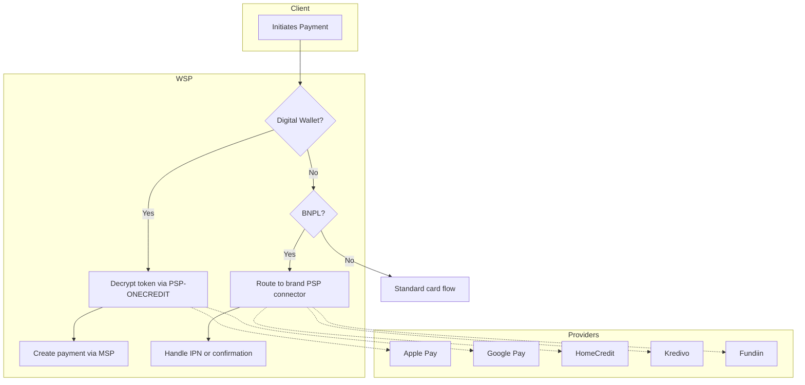

# Digital Wallets and Buy Now Pay Later (BNPL)

This document details the digital wallet payment methods and Buy Now Pay Later (BNPL) integrations supported by the WSP application. It covers the processing of Apple Pay, Google Pay, and Samsung Pay, as well as instrument management for digital wallets and BNPL providers like HomeCredit, Kredivo, and Fundiin.

## Overview

The WSP application facilitates payments using various digital instruments beyond traditional cards. These include:

*   **Digital Wallets**: Apple Pay, Google Pay, and Samsung Pay.
*   **BNPL Providers**: HomeCredit, Kredivo, and Fundiin.
*   **Tokenized Payments**: Instrument lookup and management for recurring or saved payments.

These methods are handled through specialized service classes that manage the unique requirements of each provider, such as token decryption, session creation, and specific routing to Payment Service Providers (PSPs) or Merchant Service Providers (MSPs).

## Digital Wallet Payment Methods

### Apple Pay

Apple Pay payments are processed via the `PaymentServiceApple` class. The flow involves creating a session, decrypting the Apple Pay token, and routing the payment to the appropriate PSP (ONECREDIT for international cards, ONECOMM for NAPAS cards).

**Key Components:**
*   **Session Creation**: Managed by `ApplePaySession` to initialize the Apple Pay session.
*   **Token Decryption**: Handled by `PspOnecreditRequest` which communicates with the PSP to decrypt the secure payment token.
*   **Payment Routing**: Based on the card brand (Visa, MasterCard, JCB vs. NAPAS), the payment is routed to either ONECREDIT or ONECOMM PSP.

**Flow:**
1.  Merchant creates an Apple Pay session.
2.  Client (Apple device) initiates payment.
3.  WSP receives encrypted token and forwards it to PSP for decryption (`/applepay-tokens`).
4.  Upon successful decryption, WSP constructs a payment request and sends it to the MSP (`/applepay-payments`).
5.  MSP processes the payment and returns the result.

### Google Pay

Google Pay payments are handled by `PaymentServiceGoogle`. Similar to Apple Pay, it involves token decryption and routing, but with specific handling for Google Pay's `PAN_ONLY` and `CRYPTOGRAM_3DS` authentication methods.

**Key Components:**
*   **Token Decryption**: Uses `PspOnecreditRequest` to decrypt Google Pay tokens via `/googlepay-tokens`.
*   **Instrument Preparation**: Constructs the instrument object with Google-specific data like `cryptogram` and `eciIndicator`.
*   **Payment Creation**: For `PAN_ONLY` methods, it uses the standard `PaymentService.createGooogle`. For `CRYPTOGRAM_3DS`, it creates a specific Google Pay payment via MSP (`/googlepay-payments`).

**Flow:**
1.  Merchant initiates Google Pay payment.
2.  WSP receives the Google Pay token.
3.  WSP decrypts the token via PSP (`/googlepay-tokens`).
4.  Based on `authMethod` (PAN_ONLY vs. CRYPTOGRAM_3DS), WSP routes to either standard payment creation or specific Google Pay payment creation endpoint.

### Samsung Pay

Samsung Pay integration follows a similar pattern, handled by `SamSungPayTransaction`. The flow is standard for digital wallets: receive token -> decrypt via PSP -> create payment via MSP. It specifically supports 3DS flow initiated by the Samsung device.

## Merchant Decrypt Flow

The `DigitalWalletMerchantDecrypt` class provides a generic endpoint for processing digital wallet payments where the merchant performs the decryption or handling. This endpoint accepts a form-urlencoded request containing the digital wallet instrument data (e.g., Apple Pay token or Google Pay token).

**Endpoint:** `POST /vpc/merchants/:merchant_id/digital-wallet/:merchTxnRef`

**Process:**
1.  Validates request parameters and invoice info.
2.  Encodes the request body (including the instrument) into `merchant_data` using Base64.
3.  Forwards the encoded data to the MSP via `POST /vpc/merchants/:merchantId/digital-wallet/:merchantTxnRef`.
4.  The MSP handles the decryption and processing, returning the transaction result to WSP, which then forwards it to the merchant.

## Buy Now Pay Later (BNPL)

BNPL payments allow customers to pay for goods/services in installments. WSP supports multiple BNPL providers, each integrated as a specific instrument type.

**Supported Providers:**
*   **HomeCredit**: Instrument type `bnpl` with brand `homecredit`.
*   **Kredivo**: Instrument type `bnpl` with brand `kredivo`.
*   **Fundiin**: Instrument type `bnpl` with brand `fundiin`.

**Processing Logic:**
BNPL payments are identified by `instrument.type = "bnpl"` and a specific `brand.id`.
*   **Routing**: BNPL payments are routed to their respective PSP connectors (e.g., `psp-connector-kredivo`, `psp-connector-fundiin`).
*   **Confirmation**: Providers like Kredivo and Fundiin require specific confirmation flows (IPN - Instant Payment Notification) which are handled by `KredivoService` and `FundiinService`.
*   **Instrument Mapping**: `InstrumentService.transformOPNapas` handles the mapping of instrument types, including identifying BNPL instruments.

Caption: A[Initiates Payment]
*Digital wallet and BNPL routing: WSP decrypts wallet tokens through PSP-ONECREDIT, creates the payment in MSP, and routes BNPL instruments to their brand-specific PSP connector such as psp-connector-kredivo or psp-connector-fundiin.*

## Instrument Management

The `InstrumentService` and `InstrumentCache` provide utilities for managing payment instruments, including looking up BIN (Bank Identification Number) information to determine card origin and mapping instrument types to their respective PSPs.

*   **BIN Lookup**: `getBinCountry` retrieves the country associated with a card BIN.
*   **Instrument Transformation**: `transformOPNapas` adjusts instrument types (e.g., distinguishing between OnePay and NAPAS cards) based on merchant configuration.

## Configuration

Provider-specific configurations are managed in `Config.java`, including URLs, credentials, and timeouts for each PSP connector (e.g., `psp-connector-kredivo`, `psp-connector-fundiin`).
