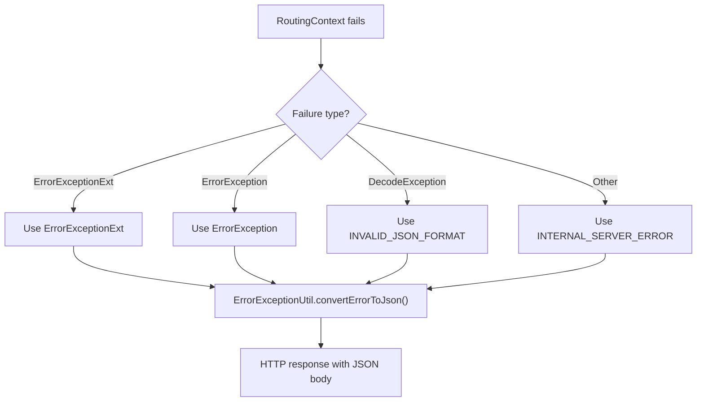
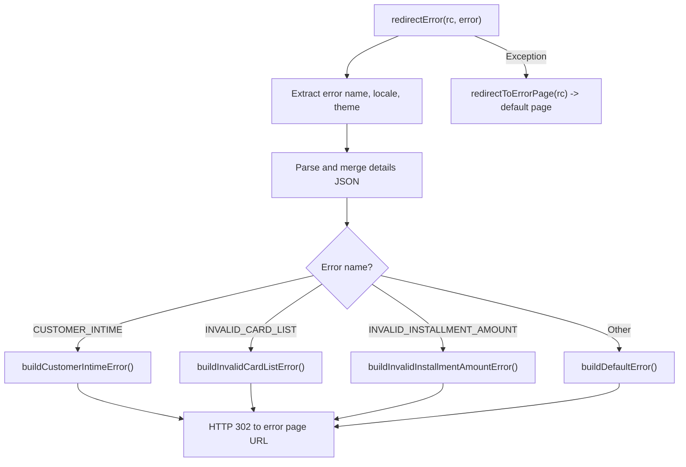

# Error Codes and Handling

This page documents how the WSP payment gateway handles errors, formats error responses for API clients, and renders error pages for end-users. The system defines standard error types via an external `IErrors` interface (from the `vn.onepay.error` dependency), extends them for application-specific needs (`ErrorExceptionExt`), and routes failures through a centralized response formatter (`ErrorExceptionUtil`).

## Error Types and Definitions

The gateway uses a hierarchy of error objects defined in the external `vn.onepay:error` dependency and extended locally:

### External Error Types (IErrors / ErrorException)

The `IErrors` interface provides static `ErrorException` constants representing standard HTTP error conditions. These are imported and used directly throughout the codebase.

| Error Constant | HTTP Status | Description |
|---|---|---|
| `INTERNAL_SERVER_ERROR` | 500 | Generic server-side failure, used as the default fallback when no specific error is available. |
| `VALIDATION_ERROR` | 400 | Client request failed validation (missing fields, invalid format, business rule violation). |
| `INVALID_JSON_FORMAT` | 400 | Request body is not valid JSON. |

Evidence: `repo://src/main/java/vn/onepay/wsp/Util.java#L239-L258`

### Extended Application Errors

Services throw domain-specific `ErrorException` instances by name. Key error names include:

| Error Name | Context | Description |
|---|---|---|
| `VALIDATION_ERROR` | Invoice creation, authorization, installment | Invalid request parameters. |
| `INTERNAL_SERVER_ERROR` | Any service | Unexpected failure. |
| `FRAUD` | Payment processing | PSP flagged the transaction as fraudulent. |
| `TRANSACTION_TIMEOUT` | Payment processing | PSP or bank response timed out. |
| `CUSTOMER_INTIME` | PSP callback | Customer session timed out or expired during 3DS. |
| `INVALID_CARD_LIST` | Instrument selection | Card BIN not supported by the merchant/invoice. |
| `INVALID_INSTALLMENT_AMOUNT` | Installment validation | Requested installment amount outside allowed range. |
| `INVALID_INSTALLMENT_BIN` | Installment validation | Card BIN not eligible for installments. |
| `INVALID_INSTALLMENT_FEE` | Installment validation | Calculated installment fee mismatch. |
| `INVALID_INSTALLMENT_CARD_TYPE` | Installment validation | Card type (Visa/MC/etc.) not accepted for this installment plan. |
| `INVALID_INSTALLMENT_TERM` | Installment validation | Requested installment term not configured. |
| `INVALID_INSTALLMENT_SWIFTCODE` | Installment validation | Bank SWIFT code not supported for installments. |
| `INVALID_MERCHANT` | Invoice validation | Merchant not found or unauthorized. |
| `DECRYPT_TOKEN_ERROR` | Digital wallet | Token decryption failed (Apple/Google Pay). |

Evidence: `repo://src/main/java/vn/onepay/wsp/ErrorExceptionUtil.java#L69-L74`, `repo://src/main/java/vn/onepay/wsp/ErrorExceptionUtil.java#L133-L149`

## Error Object Extension

`ErrorExceptionExt` extends the base `ErrorException` with an additional `code` field for application-specific error codes.

**Fields:**
- Inherits: `statusCode`, `name`, `message`, `informationLink`, `details`
- Added: `code` (application-specific string code)

**Key Methods:**
- `toJson()`: Serializes the error to a JSON string with fields: `name`, `message`, `information_link`, `details`, `code`.
- `E(error, merchantName, orderInfo, merchTxnRef)`: Static factory that enriches an `ErrorException` with transaction context (merchant name, order info, merchant transaction reference) by merging these into the `details` JSON field.

Evidence: `repo://src/main/java/vn/onepay/wsp/ErrorExceptionExt.java#L1-L88`

## JSON Error Response Formatting

`ErrorExceptionUtil.convertErrorToJson()` transforms an `ErrorException` into a standardized JSON response object.

### Response Structure

```json
{
  "error": {
    "name": "VALIDATION_ERROR",
    "message": "Invalid request"
  },
  "merchant_name": "ABC Store",
  "order_info": "ORDER12345",
  "merch_txn_ref": "optional value",
  "create_time": "2025-11-04T11:45:00+07:00"
}
```

For `INVALID_INSTALLMENT_AMOUNT` errors, additional fields are included:

```json
{
  "error": { "name": "INVALID_INSTALLMENT_AMOUNT", "message": "..." },
  "min_amount": 1000.0,
  "max_amount": 10000.0,
  "amount": 500.0,
  "merchant_name": "...",
  "order_info": "...",
  "merch_txn_ref": "...",
  "create_time": "..."
}
```

Evidence: `repo://src/main/java/vn/onepay/wsp/ErrorExceptionUtil.java#L29-L84`

### Processing Logic

1. Falls back to `INTERNAL_SERVER_ERROR` if the input error is `null`.
2. Parses `error.details` as JSON; if invalid, treats it as an empty object.
3. For `INVALID_INSTALLMENT_AMOUNT`, copies `min_amount`, `max_amount`, `amount` from details to the top-level response.
4. Copies `merchant_name`, `order_info`, `merch_txn_ref` from details to the top-level response.
5. Adds `create_time` as the current timestamp in ISO 8601 format.

Evidence: `repo://src/main/java/vn/onepay/wsp/ErrorExceptionUtil.java#L48-L84`

## Global Failure Handler

The Vert.x router is configured with `Util::failureResponse` as the global failure handler. This ensures that any unhandled exception or `rc.fail()` call produces a consistent JSON response.



Caption: RC[RoutingContext fails] --> CheckType{Failure type?}
*Figure 1: Global failure handling flow in Util.failureResponse.*

**Flow:**
1. Checks if the response is already closed/ended (prevents double-writes).
2. Inspects the exception type:
   - `ErrorExceptionExt`: Logged as such, used directly.
   - `ErrorException`: Logged as such, used directly.
   - `io.vertx.core.json.DecodeException`: Mapped to `INVALID_JSON_FORMAT`.
   - Any other `Throwable`: Mapped to `INTERNAL_SERVER_ERROR` (with full stack trace logging).
3. Converts the error to JSON via `ErrorExceptionUtil.convertErrorToJson()`.
4. Writes the HTTP response with the error's status code and `application/json` content type.

Evidence: `repo://src/main/java/vn/onepay/wsp/Util.java#L239-L269`

### Router Configuration

The failure handler is registered globally on the Vert.x router during server startup:

```java
router.route().failureHandler(Util::failureResponse);
```

Evidence: `repo://src/main/java/vn/onepay/wsp/Server.java#L132`

## Error Page Redirect Logic

For HTML-producing endpoints (VPC flow, form-based invoice creation), errors are handled by redirecting the end-user's browser to a themed error page instead of returning JSON.

### redirectError (ErrorExceptionUtil)

This is the primary redirect method for structured error objects. It is called by `InvoiceService`, `AuthorizationService`, `PaymentService`, and BNPL services.



Caption: Start[redirectErrorrc, error] --> Extract[Extract error name, locale, theme]
*Figure 2: Error redirect routing based on error type.*

**Process:**
1. Extracts `name`, `theme`, and `locale` from the error object.
2. Determines locale from the HTTP `Referer` header query string, falling back to `error.locale`.
3. Merges any JSON `details` into the top-level error object.
4. Dispatches to a builder method based on error name.
5. Performs an HTTP 302 redirect to the constructed URL.
6. On any exception, falls back to `redirectToErrorPage(rc)` (the default paygate error page).

Evidence: `repo://src/main/java/vn/onepay/wsp/ErrorExceptionUtil.java#L86-L162`

### Error Page URL Construction

Each builder method constructs a URL with query parameters containing the error context:

| Builder | Target Page | Key Parameters |
|---|---|---|
| `buildCustomerIntimeError` | `error?name=CUSTOMER_INTIME` | `code`, `locale`, `message`, `data`, `method`, `href` |
| `buildInvalidCardListError` | `error?name=INVALID_CARD_LIST` | `code`, `locale`, `merchant_name`, `order_info`, `merch_txn_ref` |
| `buildInvalidInstallmentAmountError` | `error?name=INVALID_INSTALLMENT_AMOUNT` | `locale`, `merchant_name`, `order_info`, `merch_txn_ref`, `min_amount`, `max_amount`, `amount` |
| `buildDefaultError` | `payment-error?error_name=...` | `error_name`, `locale`, `merchant_name`, `order_info`, `merch_txn_ref` |

The base URL is determined by:
1. **Theme-based**: `Config.getUserWebUrl(theme, null)` if a theme is set.
2. **Merchant-based**: `Config.getUserWebUrl(null, merchantId)` for merchant-specific error pages.
3. **Default**: `Config.getUserWebUrl()` (typically `https://onepay.vn/paygate/`).

Evidence: `repo://src/main/java/vn/onepay/wsp/ErrorExceptionUtil.java#L164-L245`, `repo://src/main/java/vn/onepay/wsp/Config.java#L575-L585`

### redirectToErrorPage (ErrorExceptionUtil)

Three overloads handle different redirect scenarios:

1. **`redirectToErrorPage(RoutingContext rc, JsonObject jParams)`**: Redirects to theme-specific or merchant-specific error page based on `vpc_Theme` and `vpc_Merchant` parameters.
2. **`redirectToErrorPageByMerchant(RoutingContext rc, String merchant)`**: Redirects to the merchant's configured error page URL.
3. **`redirectToErrorPage(RoutingContext rc)`**: Redirects to the default paygate error page.

Evidence: `repo://src/main/java/vn/onepay/wsp/ErrorExceptionUtil.java#L254-L297`

### Duplicate Redirect Helpers

Several service classes (`InvoiceService`, `InternationalInvoice`, `InvoiceEncryptCardService`) contain local copies of `redirectToErrorPage`, `redirectToErrorPageByMerchant`, and `redirectByLink` methods with the same logic. These are used in the VPC form-based flow where the context is slightly different (using `vpc_Theme` and `vpc_Merchant` request parameters).

Evidence: `repo://src/main/java/vn/onepay/wsp/resources/invoice/InternationalInvoice.java#L608-L654`

## Request Validation Errors

The `Validation` class performs regex-based request parameter validation against a YAML configuration (`validation.yaml`). Validation profiles are mapped to merchants.

**Error Handling:**
- On validation failure, the error message is set as `vpc_Message` with response code `7` (a legacy VPC code for validation errors).
- The user is redirected to the theme or merchant error page via `redirectToErrorPage(rc, requestParams)`.

Evidence: `repo://src/main/java/vn/onepay/wsp/resources/validation/Validation.java#L77-L108`

### Validation Configuration Structure

```yaml
merchants:
  TESTMCD: general
  TESTSHOPIFY: shopify
  default: general

profiles:
  get.invoices:
    general:
      vpc_Amount: "^([1-9][0-9]{0,11})$"
      vpc_Merchant: "^([a-zA-Z0-9.,_#+=() &!/:?;-]{1,20})$"
    shopify:
      vpc_Amount: "^([1-9][0-9]{0,11})$"
```

Evidence: `repo://src/main/resources/validation.yaml#L1-L50`

## Migration Error Handling

The VPC migration layer (`VpcpayUtils`, `OnecommWebUtils`) handles errors by rendering HTML templates:

1. **`VpcpayUtils.renderStopHtmlResponse()`**: Renders a "transaction expired or invalid" HTML page using the `stop.html` Thymeleaf template.
2. **`OnecommWebUtils.renderStopPage()`**: Similar functionality for ONECOMM-web migration endpoints.
3. **Deny page**: `VpcpayUtils` also supports rendering a `deny.html` template for blocked transactions.

These are used in the legacy VPC payment flow where the gateway communicates with the browser via HTML form submissions rather than JSON.

Evidence: `repo://src/main/java/vn/onepay/wsp/resources/migration/vpcpay/VpcpayUtils.java#L161-L204`

## Tests

### ErrorExceptionExt Tests

Located in `src/test/java/vn/onepay/wsp/ErrorExceptionExtTest.java`:
- `testToErrorExceptionPopulatesDetailsWithStrings`: Verifies that `E()` correctly populates `merchant_name`, `order_info`, and `merch_txn_ref` in the details JSON.
- `testToErrorExceptionHandlesDifferentObjectTypes`: Verifies that non-string types (integers, JSONObjects, booleans) are correctly handled in the details.

Evidence: `repo://src/test/java/vn/onepay/wsp/ErrorExceptionExtTest.java#L1-L46`

### ErrorExceptionUtil Tests

Located in `src/test/java/vn/onepay/wsp/ErrorExceptionUtilTest.java`:
- **Installment error tests**: Verify correct JSON output for `INVALID_INSTALLMENT_AMOUNT`, `INVALID_INSTALLMENT_BIN`, `INVALID_INSTALLMENT_FEE`, `INVALID_INSTALLMENT_CARD_TYPE`, `INVALID_INSTALLMENT_TERM`, `INVALID_INSTALLMENT_SWIFTCODE`.
- **Generic error tests**: Verify correct JSON output for generic errors with valid, invalid, and null details.
- **Locale extraction tests**: Verify `getLocaleFromReferer()` correctly parses the `locale` query parameter from various Referer URL formats, including edge cases (null, empty, invalid URI).

Evidence: `repo://src/test/java/vn/onepay/wsp/ErrorExceptionUtilTest.java#L1-L334`
