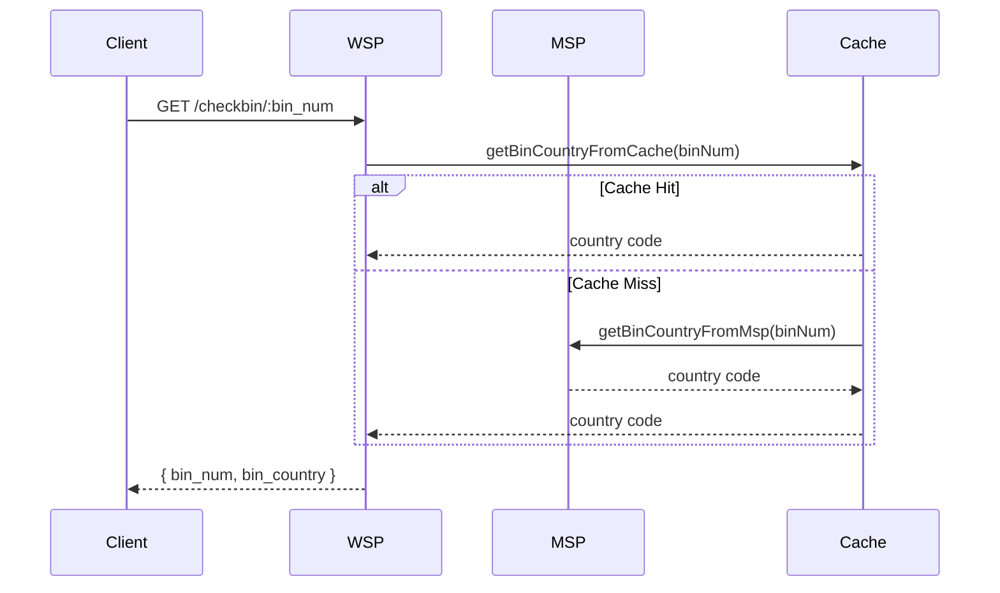
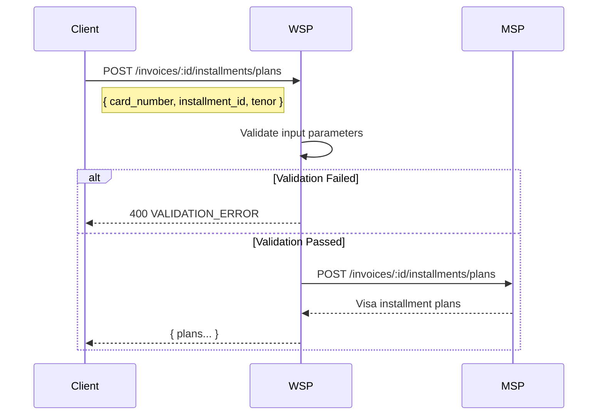

# Instruments and Tokenization

This page documents the instrument service, tokenization, card storage, and installment plan flows within the payment gateway system. It covers BIN validation, card lookups, installment invoice processing, and Visa installment plan queries.

## Instrument Service

The `InstrumentService` handles BIN validation, card lookup, and instrument transformation for payment processing.

### Key Responsibilities

- **BIN Validation**: Validates Bank Identification Numbers (BIN) for length (6-11 digits) and numeric content.
- **Country Detection**: Retrieves country codes from BINs using cached data or external MSP API calls.
- **Card Lookup**: Proxies token-based card lookup requests to the MSP service.
- **Instrument Transformation**: Adjusts instrument types (`card` vs `np_card`) based on merchant acceptance rules and Swift codes.

### API Endpoints

- `GET /checkbin/:bin_num`: Retrieves country code for a BIN.
- `GET /instruments/`: Proxies instrument lookup requests to MSP.

### Implementation Details

The `InstrumentService` utilizes `InstrumentCache` for caching BIN-country mappings with a 24-hour expiration. It validates input BINs and transforms instrument types based on merchant-specific acceptance patterns.

Caption: Client->>WSP: GET /checkbin/:bin_num
*BIN country lookup for GET checkbin: WSP serves from a 24-hour local cache and only calls MSP on a cache miss.*

## Installment Service

The `InstallmentService` manages installment plan queries and processing.

### Key Responsibilities

- **Invoice Installments**: Retrieves available installment options for a specific invoice.
- **Visa Installment Plans**: Queries Visa-specific installment plans based on card details.
- **Fee Calculation**: Calculates installment fees using conversion formulas.

### API Endpoints

- `GET /invoices/:invoice_id/installments`: Lists installment options for an invoice.
- `POST /invoices/:invoice_id/installments/plans`: Queries Visa installment plans.

### Visa Installment Plan Flow

The `getVisaInstallmentPlans` endpoint processes requests for Visa-specific installment plans. It validates input parameters (invoice ID, card number, installment ID) and forwards the request to the MSP service.

Caption: Client->>WSP: POST /invoices/:id/installments/plans
*Visa installment plan lookup: WSP validates the request and proxies the plan query to MSP.*

### Fee Calculation

The `getFeeAmountNetFee` method calculates installment fees based on the following formula:

$$
\text{Fee} = \frac{\text{Amount} \times \text{ICF}}{100 - \text{ICF} - \text{CF}}
$$

Where:
- **ICF**: Installment Conversion Fee
- **CF**: Commission Fee
- **PF**: Processing Fee (must equal ICF + CF)

## Instrument Cache

The `InstrumentCache` singleton manages BIN-country mappings using a Guava `LoadingCache` with 24-hour expiration.

### Implementation

- Uses double-checked locking for thread-safe singleton initialization.
- Loads BIN-country data from MSP on cache miss.
- Provides synchronous access via `getBinCountryFromCache`.

## Related Components

- **PaymentService**: Handles payment processing with instruments.
- **InvoiceService**: Manages invoice creation and lifecycle.
- **Server**: Configures routes for instrument and installment endpoints.

## Configuration

- **MSP Timeout**: Configured via `Config.getMspTimeout()`.
- **Supported Countries**: US, GB, CA (for AVS compatibility).
- **Cache Expiration**: 24 hours for BIN-country mappings.
