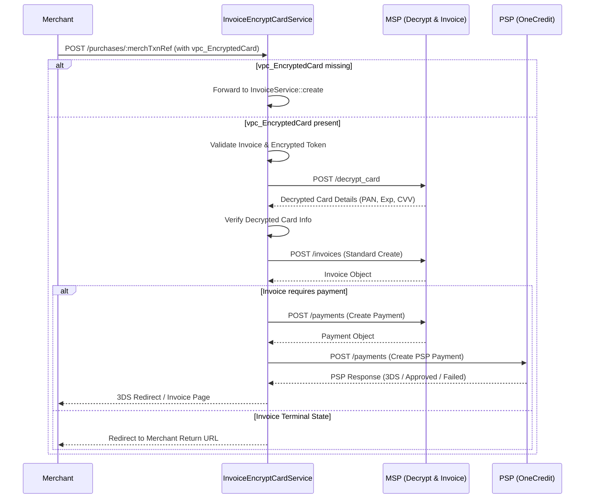

# Invoice Encrypted Card Service

The `InvoiceEncryptCardService` handles a specialized payment initiation flow for 2C2P where the merchant submits an encrypted card token (`vpc_EncryptedCard`) instead of raw card data. This service extends the standard invoice creation capabilities by adding a decryption step and specific validation for 2C2P encrypted payloads, eventually delegating to standard MSP and PSP creation paths.

## Responsibilities

The primary responsibilities of `InvoiceEncryptCardService` are:

1.  **Flow Detection**: Routing requests to either the encrypted card flow or the standard `InvoiceService` based on the presence of the `vpc_EncryptedCard` parameter.
2.  **Validation**: Ensuring the encrypted card token and standard invoice parameters (amount, command, version) are valid before proceeding.
3.  **Decryption**: Securely decrypting the card token via the MSP backend to retrieve sensitive card details (PAN, expiry, CVV) without them ever touching the merchant's server directly (via the WSP).
4.  **Payment Creation**: Orchestrating the creation of an MSP Payment and subsequently a PSP Payment, including handling 3D Secure redirects where applicable.
5.  **Instrument Handling**: Resolving payment instruments (cards, wallets, banks) based on the decrypted card data and merchant configuration.

## Entry Points

The service is exposed via a specific HTTP endpoint configured in `Server.java`:

*   **Endpoint**: `POST /paygate/vpc/v1/merchants/:id/purchases/:merchTxnRef`
*   **Consumes**: `application/x-www-form-urlencoded`
*   **Handler**: `InvoiceEncryptCardService::create`

```java
// repo://src/main/java/vn/onepay/wsp/Server.java#L255
router.post("/paygate/vpc/v1/merchants/:id/purchases/:merchTxnRef")
    .consumes(WWW_FORM_URLENCODED)
    .produces(TEXT_HTML)
    .handler(InvoiceEncryptCardService::create);
```

## Control Flow

The processing pipeline within `InvoiceEncryptCardService::create` follows these steps:



Caption: M->>WSP: POST /purchases/:merchTxnRef with vpc_EncryptedCard
*2C2P encrypted-card invoice flow: WSP asks MSP to decrypt the card, creates the invoice and payment in MSP, then creates the PSP payment and follows the 3DS redirect.*

### 1. Request Validation

Before initiating the flow, the service validates the request parameters using `validateInvoiceCardEncrypted`. This method enforces:
*   Presence and format of `vpc_EncryptedCard` (required, max 256 chars).
*   Valid `vpc_Version` (must be "2").
*   Valid amount rules based on command type (`authorize` vs `purchase`).
*   Billing address fields (optional but length-limited).
*   Custom `user_` fields.

If validation fails, the user is redirected to an error page with a specific `txnResponseCode`.

### 2. Card Decryption

The core differentiator of this service is the asynchronous decryption step.
1.  It constructs a request containing `merchantId` and `cardEncrypted`.
2.  It calls `mspPostDecryptCard` which sends a `POST` to the MSP's `/decrypt_card` endpoint.
3.  **Important**: The decrypted card data (PAN, expiry, security code) is transient in the WSP layer; it is injected into the request parameters (`CardNum`, `CardExpMonth`, etc.) to allow the subsequent `InvoiceService`-like logic to handle it as if it were a raw card submission, but is stripped or masked in logs.

```java
// repo://src/main/java/vn/onepay/wsp/resources/invoice/InvoiceEncryptCardService.java#L182-L192
JsonObject reqDecrypt = new JsonObject()
        .put("merchantId", jParams.getString("vpc_Merchant"))
        .put("cardEncrypted", jParams.getString("vpc_EncryptedCard"));
mspPostDecryptCard(rc, reqDecrypt.toBuffer())
        .onSuccess(jCardDecrypt -> {
            jParams.put("CardNum", jCardDecrypt.getString("number"));
            jParams.put("CardExpMonth", jCardDecrypt.getString("expiration_month"));
            // ... other fields
        });
```

### 3. Invoice & Payment Creation

Once decrypted:
1.  **Invoice Creation**: It calls the standard `mspPostCreateInvoice` (POST `/invoices`).
2.  **State Handling**: Upon receiving the Invoice response:
    *   **Terminal States** (Paid, Canceled, etc.): Redirects immediately.
    *   **Unpaid**: Proceeds to payment creation.
3.  **Payment Creation**: It composes a PSP request (`composeCreateMspPayment`) and calls `PaymentService.createPspPayment`.
4.  **3D Secure**: If the PSP requires authentication (`AUTHORIZATION_REQUIRED`), it retrieves the 3DS URL from the PSP response and redirects the user (`redirectByLink`).

## Instrument Mapping

The service utilizes a static `instrumentMatchs` map to resolve payment methods. While originally defined in `InvoiceService`, `InvoiceEncryptCardService` maintains its own copy (or relies on similar logic) to map BINs and card brands to internal instrument types (e.g., `card;;visa;`, `np_card;BFTVVNVXNP;atm;`).

This mapping is crucial for determining:
*   The `instrument_type` sent to the PSP.
*   The `issuer` details (Bank Swift Code, Brand Name).
*   Whether a specific bank integration (like NAPAS or 3D Secure specific flows) is required.

## Error Handling

*   **Decryption Failure**: If `mspPostDecryptCard` fails (network error, invalid token), the flow aborts and redirects to an error page.
*   **Validation Failure**: Specific error messages are passed to the error page via query parameters or standard error redirection patterns.
*   **PSP Failure**: If the PSP returns a `FAILED` state (e.g., fraud, decline), the service attempts to update the MSP payment state to reflect the failure and then redirects the user to the invoice page (which usually displays the failure message).

## Key Differences from Standard InvoiceService

| Feature | InvoiceService | InvoiceEncryptCardService |
| :--- | :--- | :--- |
| **Input** | Standard Form Data | `vpc_EncryptedCard` token |
| **Card Data** | Provided in form (if card payment) | **Decrypted** via MSP call |
| **Endpoint** | Standard Create Endpoint | `/paygate/vpc/v1/...` (2C2P specific) |
| **Validation** | Standard | Includes `vpc_EncryptedCard` format check |

## Configuration & Dependencies

*   **MSP Endpoints**: Relies on `/decrypt_card` (custom) and `/invoices` (standard).
*   **PSP Integration**: Delegates to `PaymentService` for PSP communication.
*   **Error Pages**: Uses `Config.getUserWebUrl()` for redirection.

This service represents a bridge between merchant-side tokenization (2C2P) and the internal payment processing logic of the WSP.
