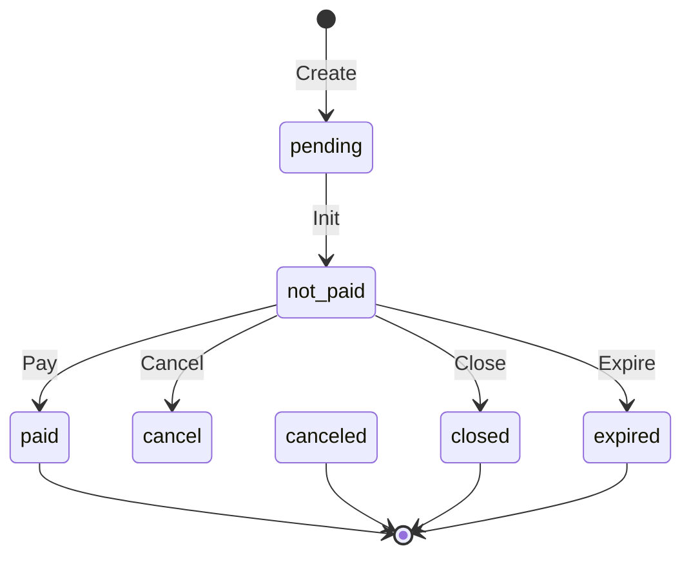
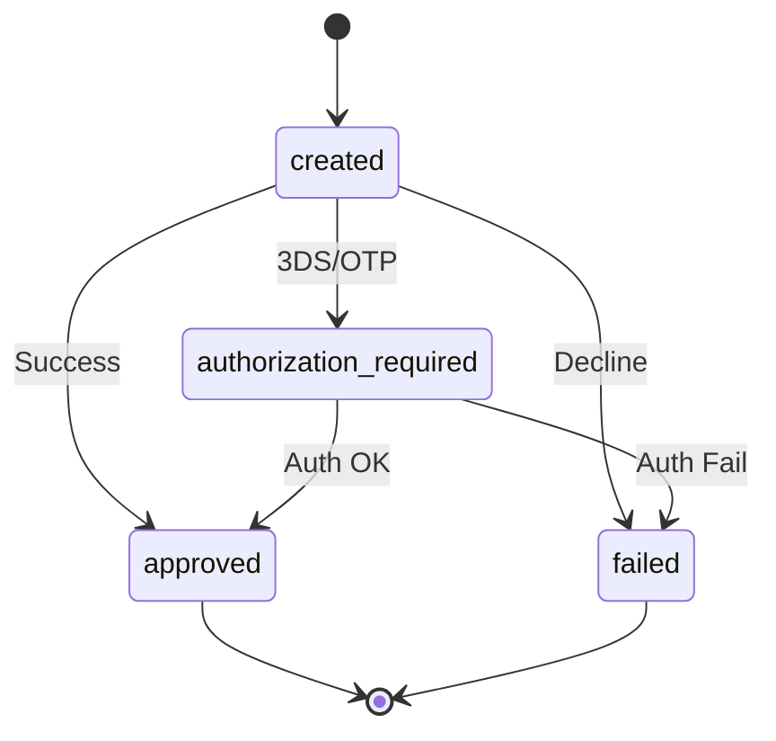

# Invoice and Payment State Model

The WSP layer acts as a stateless proxy between merchants (via VPC/JSON API) and the backend MSP (Microservice Platform) and PSP (Payment Service Provider). WSP does not persist invoice or payment state; instead, it retrieves the current state from MSP and routes the user's session accordingly.

## Invoice Lifecycle

Invoices represent the merchant's order. The MSP is the source of truth for the invoice state. WSP checks this state during creation and payment processing to decide whether to display the payment page, redirect to the merchant, or handle an authorization flow.

### Invoice States

| Constant | Value | Description |
|---|---|---|
| `PENDDING` | `"pendding"` | Legacy state (retained for backward compatibility). |
| `PENDING` | `"pending"` | Initial state during creation processing. |
| `NOT_PAID` | `"not_paid"` | Active state: awaiting payment. |
| `UNPAID` | `"unpaid"` | Active state (functionally equivalent to `not_paid` in WSP logic). |
| `PAID` | `"paid"` | Terminal state: payment successful. |
| `CANCELED` | `"canceled"` | Terminal state: invoice canceled. |
| `CLOSED` | `"closed"` | Terminal state: invoice closed (e.g., expiration or manual action). |
| `EXPIRED` | `"expired"` | Terminal state: expiration time reached without payment. |

**Evidence:** `repo://src/main/java/vn/onepay/wsp/IConstants.java#L21-L28`

### Invoice State Transitions

Caption: [*] --> pending : Create
*Invoice state transitions handled by WSP, recorded in MSP.*

**Logic:**
- **Terminal States** (`PAID`, `CLOSED`, `CANCELED`, `EXPIRED`): WSP immediately redirects to the `merchant_return_url`.
- **Active States** (`UNPAID`, `NOT_PAID`): WSP proceeds with payment collection.

**Evidence:** `repo://src/main/java/vn/onepay/wsp/resources/invoice/InvoiceService.java#L242-L248`

## Payment Lifecycle

Payments represent individual transaction attempts against an invoice. The state depends on the PSP response.

### Payment States

| Constant | Value | Description |
|---|---|---|
| `APPROVED` | `"approved"` | Terminal: Payment settled. |
| `FAILED` | `"failed"` | Terminal: Payment failed. |
| `AUTHORIZATION_REQUIRED` | `"authorization_required"` | Active: Requires 3D Secure, OTP, or redirection. |
| `MORE_INFO_REQUIRED` | `"more_info_required"` | Active: Requires additional user input. |

**Evidence:** `repo://src/main/java/vn/onepay/wsp/IConstants.java#L30-L33`

### Payment State Transitions

Caption: [*] --> created
*Payment state transitions recorded in MSP and synchronized by WSP.*

**Logic:**
- **`AUTHORIZATION_REQUIRED`**: WSP creates a local authorization resource and redirects the user to the PSP's approval URL (e.g., 3DS page).
- **`APPROVED` / `FAILED`**: WSP syncs the status to MSP and redirects the user to the merchant's return or cancel URL.

**Evidence:** `repo://src/main/java/vn/onepay/wsp/resources/payment/PaymentService.java#L291-L319`

## Domain Objects

WSP uses these objects to bridge VPC parameters and MSP JSON structures.

### Invoice
Carries identity (`id`, `merchantId`), financials (`amount`, `currencies`), state, merchant details, and a list of `Payment` objects. It also holds `accept_instruments` patterns used to filter payment methods.

**Evidence:** `repo://src/main/java/vn/onepay/wsp/resources/invoice/Invoice.java#L16-L60`

### Payment
Represents a transaction attempt with `id`, `state`, `amount`, `instrument`, and `settlement` details.

**Evidence:** `repo://src/main/java/vn/onepay/wsp/resources/payment/Payment.java#L11-L45`

### Instrument
Captures payment method details: `type` (card, ewallet), issuer info (`swift_code`, `brand`), and card details (`number`, `month`, `year`).

**Evidence:** `repo://src/main/java/vn/onepay/wsp/resources/payment/Instrument.java#L6-L30`

## Lifecycle Summary

1.  **Creation**: WSP calls `POST /invoices` on MSP. MSP returns the invoice with initial state (`pending` or `not_paid`).
2.  **Instrument Selection**: WSP validates the user's input against `accept_instruments` defined in the invoice.
3.  **Payment Attempt**: WSP calls `POST /payments` on MSP.
    *   If `authorization_required`, WSP handles the redirect flow.
    *   If `approved` or `failed`, WSP updates the MSP payment state and redirects.
4.  **Completion**: WSP redirects the user to `merchant_return_url` upon reaching a terminal state.
