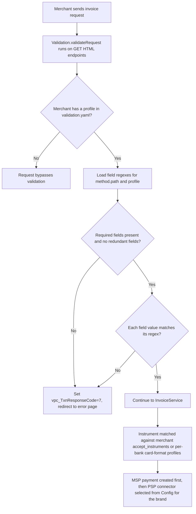

# Payment Methods Taxonomy

This page documents the complete taxonomy of payment methods supported by the WSP (Web Service Proxy) payment gateway. It describes how the gateway classifies instruments, how merchant acceptance rules and per-bank card-format profiles are defined in `config.properties`, and how per-profile request validation is applied from `validation.yaml`.

## Instrument Types

The gateway represents each payment method as an **instrument** object with a `type` field, an `issuer` object (including a Swift code and brand), and card/account details. Instrument types in the system include:

- **`card`** – Domestic or international bank card (Visa, Mastercard, JCB, Amex, CUP) processed through the OnePAY rail.
- **`np_card`** – NAPAS domestic network card (Vietnamese bank ATM cards routed through NAPAS).
- **`ewallet`** – Digital wallet instruments such as **momo** (`ewallet;MSERVICE;momo;`).
- **`viettelpay_account`** – ViettelPay account instrument (`viettelpay_account;;atm;`).
- **`dongabank_account`**, **`techcombank_account`**, **`vib_account`** – Bank-account based instruments.
- **`bnpl`** – Buy Now Pay Later instruments (HomeCredit, Kredivo, Fundiin), as documented in the digital wallets page.

The instrument match map in `InvoiceService` resolves canonical payment method codes (`VC`, `MC`, `JC`, `AE`, `CUP`, `MOMO`, `ZALOPAY`, `VIETTELPAY`, etc.) and BIN prefixes (e.g. `9704001`, `970403`, `970405`) to `type;swift_code;brand;` patterns.

## Merchant Acceptance Rules

A merchant invoice carries an `accept_instruments` set. Each entry is a `type;swift_code;brand;currency` pattern (for example `(card|);[^;]*;(visa|mastercard|amex|jcb);VND`). During payment creation, `PaymentService.paymentValidate` checks the proposed instrument against these patterns, and `MigrationService.tranformInstrument` rewrites an instrument's type and Swift code when the merchant's configured acceptance does not match the received Swift code.

`InstrumentService.transformOPNapas` performs a similar transformation: given the merchant's `accept_instruments`, it flips an instrument between `card` (OnePAY rail) and `np_card` (NAPAS rail) by appending or removing the `NP` Swift-code suffix.

## General vs Bank-Specific Card Profiles

`config.properties` defines a set of per-bank card profiles keyed by a numeric `bankId` using the property prefix `card-format.bank.<id>`, `card-name-format.bank.<id>`, `card-month-format.bank.<id>`, `card-year-format.bank.<id>`, `auth-site.bank.<id>`, `card-site.bank.<id>`, and optionally `card-month-default.bank.<id>` / `card-year-default.bank.<id>`.

Each profile element means:

- **`card-format`** – Regex the submitted card number must match (BIN-prefix based).
- **`card-number`** – Alternate card-number regex used by some banks (e.g. bank 12 SHB, bank 14 VPBANK, bank 19 BIDV, bank 27 PVCOMBANK).
- **`card-name-format`** – Regex for the cardholder name; `+$` requires a non-empty name, `*$` permits an empty one.
- **`card-month-format` / `card-year-format`** – Regex for card expiry fields; where present with a quiet (`?`) suffix the fields are optional.
- **`card-month-default` / `card-year-default`** – Fixed default expiry values used when the bank omits them (e.g. `12/12` for VAB and MSB, `09/99` for EXB, Sacom, NAB).
- **`auth-site`** – Determines where the request is authenticated: `ONEPAY` (OnePAY hosted page) or `BANK` (bank-hosted page).
- **`card-site`** – Used by some banks (e.g. bank 5 VIB `ONEPAY`, bank 6 Dong A `BANK`, bank 21 CUP `BANK`, bank 48 VIB-NAPAS `BANK`).
- **`mobile-number`** – Optional mobile-number regex used only for VPBANK (bank 14).

Two families of bank entries coexist:

1. **Legacy domestic bank profiles** (`bank.1`–`bank.30`): for example VCB (`card-format.bank.1=^(6868[0-9]{12}|970436[0-9]{13})$`, `auth-site.bank.1=ONEPAY`), MB (`bank.8`, `auth-site=ONEPAY`), SacomBank (`bank.16`, `auth-site=ONEPAY`, defaults `09/99`), OCB (`bank.18`, `auth-site=BANK`), BIDV (`bank.19`, `auth-site=BANK`).
2. **NAPAS profiles** (`bank.33`–`bank.75`): a parallel set for each bank's NAPAS cards, mostly with `auth-site.bank.<id>=BANK`, optional expiry formats, and `card-name-format` allowing empty names. Examples include ACB-NAPAS (`bank.33`), VCB-NAPAS (`bank.47`, `card-format=^(970436[0-9]{13}|6868[0-9]{12})$`), VIB-NAPAS (`bank.48`), MB-NAPAS (`bank.49`), and Kebhana-NAPAS (`bank.75`, `^(970466|970467)[0-9]{10}$`).

The bankId also maps to Swift codes in `config.json` under `help.swift_codes` (for example `BFTVVNVX` → VCB bank 1, `BFTVVNVXNP` → VCB-NAPAS bank 47), which is the authoritative Swift ↔ bankId ↔ BIN mapping.

## Request Validation: Merchant Profiles

`validation.yaml` (loaded by `Validation.loadConfig`) defines per-endpoint request field regexes, organized by **merchant profile**. The `merchants` section maps a merchant ID to a profile name, and `profiles` maps an endpoint key (e.g. `get.invoices`) to per-profile field regex maps.

Two profiles are defined for the `get.invoices` endpoint:

- **`general`** (the default profile; `default: general` applies to any unlisted merchant) – used by nearly all listed merchants (ONEPAY, TEST*, OP_*, ADAYROI*, etc.). A broad set of fields including `vpc_Amount`, `vpc_Command`, `vpc_Merchant`, `vpc_MerchTxnRef`, `vpc_SecureHash`, `CardNum`, `CardMonth`, `CardYear`, `CardSecurityCode`, AVS fields, and FX fields (`vpc_FxAmount`, `vpc_FxRate`, `vpc_FxCurrency`, `vpc_DisplayForeignCurrency`).
- **`shopify`** – used only by `TESTSHOPIFY` and `TESTSHOPIFYTG`. Adds Shopify-specific fields: `user_Branch`, `vpc_AuthIndicator`, `user_Customer_Email`, `user_Customer_Phone`, `user_OrderId`, `user_PayGate`, `user_ShopifyAppID`, `user_ShopifyShopDomain`, `user_ShopifyGID`, `user_ShopifyTest`, `user_ShopifyCurrency`, `user_ShopifyCancelURL`, `user_OrgAmount`, `user_OrgCurrency`, `user_ExchangeRate`, and pins `user_Client_Channel` to `SHOPIFY`.

### Validation Semantics

`Validation.validateRequest` runs as a route handler on HTML-rendered GET endpoints:

1. The request params are gathered and `vpc_Merchant` is used to look up the merchant's profile.
2. If the merchant has no profile, the request **bypasses** validation (`rc.next()`).
3. Otherwise the field set for the `method.path` key (e.g. `get.invoices`) and profile is loaded.
4. **Required-fields check**: redundant (request) and missing (not in request, regex rejects empty) fields produce an error; a field is optional if its regex matches the empty string.
5. **Per-field regex check**: every submitted field must match its configured regex.
6. On failure, the response sets `vpc_TxnResponseCode=7` with the message and redirects to the error page (`Config.getUserWebUrl()` + theme, or the merchant URL).

Character-class regexes such as `^([a-zA-Z0-9.,_#+=() &!/:?;-]{0,64})$` restrict both field length and the allowed character set, and a leading `|` alternative (e.g. `^(|true|false)$`, `^(|([0-9]{2}))$`) marks the field as optional.

## Configuration and Operations

- **Card masking**: `instrument.mask.regexp=^(\d{6})\d+(\d{4})$` and `instrument.mask.replacement=$1***$2` mask card numbers to first-six/first-four digits; `MigrationService.sendVpcResponse` also masks with `^(\d{6}).+(\d{3})$` → `$1xxx$3`.
- **Big-merchant amount limits**: `bigmerchant.maxamount=10000000000`, `bigmerchant.minamount=1000`, and a default validated-parameter list `bigmerchant.default.params.validate`.
- **OHCredit / KBank amount limits**: `kbank.maxamount=5000000`, `kbank.minamount=300000`.
- **White-listed redirect URL**: `white-list.url.post-redirect=https://checkout.sacombank.com.vn/checkout/stbCheckout`.

## Flow Diagram

Caption: A[Merchant sends invoice request] --> B[Validation.validateRequest runs on GET HTML endpoints]
*Request validation and payment-method resolution before invoice creation.*

## Failure and Invariant Notes

- If `accept_instruments` filtering rejects the requested payment method, the API returns HTTP 400 with `vpc_Message: Invalid payment method`.
- Validation failures never proceed to payment creation; they always terminate with `vpc_TxnResponseCode=7` and an error redirect.
- Adding a new bank requires a new numeric `bankId` block in `config.properties`, a matching `swift_codes` entry in `config.json`, and (for card-list invoice flows) an entry in `InvoiceService.instrumentMatchs`.

## Related Pages

- [Card Brands and Instrument Types](card-brands.md)
- [Instruments and Tokenization](instrument.md)
- [Instrument Cache and BIN Country Lookup](instrument-cache.md)
- [Digital Wallets and BNPL](digital-wallets.md)
