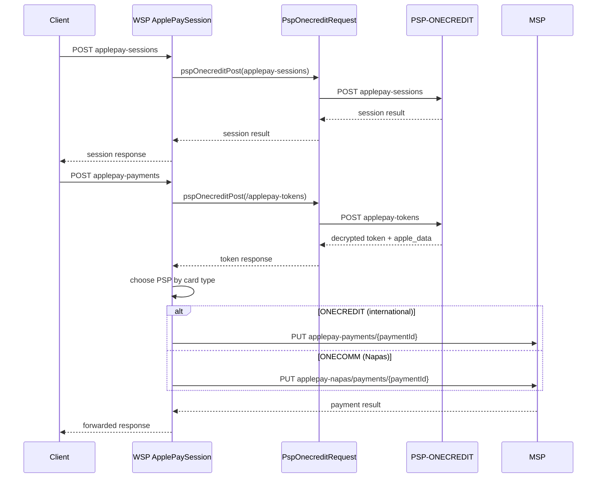

# Apple Pay Payment

This page documents how the WSP application accepts Apple Pay payments. Apple Pay is a digital-wallet instrument (instrument type `applepay`) entered through the public payment gateway. The integration is split across three classes in `vn.onepay.wsp.resources.applepay`:

- `ApplePaySession` — creates an Apple Pay session on the PSP before the device can complete a payment.
- `PaymentServiceApple` — orchestrates payment creation: receives the encrypted token, has it decrypted by the PSP, and routes the resulting payment to the appropriate payment processor.
- `PspOnecreditRequest` — the low-level HTTP client that talks to the PSP-ONECREDIT service with WSP's AWS-style request authorization.

The ONESM card-encryption helper `OneSMHttpClient` is used to encrypt the card PAN before it is sent onward. A separate 3DS2 migration client, `vn.onepay.wsp.resources.migration.mpgs3ds2.OnecreditClient`, is used by the MPGS 3DS2 migration flow, not by Apple Pay, and is documented for contrast below.

## Responsibilities

**ApplePaySession.create**: Called when a merchant app begins an Apple Pay checkout. It forwards the device-provided session body to the PSP endpoint `/merchants/{merchant_id}/invoices/{invoice_id}/applepay-sessions` and relays the result back to the client. Success is any response status 200, 201, or 202; anything else is converted into a synthetic `200` JSON error body `{ code: "1", msg: "Can't create Session", content: <raw> }`.

**PaymentServiceApple.create**: Handles a completed Apple Pay payment. It extracts `invoice_id` and `merchant_id` from the path, reads the JSON body (invoice, billingContact, installment, customer, promotion), forwards the whole body to the PSP token-decryption endpoint `/applepay-tokens`, and asynchronously continues with the decrypted result.

**PaymentServiceApple.handleApplePayToken(Response)**: Interprets the PSP decryption response. It extracts the decrypted card data (`payment_data_decrypt`), the Apple metadata (`apple_data`), determines the card brand, encrypts the PAN, builds a payment request, generates a payment id, and dispatches to ONECREDIT or ONECOMM.

**PspOnecreditRequest**: Sends an HTTP request to the PSP-ONECREDIT service, attaching the WSP access-key authorization headers via `Util.createHttpClientRequest`. It offers POST/GET/PUT/PATCH wrappers; the Apple Pay path uses the POST wrapper (`pspOnecreditPost`).

## Entrypoints

Routes are registered in `Server.java` under the server URI prefix (default `Config.getUriPrefix()`, `/paygate/api/v1`):

| Method | Path | Handler |
| --- | --- | --- |
| POST | `{prefix}/merchants/{merchant_id}/invoices/{invoice_id}/applepay-sessions` | `ApplePaySession::create` |
| POST | `{prefix}/merchants/{merchant_id}/invoices/{invoice_id}/applepay-payments` (JSON) | `PaymentServiceApple::create` |

Both are added to the router by the `applePay(Router)` private method.

## Control flow

Caption: Apple Pay session creation goes through PSP-ONECREDIT, then the decrypted token is dispatched to MSP ONECREDIT for international cards or MSP NAPAS for domestic Napas cards.

## Token decryption & card handling (PaymentServiceApple)

After the PSP responds to `/applepay-tokens` with status 200, 201, or 202, `handleApplePayToken` processes the payload:

1. Reads `payment_data_decrypt` and `apple_data` from the response.
2. Extracts the PAN (`applicationPrimaryAccountNumber`), expiry (`applicationExpirationDate`, parsed as `YYMM` into `month`/`year`), cardholder name, issuer name/country/bin-length/account-prefix (from `apple_data`), brand name (`brand_name`), and Apple card BIN (`apple_card_bin`).
3. Chooses the PSP by `apple_data.s_card_type`:
   - `MasterCard`, `Visa`, `JCB` → `pspId = ONECREDIT`.
   - `Napas` → `pspId = ONECOMM`.
   - Anything else leaves `pspId` empty, which fails with `VALIDATION_ERROR`.
4. Encrypts the PAN via `OneSMHttpClient.encryptToBase64String` using OneSM URL/client id/client key and the `onecredit.hmac` handler.
5. Builds the `digitalWalletData` JSON (`dw_data`) with the ECI indicator, online payment cryptogram, payment data type, card type, `s_type`, and issuer details.
6. Constructs a payment request whose `instrument` carries type `applepay`, the encrypted PAN hash, month/year, issuer brand, `apple_card_bin`, and `dw_data`, plus installment/customer/promotion and `psp_id`.
7. Generates a payment id `PAY-` + URL-safe Base64 of a random UUID.
8. Dispatches on `psp_id`.

If the decryption response status is anything else, the request fails with `DECRYPT_TOKEN_ERROR` ("Digital wallet token decrypt fail").

## Payment dispatch

**International (ONECREDIT)** — `handleApplePayPayment` calls `mspPut` against `/merchants/{merchant_id}/invoices/{invoice_id}/applepay-payments/{paymentId}` with the constructed payment JSON. Success is 200 or 201; other statuses are mapped to an `ErrorExceptionExt`. Timeout exceptions produce `TRANSACTION_TIMEOUT` (400).

**Local Napas (ONECOMM)** — `handleApplePayNapasPayment` rewrites the instrument type to `applepay_napas`, attaches `payment_data_decrypt` and `payment_method` (from the original decryption response), then `mspPut`s to `/merchants/{merchant_id}/invoices/{invoice_id}/applepay-napas/payments/{paymentId}`. Success is any status `<= 201`; failures are mapped like the international path, including `TRANSACTION_TIMEOUT`.

Both dispatch paths forward the successful MSP response to the client with `Util.sendResponse`.

The token-response processing runs inside `rc.vertx().executeBlocking(...)`, so heavy parsing/encryption performed after decryption is off the event loop.

## PspOnecreditRequest mechanics

`pspOnecreditRequest` is the shared transport for Apple Pay requests to PSP-ONECREDIT:

- Parses any `?key=value` query string out of `path` into URL-decoded query params.
- Builds the outgoing request via `Util.createHttpClientRequest(...)`, targeting `Config.getPspOnecreditUrl() + path` with region/service/access-key credentials from `Config`.
- `Util.createHttpClientRequest` selects the Vert.x HTTP or HTTPS client from the URL scheme and signs the request with WSP's `Authorization` (request expires 900 seconds, header `X-OP-Authorization`, `X-OP-Date`, `X-OP-Expires`), forwarding `X-Forwarded-For` from the routing context.
- Response body is delivered to the caller's `HttpResponseHandler`; transport and body-level exceptions are routed to the caller's exception handler.
- Timeout is pass-through per call: Apple Pay token decryption uses 15000 ms, session creation 30000 ms.

Relevant configuration (in `Config.java`): `psp-onecredit.url` (default `http://localhost/psp-onecredit/api/v1`), `psp-onecredit.region` (`onepay`), `psp-onecredit.service` (`psp-onecredit`), `psp-onecredit.access_key_id` (`WSP`), `psp-onecredit.secret_access_key`, and `psp-onecredit.timeout` (default 60000 ms). OneSM encryption uses `onesm.url`, `onesm.client_id`, and `onesm.client_key`.

## Invariants & failure behavior

- The checkout is only valid after a session has been created for the same `merchant_id`/`invoice_id`; the payment route does not create its own session.
- Card type is authoritative for routing: only Visa/MasterCard/JCB go to ONECREDIT, and only Napas to ONECOMM. An unknown card type aborts before any payment call.
- Successful token decryption statuses are exactly 200, 201, and 202.
- mspPut timeouts, transport failures, and non-2xx MSP responses all end in `rc.fail(...)`, so the routing context's failure handler (not a forwarded 200) owns error responses.
- The instrument hash (`HASH`) is the OneSM-encrypted PAN, so the raw PAN is never placed in that field.

## Related component: migration OnecreditClient

`vn.onepay.wsp.resources.migration.mpgs3ds2.OnecreditClient` is a distinct HTTP client used only by the MPGS 3DS2 migration flow (`Mpgs3ds2` / `Mpgs3ds2AuthenticatePayer`). It is not part of the Apple Pay integration, but shares the "onecredit" name. It POSTs a JSON request map to `Config.getMigrationOnecreditBaseUrl() + "/onecredit/execute"`, restricting `command_id` values (`CMPI_LOOKUP`, `AUTHENTICATE_PAYER`, `CANCEL`, `FINGERPRINT_QUERY`), signs the body with an HMAC-SHA256 `X-Secure-Hash` header, and verifies the returned hash on 200 responses. It uses `Config.getPspOnecreditTimeout()` as its read timeout default.

## Tests

There is no dedicated automated test for the Apple Pay classes in `src/test`. The analogous Samsung Pay test (`SamSungPayTransactionTest`) exercises the same `PspOnecreditRequest`-style flow: it verifies `pspOneCreditPost` is invoked on create and that the token handler eventually calls `Util.mspPut`. No test covers `PaymentServiceApple`, `ApplePaySession`, or the applepay `PspOnecreditRequest` directly.
