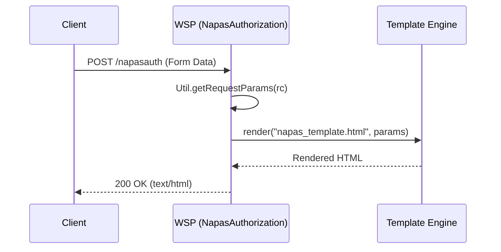
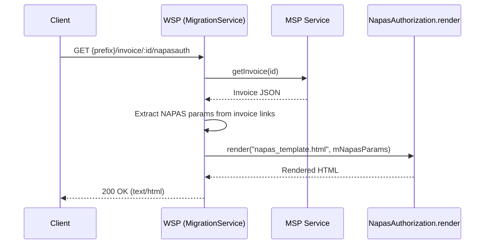

# NAPAS Authorization

This page documents the NAPAS OTP authorization flow in the WSP application. The integration involves receiving authorization requests, rendering a payment widget for OTP input, and handling the callback to complete the payment process.

## Responsibilities

### `NapasAuthorization` (Service)

- **`input(RoutingContext rc)`**: The main entry point for direct NAPAS authorization requests. It extracts parameters from the request (query and body), renders the `napas_template.html` with these parameters, and returns the HTML page to the client.
- **`render(String templateFile, Map<String, Object> params)`**: A reusable utility method (also used by `MigrationService`) that performs string substitution on a template file, replacing `${key}` placeholders with values from the provided map.
- **`getTemplate(String templateFile)`**: Loads and caches the specified template file from the classpath (resources directory). It reads the file line-by-line and caches the result in a static map.

### `MigrationService` (Integration)

- **`input(RoutingContext rc)`**: An alternative entry point for migration scenarios. It retrieves invoice details from the MSP, extracts NAPAS parameters from the invoice's authorization link, and uses `NapasAuthorization.render` to generate the widget page.

## Entrypoints

Routes are registered in `Server.java`:

| Method | Path | Handler | Description |
| --- | --- | --- | --- |
| POST | `/napasauth` | `NapasAuthorization::input` | Direct NAPAS OTP endpoint |
| POST | `/auth` | `NapasAuthorization::input` | Generic auth endpoint (alias) |
| GET | `{prefix}/invoice/:id/napasauth` | `MigrationService::input` | Migration/Invoice-based NAPAS entry |

## Control Flow

### Direct Authorization (`NapasAuthorization::input`)

Caption: Direct NAPAS authorization request flow.

### Migration Authorization (`MigrationService::input`)

Caption: Migration-based NAPAS authorization flow.

## Template (`napas_template.html`)

The `napas_template.html` file is an HTML page that integrates the NAPAS widget script. It contains placeholders (e.g., `${napas_merchant_id}`, `${napas_return_url}`) that are replaced at runtime.

Key parameters injected:
- `napas_return_url`: The URL where the form will be posted after completion.
- `napas_js`: The URL of the NAPAS widget JavaScript library.
- `napas_merchant_id`, `napas_order_id`, etc.: Configuration and transaction details required by the widget.

## Configuration & Dependencies

- **`Util.getRequestParams`**: Used to merge query parameters and URL-encoded body parameters into a single map for template rendering.
- **`PaymentService.getInvoice`**: Used by the migration flow to fetch invoice details.
- **Templates**: Stored in `src/main/resources/napas_template.html`. Loaded once and cached in memory.

## HelpService create flow

`HelpService.create` is a POST endpoint for customer support requests that sends a templated email containing payment details.

### Flow

1. Extracts `invoice_id` from path params and customer info (name, phone, email) from the JSON body, truncating and sanitizing each to 50 chars.
2. Calls `PaymentService.getInvoice(invoiceId)` to fetch the invoice and associated payment data asynchronously.
3. From the payment data, extracts bank info: looks up the issuer's `swift_code` in `Config.getHelpBank(swiftCode)` (backed by `help.swift_codes.*` properties); falls back to the brand ID if no swift code is present.
4. Parses `vpc_TxnResponseCode` and `vpc_Message` from the invoice's merchant return link using regex.
5. Builds a `MailMessage` via `Config.getHelpMailMessage(merchantId)`, which applies per-merchant CC overrides from the `help.mail.merchant` config array.
6. Substitutes template placeholders (`${MERCHANT_ID}`, `${INVOICE_ID}`, `${AMOUNT}`, `${BANK}`, etc.) into the message subject and HTML body.
7. Sends the email asynchronously via `Server.helpMailClient.sendMail(...)`.
8. Returns HTTP 201 with an empty JSON body on success; propagates failures via `rc.fail(...)`.

### Dependencies

- **Server initialization**: `Server.start()` creates `helpMailClient` from `Config.getHelpMailConfig()` (Vert.x `MailClient`, default SMTP `mail.onepay.com.vn:25`).
- **Config**: `help.mail.hostname`, `help.mail.port`, `help.mail.from`, `help.mail.to`, `help.mail.cc`, `help.mail.bcc`, `help.mail.subject`, `help.mail.content`, and `help.mail.merchant` (JSON array for merchant-specific CC lists).

## Tests

There are no dedicated tests for `NapasAuthorization` or `HelpService` in `src/test`. The `AuthorizationServiceTest` exists but focuses on the general `AuthorizationService`, not the NAPAS widget generation or help email flow.
