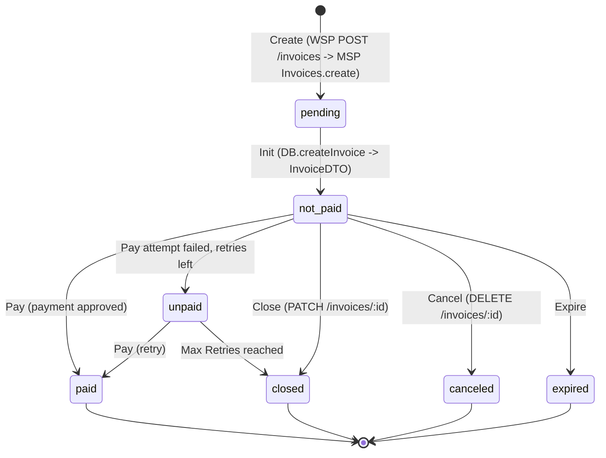
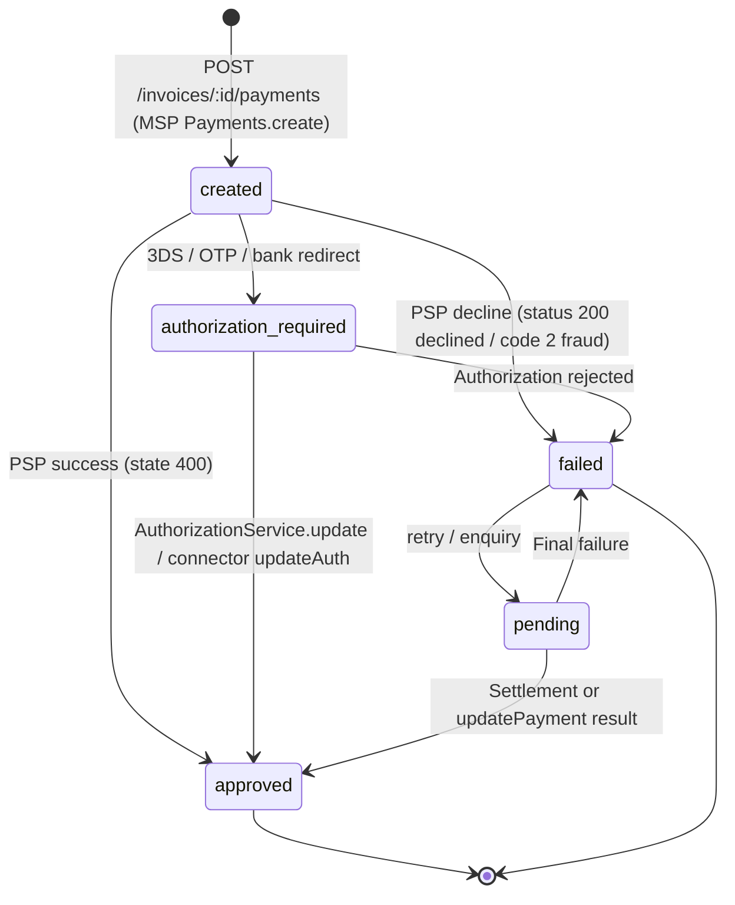
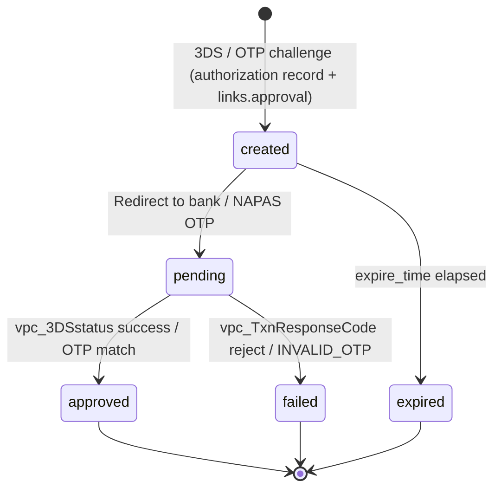
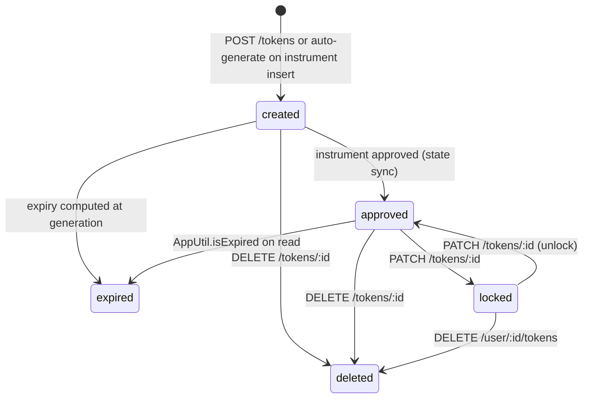
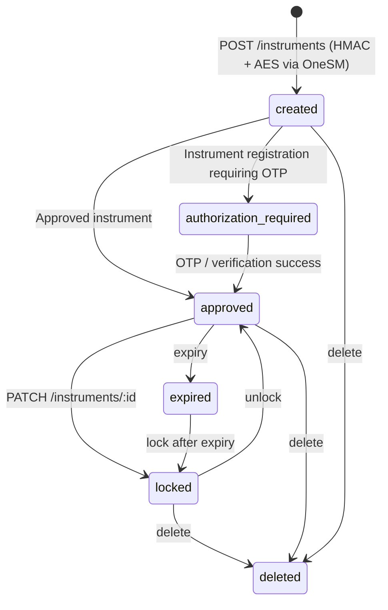
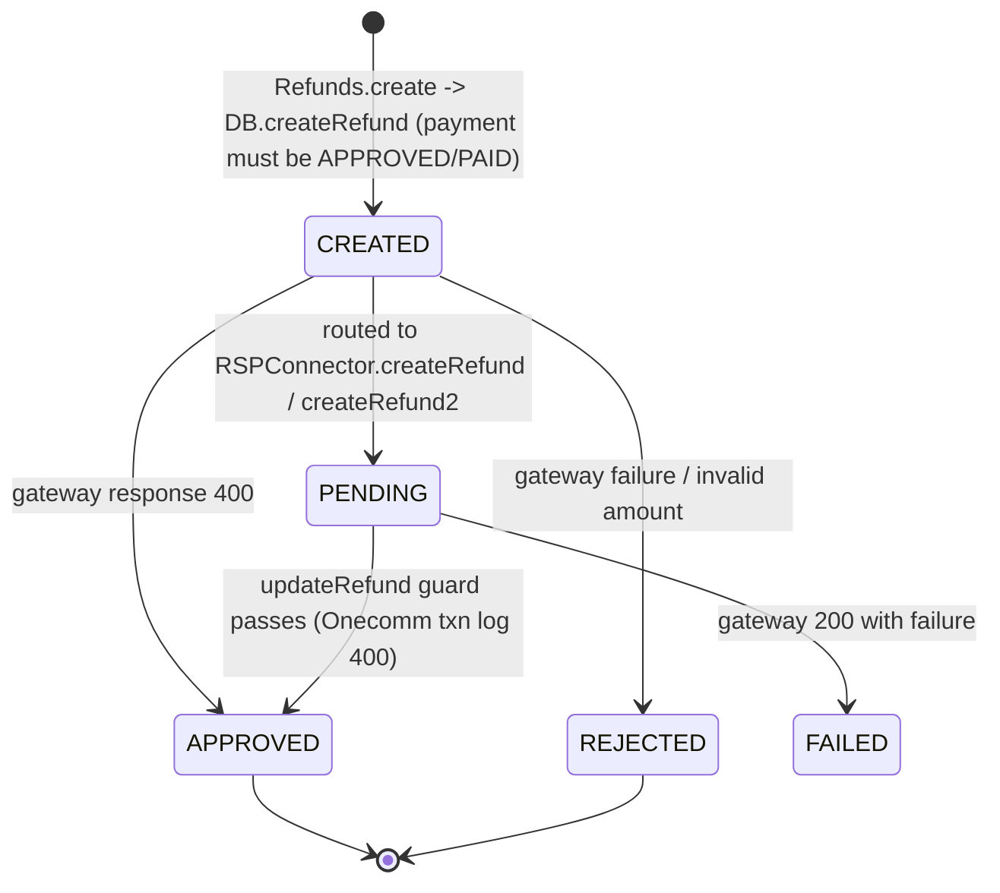
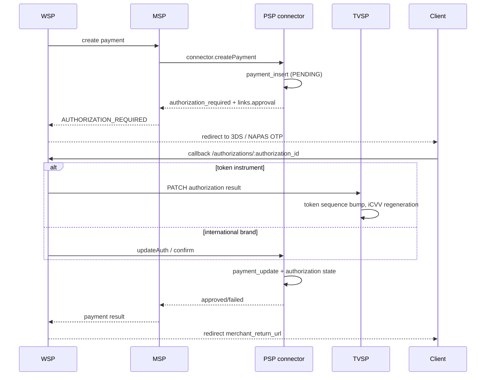

# State machines for invoices, payments, authorizations, tokens and refunds

Companion pages: [`/openwiki/architecture/system-topology.md`](/openwiki/architecture/system-topology.md), [`/openwiki/workflows/cross-service-flows.md`](/openwiki/workflows/cross-service-flows.md).

## 1. Invoice

| Constant (`IConstants`) | Value | Terminal |
|---|---|---|
| `PENDDING` | `pendding` | no (legacy spelling) |
| `PENDING` | `pending` | no |
| `NOT_PAID` | `not_paid` | no |
| `UNPAID` | `unpaid` | no |
| `PAID` | `paid` | yes |
| `CANCELED` | `canceled` | yes |
| `CLOSED` | `closed` | yes |
| `EXPIRED` | `expired` | yes |

MSP core-workflow pages also use lowercase `created`, `pending`, `paid`, `unpaid`, `cancelled`; the two spellings are not reconciled in the docs. Terminal states make WSP redirect to `merchant_return_url`; active states keep collecting payment.

## 2. Payment

Connector-side payment states (`ResourceStates`, connectors): `CREATED`, `PENDING`, `AUTHORIZATION_REQUIRED`, `APPROVED`, `FAILED`, `CANCELED`, `EXPIRED`. Gateway numeric statuses are translated: `400` -> approved, `300`/`100` -> pending, bank decline -> failed, `2` -> fraud.

## 3. Authorization

Final states checked by `AuthorizationService.update` before processing, to prevent double processing: `approved`, `failed`, `canceled`, `expired`.

## 4. Token (TVSP `ResourceStates`)

Expiry is enforced lazily on read (`TokenService.get` -> `AppUtil.isExpired` -> state `EXPIRED`), not by a background job. Token number = `Prefix + Random Middle + Luhn Checksum + Suffix` for cards, or `970499`-style default prefix for accounts; expiry defaults to `token.expiration.month` = 48 months and is capped by the parent card expiry.

## 5. Instrument (TVSP `ResourceStates`)

## 6. Refund and void

Void states are not documented; MSP routes voids through `VoidConnector.createVoid` / `enquiryVoid` (`UnionpayQrVoid`, `WSPVoid`) and PSP-level `voidOrder`, and updates transaction and invoice state.

Refund amount rule: refund amount must not exceed the original payment minus previous refunds. `RefundRule.isManual(bankId, paymentTime, amount)` decides auto vs manual per bank (e.g. BIDV 19 auto up to 180 days, NAPAS banks up to 300 days, VNPT Money 80 / VietinBank 4 up to 90 days; unconfigured bank -> `INVALID_REFUND`).

## 7. Cross-service state propagation

