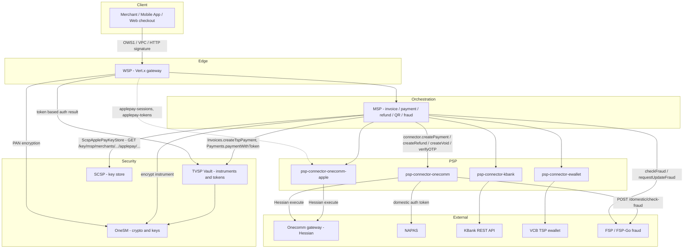
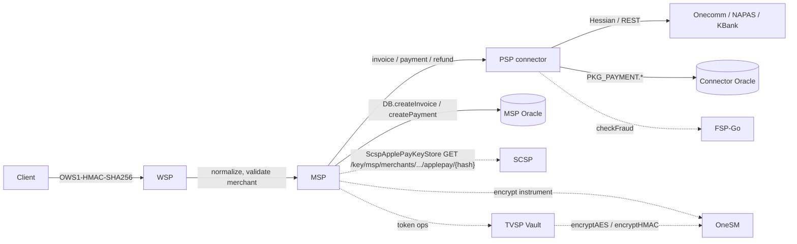
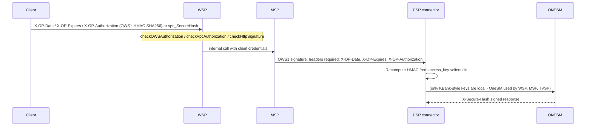

# System topology and cross-service interaction map

Companion pages:

- [`/openwiki/workflows/cross-service-flows.md`](/openwiki/workflows/cross-service-flows.md) - step-by-step sequence diagrams for each canonical flow.
- [`/openwiki/architecture/state-machines.md`](/openwiki/architecture/state-machines.md) - invoice, payment, token, instrument and refund state machines.

## 1. Services and owned responsibility

| Service | Stack | Owns | Downstream calls |
|---|---|---|---|
| WSP (`wsp`) | Vert.x HTTP gateway, prefix `/paygate/api/v1` (VPC `/paygate/api/vpc/v1`) | Request normalization, merchant validation (`validation.yaml`), bank/instrument profiles, rendering NAPAS/3DS pages, redirect handling. **No own database.** | MSP, PSP-ONECREDIT (`/applepay-sessions`, `/applepay-tokens`), OneSM (`OneSMHttpClient.encryptToBase64String`), TSP Vault |
| MSP (`msp`) | Vert.x, prefix `/msp/api/v1` | Invoice, payment, refund, void, QR, fraud orchestration, connector strategy loading (`Main.mspConnectors`) | TVSP, OneSM, SCSP (Apple Pay merchant key/cert via `ScspApplePayKeyStore`), FSP / FSP-Go, `ma-service`, `smssp`, `onebill`, all PSP connectors |
| TVSP (`tvsp`) | Vert.x, `RoutePool` root `/tspvault/api/v1` (config also lists `service.base_path=/tvsp/api/v2`) | Instrument and token lifecycle, iCVV generation, token/instrument state, Oracle `PKG_INSTRUMENT` / `PKG_TOKEN2` | OneSM (`encryptAES`, `encryptHMAC`, `decrypt`) |
| OneSM (`onesm`) | Java 11 / Netty, only `POST /encryptions` and `POST /decryptions` | Local JCEKS keystore (`/keystore.jceks`), HMAC request auth (`X-Authorization` + `X-Date`), AES/CBC/PKCS5, RSA/ECB/PKCS1, Guava key cache | nothing; standalone |
| SCSP (`scsp`) | Go / Gin, prefix `/scsp/api/v1` | Key/subkey store on Postgres `scsp.tb_kv_store` + `scsp.tb_user_policy`, Argon2id Basic auth, per-path policies, Ristretto cache | Vault transit (`EncryptionPort`) |
| PSP connectors | Vert.x, per-connector prefix (`/psp/api/v1`, `/psp-connector-onecomm-apple/api/v1`, ...) | Protocol adapters, per-connector Oracle payment/auth/refund state via stored procedures | Onecomm Hessian gateway, NAPAS, KBank REST (AES-GCM + RSA), VCB TSP `/instruments` |
| FSP / FSP-Go | external | Fraud scoring | called by MSP and `psp-connector-onecomm` |

## 2. Logical topology

## 3. Per-request hop chain

Each connector owns its own Oracle schema reached only through stored procedures (`PKG_PAYMENT.payment_insert`, `PKG_AUTHORIZATION.auth_insert`, `PKG_REFUND.refund_insert`, ...). MSP owns invoice/payment state; TVSP owns instrument/token state. Databases are per-service, never shared.

## 4. Authentication across the edges

Key-ownership summary: OneSM keys come from its own JCEKS keystore (`http_client.<clientId>`, aliases such as `onecredit.hmac`, `tspvault.aes`, `tspvault.hmac`, `aes256`). SCSP is a standalone KSM over Postgres with Basic auth and path policies; MSP is the documented consumer of SCSP keys (Apple Pay merchant key/cert lookup), while **no documented edge from OneSM to SCSP** exists.

## 5. Error envelope contract

| Layer | Shape | Example names |
|---|---|---|
| MSP / WSP | `response_code`, `response_desc`, `response_data` | `UNAUTHORIZED`, `VALIDATION_ERROR`, `EXPIRED_AUTHORIZATION`, `DECRYPT_TOKEN_ERROR`, `TRANSACTION_TIMEOUT`, `GET_QR_INVOICE_NOT_FOUND` |
| PSP connectors | `{name, message, details, information_link}` | `INVALID_REQUEST_BODY`, `INVALID_MERCHANT`, `INVALID_ACCESS_KEY`, `OPERATION_EXPIRED`, `PSP_CONNECTION_ERROR`, `INVALID_REFUND`, `METHOD_NOT_SUPPORTED` |
| OneSM | `{name, message, information_link, details}` | `UNAUTHORIZED_ACCESS`, `INVALID_KEY`, `ALGORITHM_NOT_SUPPORTED`, `UNSUPPORTED_ALGORITHM` |
| SCSP | `{"error": "..."}` | `Key not found`, `Key already exists`, `Version conflict`, `Forbidden: Insufficient permissions` |

Status mapping for connectors: `AuthorizationException` 401, `BadRequestException` 400, `ResourceConflictException` 409, `ResourceNotFoundException` 404, `HttpServiceException` upstream code, otherwise 500 `INTERNAL_SERVER_ERROR`.

## 6. Documented gaps

- No documented scheduler/cron settlement or batch job in any service (closest: `paymentRefund4B` pending record with status 210 for CDR file generation).
- No documented inbound bank webhook other than WSP IPN routes `POST {prefix}/homecredit/ipn` and `POST {prefix}/kredivo/ipn/:payment_id`.
- KBank void/capture flows and onecomm void routes exist as classes but their endpoint-level sequences are not documented.
- QR scan-and-pay callback endpoint is not documented; only the resulting invoice status update is described.
