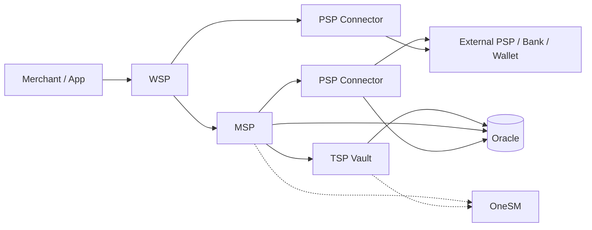
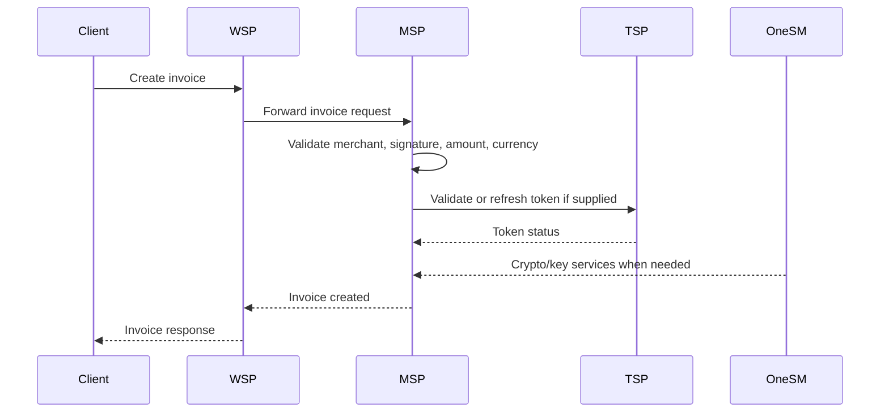
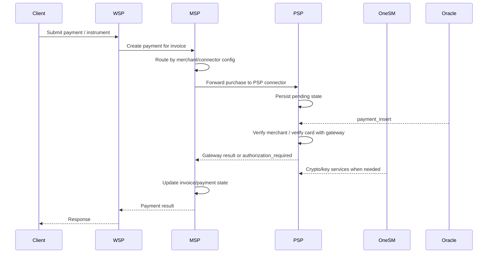
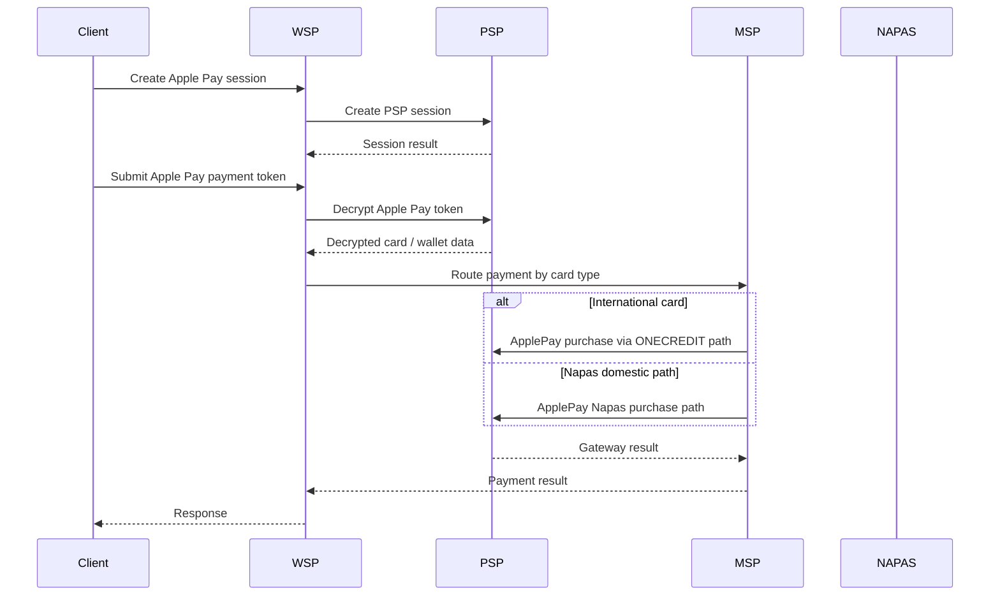
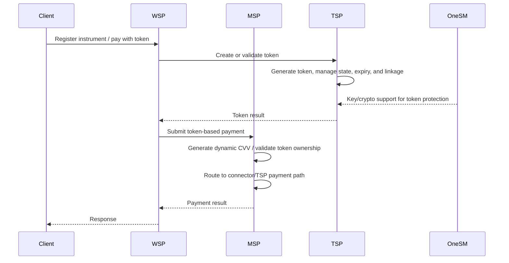
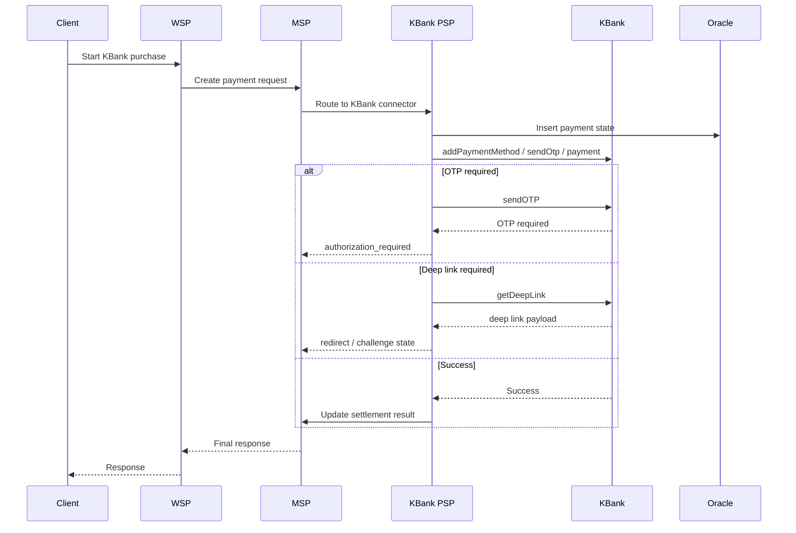
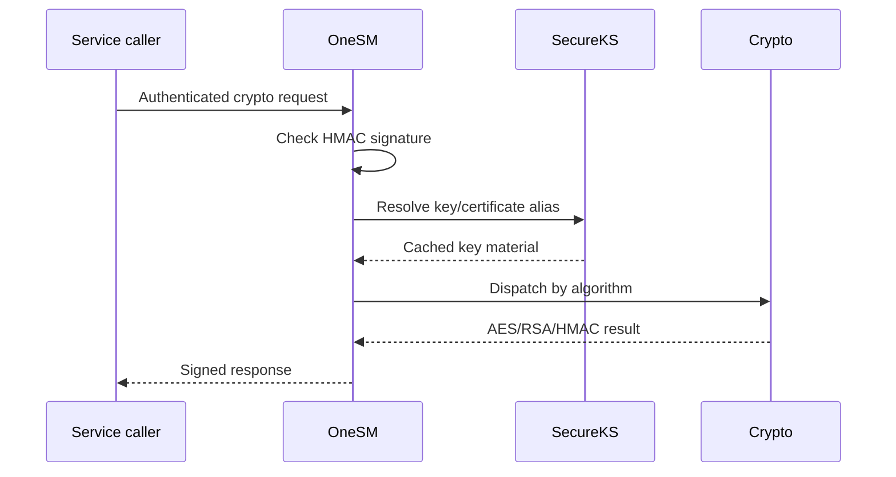

# Cross-service orchestration overview

This page summarizes how the services in this repository collaborate to process payments, refunds, tokenization, authorization, and security operations. It is a navigation hub: each subsection explains the responsibility boundary, the service that owns it, and the main evidence pages to consult next.

## Service roles

| Service | Short name | Core responsibility |
|---|---|---|
| Website Service Provider | WSP | Merchant-facing API gateway, request normalization, routing to downstream services. |
| Merchant Service Provider | MSP | Invoice, payment, refund, void, QR, fraud orchestration, and connector strategy routing. |
| OneSM | onesm | Centralized key management and authenticated cryptography services (AES, RSA, HMAC). |
| TSP Vault | tvsp | Payment instrument storage, tokenization, and token lifecycle management. |
| PSP Connector: Onecomm | psp-connector-onecomm | PSP bridge for standard card and Apple Pay NAPAS flows via the Onecomm gateway. |
| PSP Connector: Onecomm Apple | psp-connector-onecomm-apple | Specialist Apple Pay PSP connector with the same Onecomm integration pattern. |
| PSP Connector: KBank | psp-connector-kbank | PSP bridge for the KBank BNPL/account-payment integration. |

## End-to-end request flow

Caption: Logical request path through the payment stack in this repository.

## Canonical flows across services

### 1. Invoice creation and optional token payment

Key pages:
- MSP core workflows: `msp/openwiki/workflows/core-workflows.md`
- TSP tokenization: `tvsp/openwiki/workflows/tokenization.md`
- WSP architecture: `wsp/openwiki/architecture/overview.md`

### 2. Standard card purchase

Key pages:
- MSP connector model: `msp/openwiki/concepts/connectors.md`
- Onecomm purchase flow: `psp-connector-onecomm/openwiki/workflows/purchase.md`
- Onecomm Apple purchase flow: `psp-connector-onecomm-apple/openwiki/workflows/purchase.md`

### 3. Apple Pay session and payment

Key pages:
- WSP Apple Pay integration: `wsp/openwiki/integrations/apple-payment.md`
- PSP Onecomm Apple purchase: `psp-connector-onecomm-apple/openwiki/workflows/purchase.md`

### 4. Tokenization and token-based payment

Key pages:
- TSP tokenization: `tvsp/openwiki/workflows/tokenization.md`
- TSP instrument management: `tvsp/openwiki/workflows/instrument-management.md`
- MSP token-based payment flow: `msp/openwiki/workflows/core-workflows.md`

### 5. KBank BNPL/account payment

Key pages:
- KBank gateway integration: `psp-connector-kbank/openwiki/integrations/kbank-gateway.md`
- KBank security model: `psp-connector-kbank/openwiki/concepts/security.md`
- MSP configuration and routing: `msp/openwiki/operations/configuration.md`

### 6. Security, keys, and cryptography boundary

Key pages:
- OneSM quickstart: `onesm/openwiki/quickstart.md`
- Crypto operations: `onesm/openwiki/concepts/crypto-operations.md`
- Key management: `onesm/openwiki/concepts/key-management.md`
- OneSM encryption endpoints: `onesm/openwiki/workflows/encryption-decryption-endpoints.md`
- OneSM request auth: `onesm/openwiki/workflows/http-request-auth.md`

## Cross-service integration patterns

- **WSP is the external gateway** but owns no payment state of its own. It normalizes requests and delegates persistence and orchestration to MSP, TSP, and PSP connectors.
- **MSP owns transaction orchestration** and the connector strategy layer. New PSPs are added as connectors, not as changes to WSP or the core domain model.
- **PSP connectors are protocol adapters.** They translate MSP operations into gateway-specific protocols (Hessian/Onecomm, AES-GCM+RSA/KBank), manage local Oracle payment state, and return normalized PSP states back to MSP.
- **TSP Vault owns token lifecycle** separate from PSP-specific card flows. Tokens are created, approved, expired, locked, and deleted independently, while remaining linked to parent instruments.
- **OneSM is a shared crypto boundary.** Other services delegate encryption, decryption, hashing, and authenticated key resolution to OneSM instead of embedding raw key material directly.
- **Oracle databases are per-service**, not a single shared schema. PSP connectors persist connector-side payment/auth state; MSP persists invoice/payment/refund state; TSP persists instrument and token state.

## Navigation index by concern

| Concern | Start here |
|---|---|
| High-level architecture | `wsp/openwiki/architecture/overview.md` |
| Invoice and payment orchestration | `msp/openwiki/workflows/core-workflows.md` |
| PSP connector model | `msp/openwiki/concepts/connectors.md` |
| Onecomm gateway protocol | `psp-connector-onecomm/openwiki/integrations/onecomm-gateway.md` |
| Apple Pay flows | `wsp/openwiki/integrations/apple-payment.md` |
| KBank integration and OTP/deeplink | `psp-connector-kbank/openwiki/integrations/kbank-gateway.md` |
| Tokenization | `tvsp/openwiki/workflows/tokenization.md` |
| Instrument management | `tvsp/openwiki/workflows/instrument-management.md` |
| Cryptography and key management | `onesm/openwiki/concepts/key-management.md` |
| Security and authorization | `wsp/openwiki/concepts/authorization.md` |
| Deployment and configuration | `msp/openwiki/operations/configuration.md` |

## Open questions for future enrichment

- The repository also contains a `psp-connector-ewallet` service, but its current openwiki output is incomplete; document it once its generated wiki is refreshed.
- Some MSP and PSP integrations reference other internal systems such as ASP and Fraud Service Provider; those boundaries are documented outside this repository and should be linked when available.
- The exact shared infrastructure topology (load balancers, deployment segments, sync scripts) is partially captured in service-specific operations pages, but a single deployment topology page would make cross-service operations clearer.
