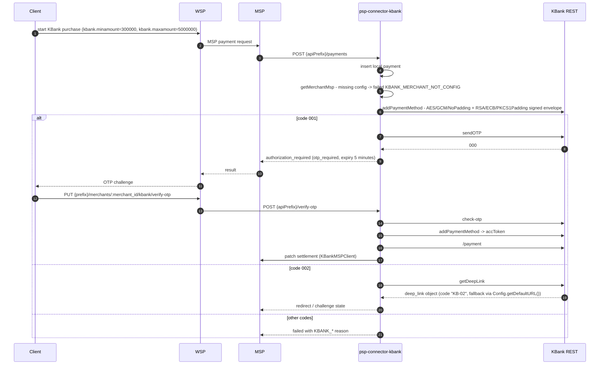
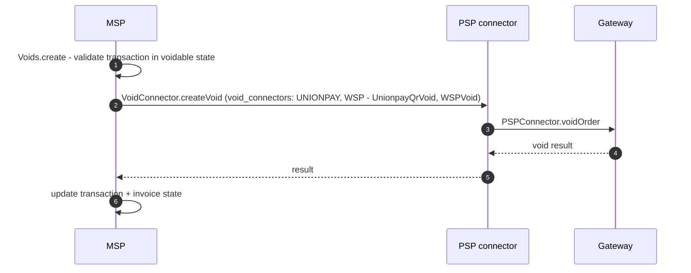
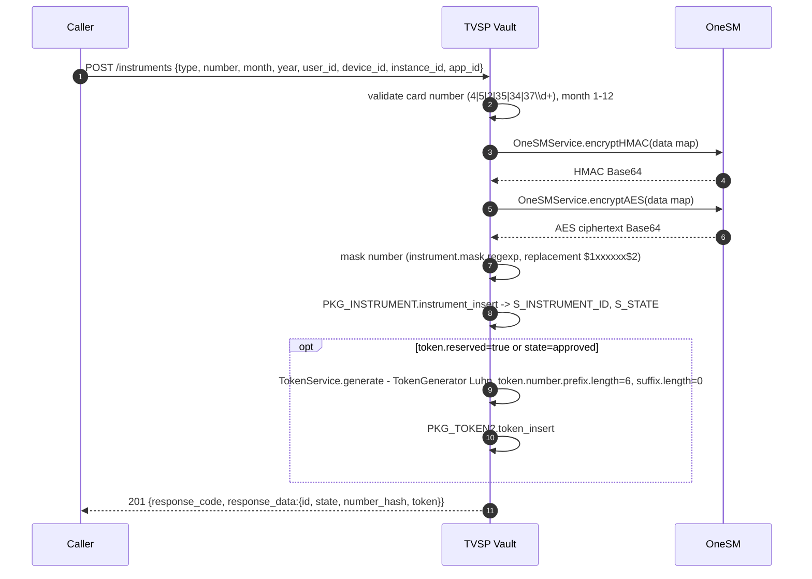
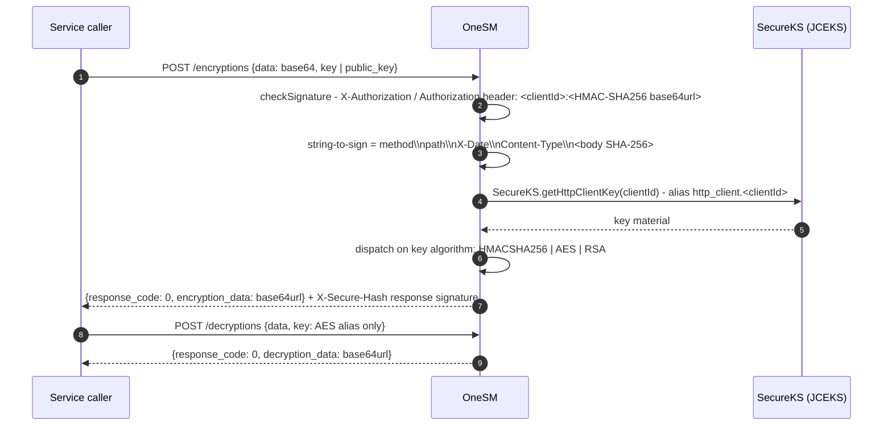
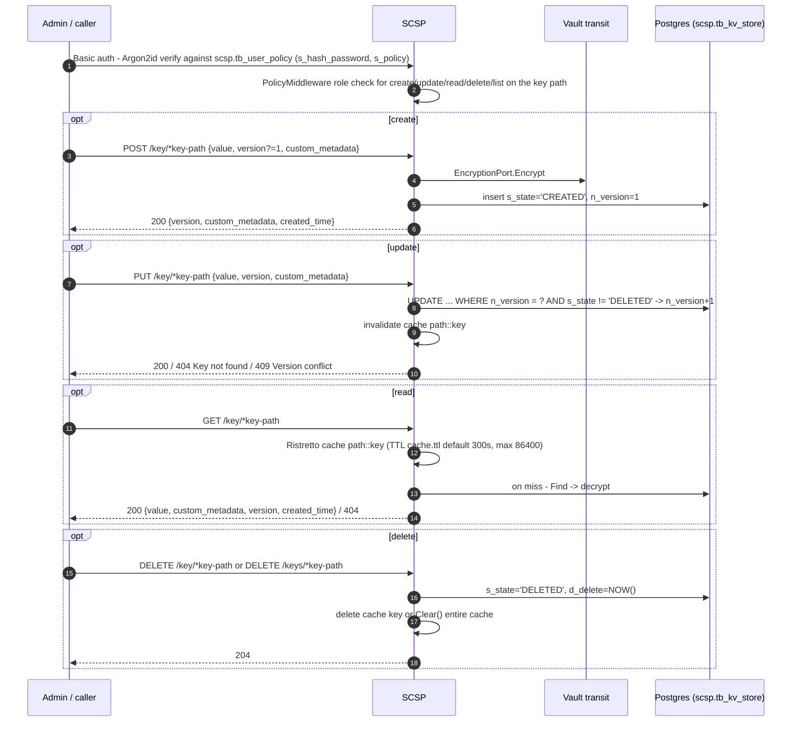
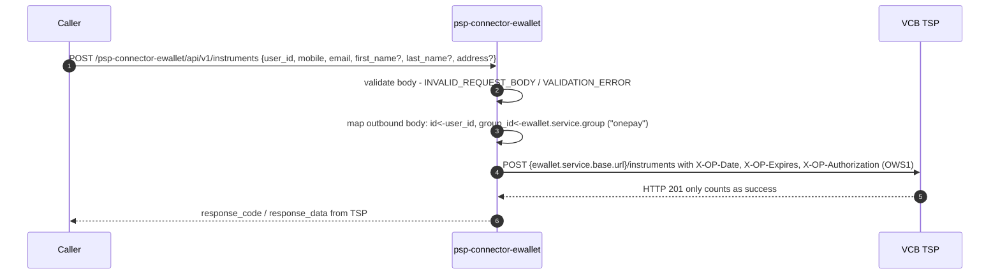

# Cross-service interaction flows

All diagrams use the service short names from [`/openwiki/architecture/system-topology.md`](/openwiki/architecture/system-topology.md). Exact identifiers are quoted from the openwiki documentation of each service.

## 1. Invoice creation (with optional immediate token payment)

```mermaid
sequenceDiagram
    autonumber
    participant C as Client / Merchant
    participant W as WSP
    participant M as MSP
    participant O as OneSM
    participant T as TVSP Vault
    C->>W: POST {prefix}/invoices (JSON or Form) - headers X-OP-* or vpc_SecureHash
    W->>W: Util.logRequest, metricsMiddleware, Validation.validateRequest (validation.yaml)
    W->>W: Instrument filter vs invoice accept_instruments (type;swift_code;brand;currency)
    W->>W: Bank profile via config.properties card-format.bank.<id>, auth-site.bank.<id>
    W->>M: POST /msp/api/v1/invoices
    M->>M: Invoices.create / Invoices.vpcCreate
    M->>M: checkOWSAuthorization / checkVpcAuthorization / checkHttpSignature
    M->>M: type map "ewallet"->"ESP", "eshop"->"ESHOP"; isValidInstallment
    M->>T: validate token if tokenId present (state must be APPROVED)
    T-->>M: token status
    M->>M: InvoiceDB.createInvoice / DB.createInvoice -> state NOT_PAID
    M->>O: encrypt instrument data (encryptToBase64String, alias e.g. onesm.client_id)
    O-->>M: encrypted instrument payload
    opt immediate token payment
        M->>T: Invoices.createTspPayment
        T-->>M: payment result
        M->>M: update invoice state PAID / CLOSED
    end
    M-->>W: INVOICE_CREATED notification + invoice + signed merchReturnUrl (201)
    W-->>C: invoice response
```

Key hop: MSP is the source of truth for invoice state; WSP stays stateless.

## 2. Standard card purchase (Onecomm NAPAS card)

```mermaid
sequenceDiagram
    autonumber
    participant C as Client
    participant W as WSP
    participant M as MSP
    participant P as psp-connector-onecomm
    participant G as Onecomm gateway
    participant F as FSP-Go
    C->>W: POST {prefix}/invoices/:id/payments (instrument)
    W->>W: PaymentService.paymentValidate vs accept_instruments
    W->>M: MSP Payments.create (invoiceId + instrument)
    M->>M: invoice state NOT_PAID/UNPAID, maxPayment check
    M->>M: BIN / brand extraction, isBinAllow
    M->>M: OnePAYPrsp promotion, CustomerFee
    M->>M: DB.createPayment -> PaymentDTO
    M->>P: connector.createPayment (mspConnectors by mspId e.g. ONUS, ONECREDIT)
    P->>P: PaymentService.insert -> PKG_PAYMENT.payment_insert
    P->>P: instrument normalization (OceanBank/VPBank fixes)
    opt domestic
        P->>F: Fraud.checkFraud("domestic", paymentRequestMap, rawData, clientId)
        F-->>P: 200 with "fraud" content
        P-->>M: ErrorException(400, "FRAUD", "Txn is fraud")
    end
    P->>G: OnecommGateway.verifyCard -> verifyMerchant (Hessian VERIFY_MERCHANT)
    G-->>P: bank_list, bankId, transaction_id
    alt cardSite = ONEPAY
        P->>G: verifyCard (BANK_VERIFY_CARD / VCB_VERIFY_CARD ...)
        G-->>P: gateway response (state, links, authorization)
    else cardSite = BANK
        P->>G: selectBank (SELECT_BANK)
        G-->>P: redirect URL
    end
    P->>P: payment_update via PKG_PAYMENT.payment_update
    P-->>M: approved / authorization_required / failed + links.approval
    M->>M: update invoice PAID / UNPAID; notifications PAYMENT_APPROVED / PAYMENT_FAILED
    M-->>W: payment result
    W-->>C: response
```

Hessian magic header on the wire: `0x63 0x02 0x00 0x6d 0x00 0x07 "execute"` + length + payload to `onecomm_service_url` (default `http://localhost/onecomm-payservice/execute`).

## 3. Token payment

```mermaid
sequenceDiagram
    autonumber
    participant C as Client
    participant W as WSP
    participant M as MSP
    participant T as TVSP Vault
    participant O as OneSM
    C->>W: POST {prefix}/invoice/:id/payment (tokenId)
    W->>M: Payments.paymentWithToken (invoiceId + tokenId)
    M->>T: token ownership + group validation
    T-->>M: token APPROVED
    M->>M: generateCVV - HMAC-SHA256(token secret, current timestamp/sequence) -> dynamic 4-digit iCVV
    M->>T: Invoices.createTspPayment
    T->>O: encryptAES / encryptHMAC / decrypt for token data
    O-->>T: Base64url crypto result
    T-->>M: transaction processed
    M->>M: update payment + invoice state; token sequence number bump (anti-replay)
    M-->>W: payment result
    W-->>C: response
```

Config on MSP side for TVSP: `tsp` section, `OWS1-HMAC-SHA256`, timeout `55s`, `authorization_return_url` pointing at paygate authorizations.

## 4. Apple Pay session + NAPAS / international payment

```mermaid
sequenceDiagram
    autonumber
    participant C as Client
    participant W as WSP
    participant OCA as psp-connector-onecomm-apple
    participant OC as psp-connector-onecomm
    participant M as MSP
    participant S as SCSP
    participant ONE as OneSM
    participant G as Onecomm gateway
    C->>W: POST /merchants/{merchant_id}/invoices/{invoice_id}/applepay-sessions
    W->>OCA: pspOnecreditPost /applepay-sessions
    OCA-->>W: session result (success 200/201/202)
    C->>W: POST .../applepay-payments
    W->>OCA: POST /applepay-tokens (full body)
    OCA-->>W: payment_data_decrypt, apple_data (applicationPrimaryAccountNumber, brand_name, s_card_type)
    W->>W: executeBlocking - parse PAN, expiry YYMM
    alt s_card_type in (MasterCard, Visa, JCB)
        W->>M: PUT /merchants/{m}/invoices/{i}/applepay-payments/{paymentId}
    else s_card_type = Napas
        W->>M: PUT /merchants/{m}/invoices/{i}/applepay-napas/payments/{paymentId}
    end
    W->>ONE: OneSMHttpClient.encryptToBase64String (PAN -> HASH; handler onecredit.hmac)
    ONE-->>W: encrypted HASH
    W->>M: instrument type applepay / applepay_napas + dw_data
    M->>S: ScspApplePayKeyStore - GET /key/msp/merchants/{merchantId}/applepay/{publicKeyHashHex} (HTTP Basic; Ristretto cache TTL 3600s in front)
    S-->>M: {value: {certificate, private_key}, version} / 404
    M->>M: CachingApplePayKeyStore wrap - resolve ApplePayKey, verify keyMatchesCert
    M->>OC: Onecomm payment path
    OC->>OC: mandatory checkFraud("domestic", ...)
    OC->>G: verifyCard chain
    G-->>OC: gateway result
    OC-->>M: approved / authorization_required / failed
    M-->>W: result
    W-->>C: response
```

Payment id format: `PAY-` + URL-safe Base64 of a random UUID. Synthetic Apple session error body: `{ code: "1", msg: "Can't create Session", content: <raw> }`.

## 5. 3DS / NAPAS authorization callback

```mermaid
sequenceDiagram
    autonumber
    participant C as Client / browser
    participant W as WSP
    participant M as MSP
    participant T as TVSP
    participant OC as psp-connector-onecomm
    participant OCA as psp-connector-onecomm-apple
    C->>W: payment created -> AUTHORIZATION_REQUIRED + links.approval (aut;D;<merchantId>;<merchTxnRef>)
    W-->>C: redirect to 3DS page / NAPAS OTP (napas_template.html)
    C->>W: POST/GET {prefix}/authorizations/:authorization_id (vpc_3DSstatus, vpc_TxnResponseCode, vpc_Otp)
    W->>W: AuthorizationService.update - guard on final states approved/failed/canceled/expired; check expire_time
    alt token instrument
        W->>T: PATCH authorization result to TSP vault
        T->>T: token sequence update
    else international card brand
        W->>OCA: updateAuth / confirm (PATCH /authorizations/:id)
        OCA->>G: OnecommGateway.updateAuth
    else NAPAS domestic card
        W->>OC: PATCH /authorizations
        OC->>G: updateAuth -> confirm
    end
    G-->>OC: approved / failed / canceled + settlement payload
    OC-->>W: auth + payment state update (PKG_AUTHORIZATION, PKG_PAYMENT)
    W->>M: patch MSP authorization + payment state
    M-->>W: result
    W-->>C: auto-submit redirect to merchant_return_url
```

NAPAS widget entry points: `POST /napasauth`, `POST /auth`, and invoice-based `GET {prefix}/invoice/:id/napasauth` (MigrationService). NAPAS gateway lookup: `GET /merchant/{caic}/order/{id}/domestic/` with JWT token cache `ConcurrentHashMap<String, NapasToken>`.

## 6. KBank BNPL purchase, OTP and deep link



Wire format: plaintext `{"headerReq":{...},"bodyReq":{"data":{...}}}` is encrypted to `{"data":"<AES-GCM base64>","signature":"<RSA/SHA-256 base64>"}`. Headers: `token`, `requestUID` = `{partnerId}_{yyyyMMdd}_{OP}_{epochMillis}`, `requestDateTime`, `partnerID`, `code`, `Accept-Language`, `IV` (random UUID).

## 7. QR create, scan-and-pay, VietQR cancel

```mermaid
sequenceDiagram
    autonumber
    participant C as Client
    participant W as WSP
    participant M as MSP
    C->>W: POST {prefix}/invoices/:id/qrs
    W->>M: POST /msp/api/v1/invoices/{invoiceId}/qrs
    M->>M: QRService.create - generate QR payload
    M-->>W: QR image/data
    W-->>C: QR response
    C->>C: customer scans and pays at bank app
    M->>M: process payment via connector (NapasQR / MoMoQR mentioned; class wiring not fully documented)
    M->>M: update invoice state from payment result
    opt VietQR cancel
        C->>W: PATCH /invoices/:invoice_id/payments_vietqr/:payment_id
        W->>M: cancelVietQrPayment -> MSP payments_vietqr path
    end
    opt VietQR + invoice cancel
        C->>W: DELETE /invoices/:invoice_id/payments_vietqr/:payment_id
        W->>M: cancelVietQrPaymentAndInvoice
    end
```

VRB QR follows the same pattern through `/payments_vrbqr`. Deeplink info: `/vietqrpay/deeplink-apps` and `/invoices/{invoiceId}/deeplink-apps/{issuerCode}`.

## 8. Refund (auto and manual)

```mermaid
sequenceDiagram
    autonumber
    participant C as Caller
    participant W as WSP
    participant M as MSP
    participant P as PSP connector
    participant G as Gateway
    C->>W: refund request
    W->>M: Refunds.create / Refunds.vpcCreate (paymentId + amount)
    M->>M: payment APPROVED/PAID; amount <= paid - refunded
    M->>M: RefundDTO state CREATED -> DB.createRefund
    M->>P: RSPConnector.createRefund / createRefund2 / BillRspConnector.createRefund
    P->>P: RefundRule.isManual(bankId, paymentTime, amount)
    alt auto
        P->>P: refundInsert -> RefundDB / PKG_REFUND
        P->>G: OnecommGateway.refundExtend / refundNP / refundApple / KBank /cancellation
        G-->>P: numeric status 200 FAILED / 300 PENDING / 400 APPROVED
        P->>P: update refund state + Onecomm txn log
    else manual
        P->>P: insert Onecomm txn log status 400 + APPROVED refund process_type=manual
    end
    P-->>M: result
    M->>M: notifications REFUND_APPROVED / REFUND_FAILED
    M-->>W: result
    W-->>C: response
```

Refund endpoints on connectors: `POST /merchant/:merchant_id/refunds/:merch_txn_ref`, `POST /refund_napas`, `POST /merchant/:merchant_id/refunds_manual|refunds_auto/:merch_txn_ref`, `PATCH /merchant/:merchant_id/refunds/:merch_txn_ref`; on apple `POST /refunds`, `POST /refunds2`; on kbank `POST {apiPrefix}/refunds2` (branch `command == "capture_refund"`).

## 9. Void



WSP Big Merchant surface: `PUT {prefix}/vpc/merchants/:merchant_id/purchases/:orgMerchTxnRef/voids/:merchTxnRef` (and captures/refunds counterparts). Exact voidable-state enum values are not documented.

## 10. Tokenization and instrument registration (TVSP)



Token state PATCH cascade: `PATCH /instruments/:id` updates tokens that are not expired/locked/deleted to match the instrument state (`PKG_INSTRUMENT.instrument_update_state`, `PKG_TOKEN2.token_update_state`). Delete is soft (state `deleted`).

## 11. OneSM crypto request (called by WSP, MSP, TVSP)



AES output uses `AES/CBC/PKCS5Padding` with a random IV prepended to the ciphertext; RSA uses `RSA/ECB/PKCS1Padding`. `X-Date` freshness is **not** validated (no replay window on the OneSM side).

## 12. SCSP key lifecycle (standalone KSM)



Key path grammar: pure path ends with `/` and matches `^/[-0-9a-zA-Z_/]+/$`; path+subkey splits the last segment as subkey. Roles: `create`, `update`, `read`, `delete`, `list`; deny-by-default.

## 13. ewallet instrument registration proxy



No local Oracle persistence on this route; no purchase/refund endpoints are documented for this connector.

